# Flow диаграммы QR подписания eGov Mobile

## Содержание

1. [QR подписание через сканирование QR-кода](#1-qr-подписание-через-сканирование-qr-кода)
2. [Кросс подписание через динамическую ссылку](#2-кросс-подписание-через-динамическую-ссылку)
3. [Процесс получения документов (API №2)](#3-процесс-получения-документов-api-2)
4. [Процесс подписания документов](#4-процесс-подписания-документов)
5. [Процесс отправки подписанных документов](#5-процесс-отправки-подписанных-документов)
6. [Аутентификация по типам](#6-аутентификация-по-типам)

---

## 1. QR подписание через сканирование QR-кода

### 1.1 Общий поток QR подписания

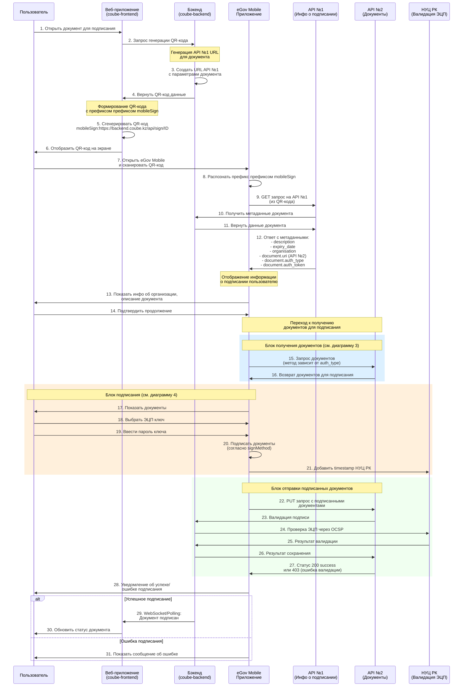

### 1.2 Детализация генерации QR-кода

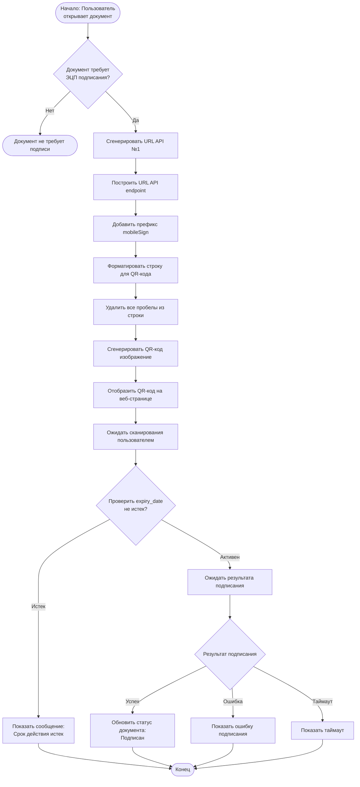

---

## 2. Кросс подписание через динамическую ссылку

### 2.1 Общий поток кросс подписания

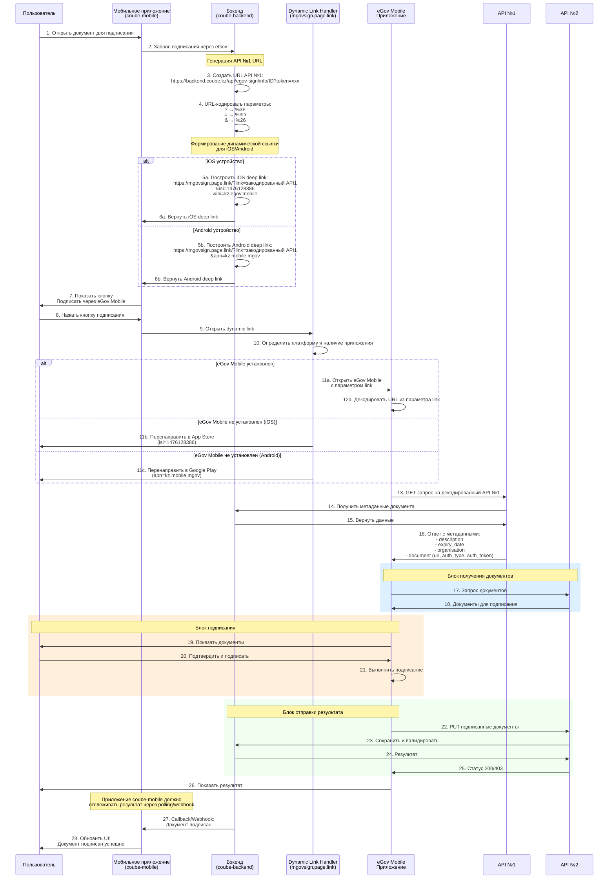

### 2.2 Построение динамической ссылки

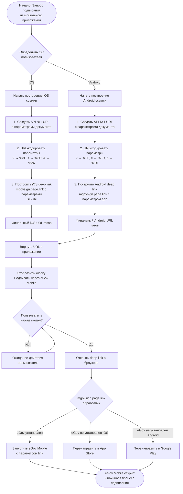

---

## 3. Процесс получения документов (API №2)

### 3.1 Получение документов в зависимости от типа аутентификации

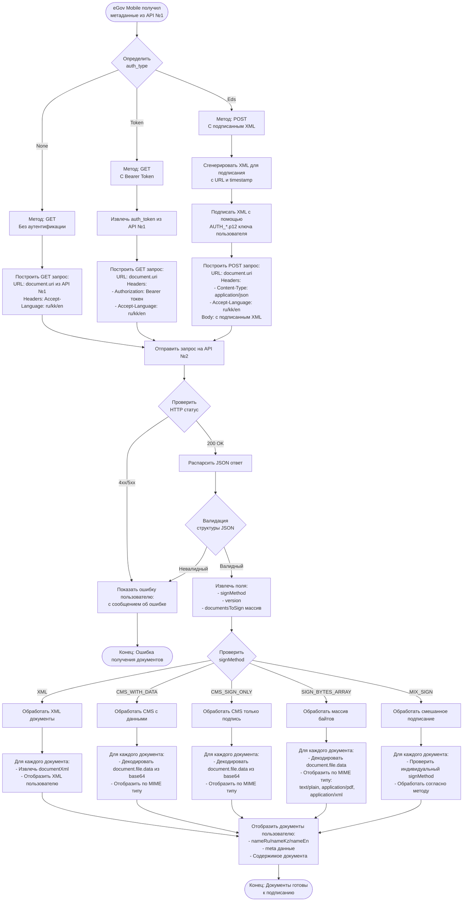

### 3.2 Обработка MIME типов при отображении

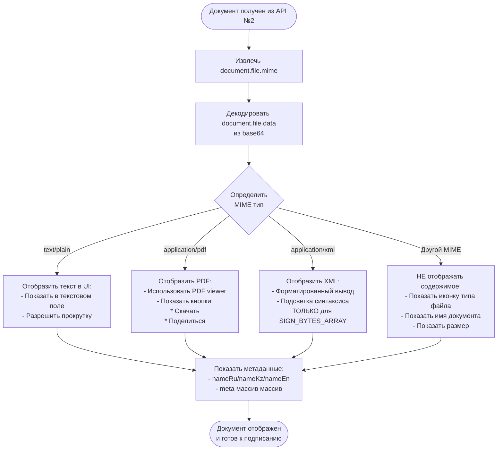

---

## 4. Процесс подписания документов

### 4.1 Общий процесс подписания

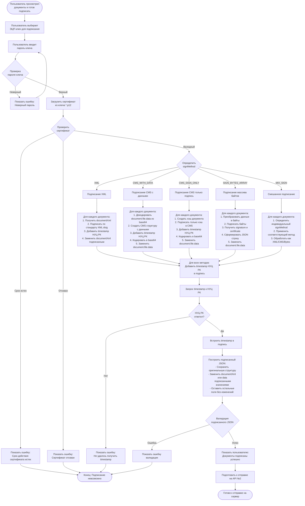

### 4.2 Детализация SIGN_BYTES_ARRAY

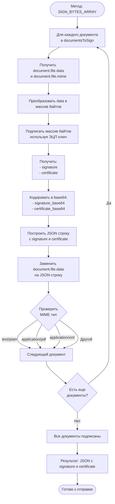

---

## 5. Процесс отправки подписанных документов

### 5.1 Отправка и валидация подписанных документов

```mermaid
sequenceDiagram
    participant eGov as eGov Mobile
    participant API2 as API №2
    participant Backend as Backend<br/>(coube-backend)
    participant НУЦ as НУЦ РК<br/>(OCSP сервис)
    participant DB as База данных

    Note over eGov: Документы подписаны<br/>локально

    eGov->>eGov: 1. Подготовить JSON с подписанными<br/>документами (замененные поля)

    eGov->>API2: 2. PUT запрос<br/>URL: document.uri (из API №1)<br/>Headers:<br/>- Content-Type: application/json<br/>- Authorization: Bearer токен (если auth_type=Token)<br/>- Accept-Language: ru/kk/en<br/>Body: подписанный JSON

    API2->>Backend: 3. Получить подписанные документы

    Backend->>Backend: 4. Проверить структуру JSON

    alt Структура невалидна
        Backend->>API2: 5a. Ошибка 400 Bad Request
        API2->>eGov: 6a. с сообщением об ошибке
        eGov->>eGov: 7a. Показать ошибку пользователю
    else Структура валидна
        Backend->>Backend: 5b. Извлечь подписи из документов

        loop Для каждого подписанного документа
            Backend->>Backend: 6b. Извлечь ЭЦП из documentXml или data

            Note over Backend: Валидация ЭЦП согласно<br/>Правилам НУЦ РК

            Backend->>Backend: 7. Проверить структуру ЭЦП<br/>(XML dsig / CMS format)

            Backend->>Backend: 8. Извлечь сертификат из подписи

            Backend->>Backend: 9. Проверить регистрационное<br/>свидетельство :<br/>- Выдано НУЦ РК<br/>- ИИН/БИН соответствует отправителю

            Backend->>Backend: 10. Проверить срок действия:<br/>- NotBefore <= текущее время<br/>- NotAfter >= текущее время<br/>(время Астаны)

            Backend->>Backend: 11. Проверить цепочку сертификатов<br/>до корневого НУЦ РК

            Backend->>НУЦ: 12. OCSP запрос для проверки<br/>статуса сертификата

            alt OCSP сервис доступен
                НУЦ->>Backend: 13a. OCSP квитанция:<br/>- good (не отозван)<br/>- revoked (отозван)<br/>- unknown

                alt Сертификат отозван
                    Backend->>Backend: 14a. Пометить документ<br/>как невалидный
                else Сертификат валидный (good)
                    Backend->>Backend: 14b. Продолжить валидацию
                end

            else OCSP недоступен
                НУЦ->>Backend: 13b. Timeout / Error
                Backend->>Backend: 14c. Проверить по CRL списку:<br/>- Base CRL<br/>- Delta CRL

                Backend->>Backend: 15. Проверить наличие серийного<br/>номера в CRL
            end

            Backend->>Backend: 16. Проверить KeyUsage:<br/>- Цифровая подпись<br/>- Неотрекаемость

            Backend->>Backend: 17. Проверить алгоритм:<br/>ГОСТ 34.311-95 <br/>ГОСТ 34.310-2004 

            Backend->>Backend: 18. Проверить timestamp НУЦ РК<br/>в подписи

            Backend->>Backend: 19. Вычислить хэш документа<br/>и сравнить с подписью

            alt Подпись невалидна
                Backend->>Backend: 20a. Зафиксировать ошибку валидации
            else Подпись валидна
                Backend->>Backend: 20b. Пометить документ<br/>как успешно подписанный
            end
        end

        Backend->>Backend: 21. Собрать результаты валидации<br/>всех документов

        alt Все подписи валидны
            Backend->>DB: 22a. Сохранить подписанные документы
            Backend->>DB: 23a. Обновить статус документа:<br/>status = "SIGNED"
            Backend->>Backend: 24a. Журналировать событие:<br/>- Дата/время<br/>- Пользователь (ИИН/БИН)<br/>- Документ<br/>- Статус: SUCCESS

            Backend->>API2: 25a. Ответ: 200 OK<br/>сообщение success
            API2->>eGov: 26a. Статус 200
            eGov->>eGov: 27a. Показать пользователю:<br/>Документы успешно подписаны

        else Хотя бы одна подпись невалидна
            Backend->>Backend: 22b. Журналировать ошибку:<br/>- Дата/время<br/>- Пользователь<br/>- Документ<br/>- Причина ошибки<br/>- Статус: FAILED

            Backend->>API2: 23b. Ответ: 403 Forbidden<br/>с сообщением об ошибке валидации
            API2->>eGov: 24b. Статус 403
            eGov->>eGov: 25b. Показать пользователю:<br/>Ошибка валидации подписи
        end
    end

    Note over Backend,DB: Все события журналируются<br/>в SIEM систему (syslog RFC 5424)
```

### 5.2 Процесс валидации ЭЦП (детализация)

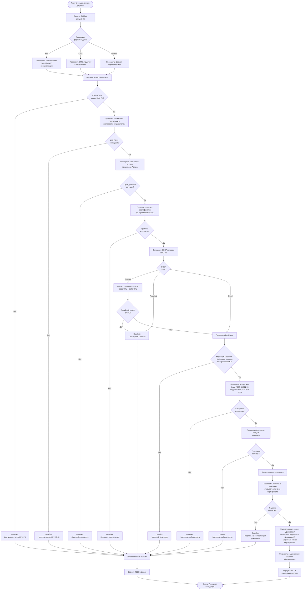

---

## 6. Аутентификация по типам

### 6.1 Выбор метода аутентификации для API №2

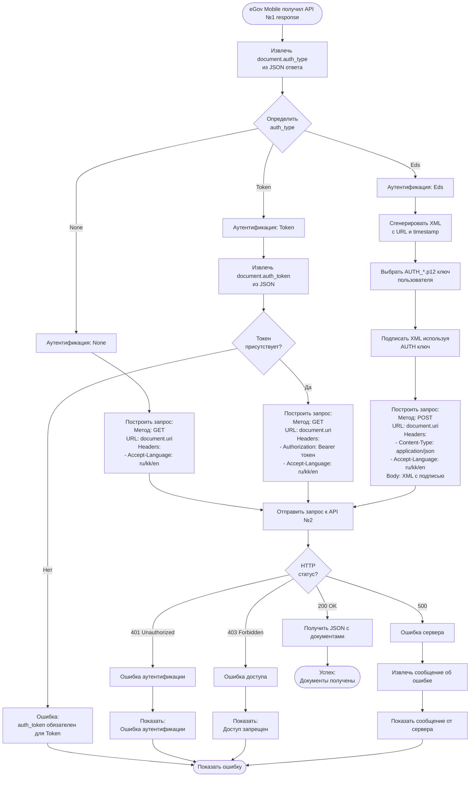

### 6.2 Примеры запросов для каждого типа аутентификации

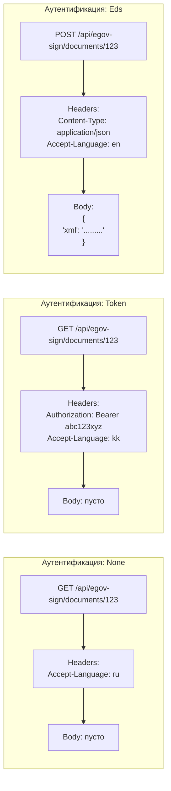

---

## 7. Архитектура интеграции Coube с eGov Mobile

### 7.1 Компоненты системы

```mermaid
graph TB
    subgraph "Coube Frontend (Vue.js)"
        WebUI[Веб интерфейс]
        QRGen[Генератор QR-кодов]
        WebSocket[WebSocket клиент]
    end

    subgraph "Coube Mobile (React Native)"
        MobileUI[Мобильный интерфейс]
        DeepLinkHandler[Deep Link обработчик]
        Polling[Polling сервис]
    end

    subgraph "Coube Backend (Spring Boot)"
        API1Controller[API №1 Controller<br/>/api/egov-sign/info/:id]
        API2Controller[API №2 Controller<br/>/api/egov-sign/documents/:id]
        SignService[Signing Service]
        ValidationService[Validation Service]
        KalkanService[Kalkan Integration<br/>(НУЦ РК)]
        WebhookService[Webhook Service]
    end

    subgraph "База данных"
        Documents[Документы]
        Signatures[Подписи]
        AuditLog[Журнал аудита]
    end

    subgraph "Внешние сервисы"
        eGovMobile[eGov Mobile App]
        НУЦ[НУЦ РК OCSP]
        SIEM[SIEM система]
    end

    WebUI -->|Запрос QR| QRGen
    QRGen -->|GET /api/egov-sign/info/:id| API1Controller

    MobileUI -->|Открыть deep link| DeepLinkHandler
    DeepLinkHandler -->|GET /api/egov-sign/info/:id| API1Controller

    API1Controller -->|Получить метаданные| SignService
    SignService -->|Читать| Documents

    eGovMobile -->|GET/POST API №2| API2Controller
    API2Controller -->|Получить документы| SignService

    eGovMobile -->|PUT подписанные| API2Controller
    API2Controller -->|Валидировать| ValidationService
    ValidationService -->|OCSP запрос| НУЦ

    ValidationService -->|Сохранить| Signatures
    ValidationService -->|Журналировать| AuditLog

    API2Controller -->|Webhook| WebhookService
    WebhookService -->|Уведомить| WebSocket
    WebSocket -->|Обновить UI| WebUI

    WebhookService -->|Уведомить| Polling
    Polling -->|Обновить UI| MobileUI

    AuditLog -->|Отправить логи| SIEM

    style eGovMobile fill:#e1f5ff
    style НУЦ fill:#ffe1e1
    style SIEM fill:#fff4e1
```

### 7.2 Последовательность обработки в Backend

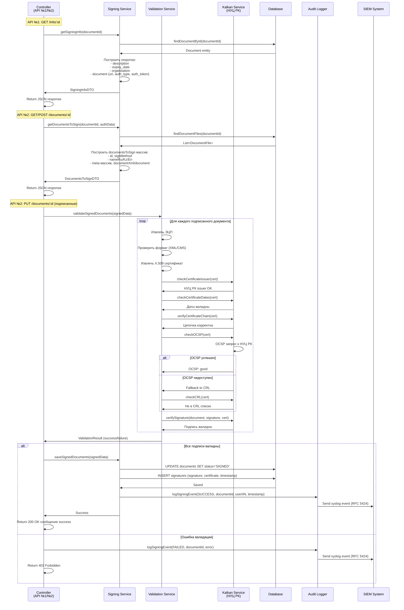

---

## 8. Обработка ошибок и edge cases

### 8.1 Обработка ошибок

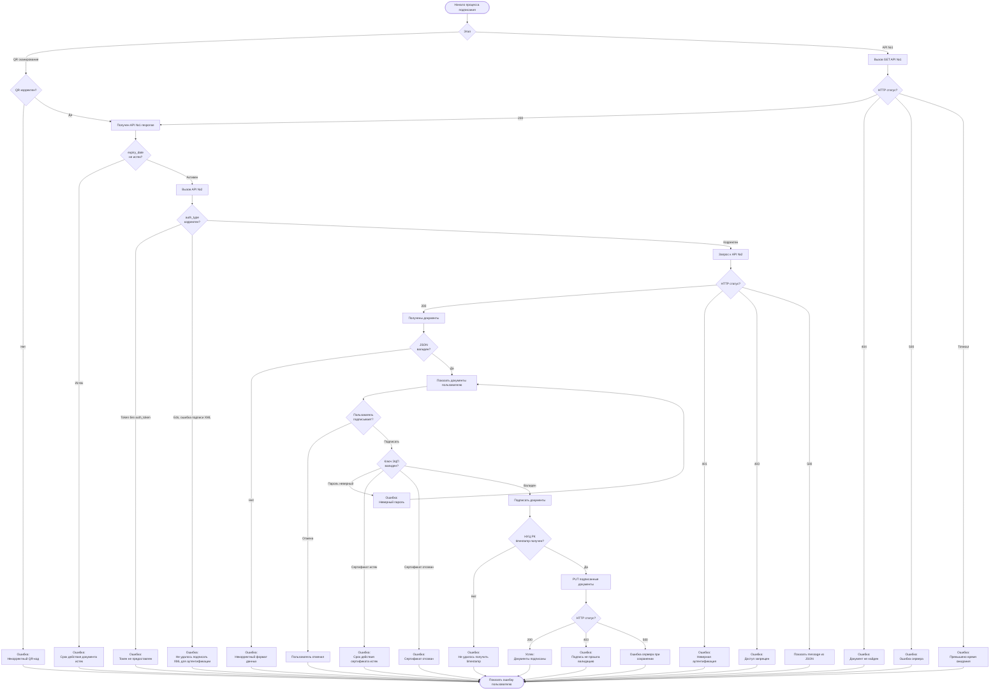

### 8.2 Edge Cases

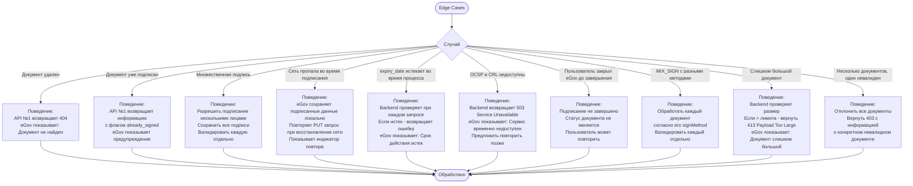

---

## 9. Журналирование и аудит

### 9.1 Структура журнала событий

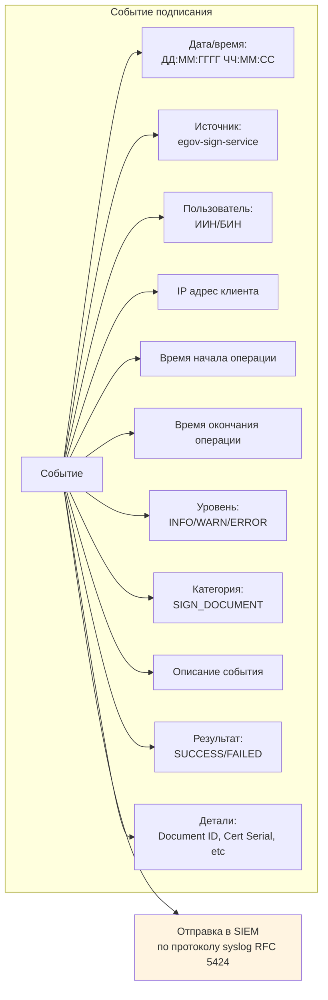

### 9.2 Примеры журнальных записей

**Пример 1: Успешное подписание**
```
2025-10-19 14:23:45 egov-sign-service user=123456789012 ip=192.168.1.100 start=14:23:30 end=14:23:45 level=INFO category=SIGN_DOCUMENT description="Document signed successfully" result=SUCCESS details="doc_id=456, cert_serial=ABC123, method=CMS_WITH_DATA"
```

**Пример 2: Ошибка валидации**
```
2025-10-19 14:25:10 egov-sign-service user=987654321098 ip=10.0.0.50 start=14:25:00 end=14:25:10 level=ERROR category=SIGN_VALIDATION description="Signature validation failed" result=FAILED details="doc_id=789, reason=Certificate revoked"
```

**Пример 3: OCSP запрос**
```
2025-10-19 14:23:42 egov-sign-service user=123456789012 ip=192.168.1.100 start=14:23:41 end=14:23:42 level=INFO category=OCSP_REQUEST description="OCSP validation successful" result=SUCCESS details="cert_serial=ABC123, status=good"
```

---

## 10. Технические требования к реализации

### 10.1 Backend (coube-backend)

**Контроллеры:**
- `EgovSignController` - обработка API №1 и API №2

**Эндпоинты:**
```java
// API №1 - Получение информации о подписании
GET /api/egov-sign/info/ID документа
Response: {
  description: string,
  expiry_date: ISO8601,
  organisation: {...},
  document: {
    uri: string,  // URL для API №2
    auth_type: None | Token | Eds,
    auth_token?: string
  }
}

// API №2 - Получение документов для подписания
GET /api/egov-sign/documents/ID документа  // для auth_type=None или Token
POST /api/egov-sign/documents/ID документа  // для auth_type=Eds
Request (POST): { xml: string }
Response: {
  signMethod: string,
  version: number,
  documentsToSign: [...]
}

// API №2 - Отправка подписанных документов
PUT /api/egov-sign/documents/ID документа
Request: { подписанный JSON }
Response: 200 OK сообщение success или 403 Forbidden
```

**Сервисы:**
- `EgovSigningService` - бизнес-логика подписания
- `DocumentValidationService` - валидация ЭЦП
- `KalkanIntegrationService` - интеграция с НУЦ РК (OCSP, CRL)
- `AuditLoggingService` - журналирование в SIEM

**Модели:**
```java
// DTO для API №1
class SigningInfoDTO {
  String description;
  String expiryDate;
  OrganisationDTO organisation;
  DocumentAuthDTO document;
}

// DTO для API №2
class DocumentsToSignDTO {
  String signMethod;
  Integer version;
  List<DocumentToSignDTO> documentsToSign;
}

// Entity для хранения подписей
@Entity
class DigitalSignature {
  Long id;
  Long documentId;
  String iin;
  String certificateSerial;
  String signatureData;  // base64
  String certificateData;  // base64
  Instant signedAt;
  Boolean validated;
}
```

### 10.2 Frontend (coube-frontend)

**Компоненты:**
- `QrSignatureModal.vue` - модальное окно с QR-кодом
- `SignatureStatus.vue` - отображение статуса подписания

**Функционал:**
```javascript
// Генерация QR-кода
async function generateQrCode(documentId) {
  const apiUrl = `${API_BASE}/api/egov-sign/info/$ID документа`;
  const qrContent = `mobileSign:${apiUrl}`.replace(/\s/g, '');
  return QRCode.toDataURL(qrContent);
}

// Подписка на обновления через WebSocket
socket.on('document-signed', (data) => {
  if (data.documentId === currentDocumentId) {
    updateDocumentStatus('SIGNED');
    showNotification('Документ успешно подписан');
  }
});
```

### 10.3 Mobile (coube-mobile)

**Компоненты:**
- `DeepLinkHandler.tsx` - обработка deep links
- `SignatureButton.tsx` - кнопка запуска подписания

**Функционал:**
```typescript
// Построение deep link
function buildEgovDeepLink(documentId: string, token: string): string {
  const api1Url = `${API_BASE}/api/egov-sign/info/$ID документа?token=$токен`;
  const encodedUrl = encodeURIComponent(api1Url);

  if (Platform.OS === 'ios') {
    return `https://mgovsign.page.link/?link=${encodedUrl}&isi=1476128386&ibi=kz.egov.mobile`;
  } else {
    return `https://mgovsign.page.link/?link=${encodedUrl}&apn=kz.mobile.mgov`;
  }
}

// Открытие deep link
async function openEgovSigning(documentId: string) {
  const deepLink = buildEgovDeepLink(documentId, authToken);
  await Linking.openURL(deepLink);

  // Начать polling статуса
  startPollingSignatureStatus(documentId);
}
```

---

## Заключение

Данные flow диаграммы покрывают все аспекты интеграции Coube с eGov Mobile для QR и кросс подписания:

✅ **QR подписание** - полный поток от генерации QR-кода до получения подписанного документа

✅ **Кросс подписание** - построение динамических ссылок для iOS/Android и обработка deep links

✅ **API №1 и API №2** - детальная спецификация всех методов и типов аутентификации

✅ **Валидация ЭЦП** - полная проверка согласно требованиям НУЦ РК

✅ **Обработка ошибок** - все возможные ошибки и edge cases

✅ **Журналирование** - структура логов для SIEM системы

✅ **Техническая реализация** - конкретные эндпоинты, модели и компоненты для Coube

Документация готова к использованию разработчиками для реализации функционала подписания через eGov Mobile.
