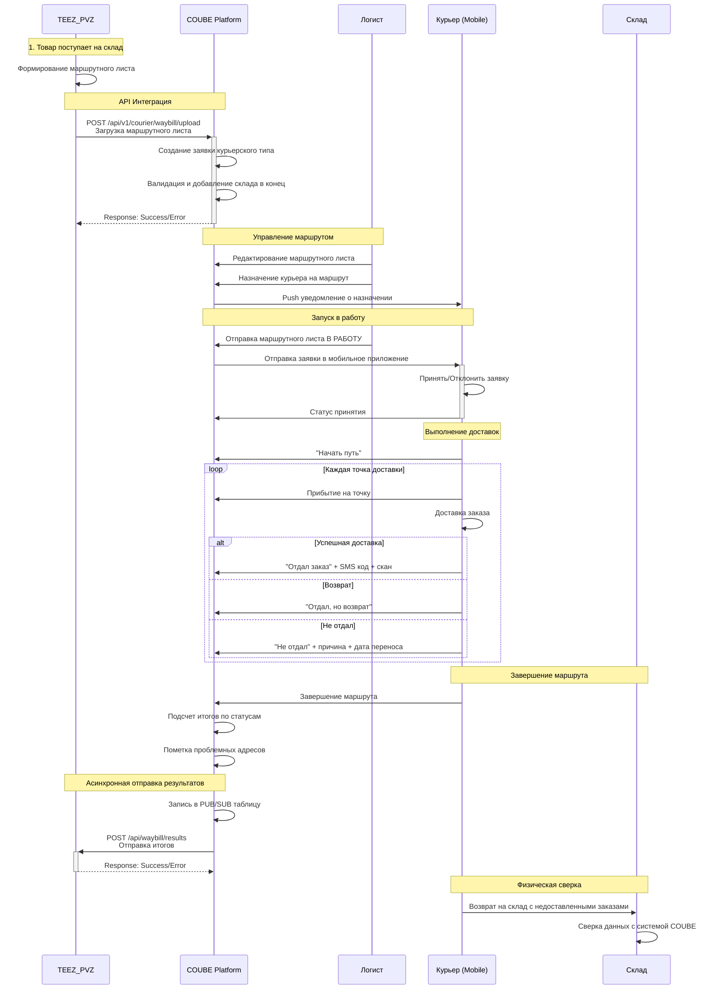
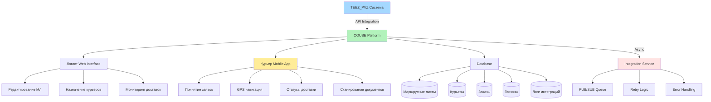
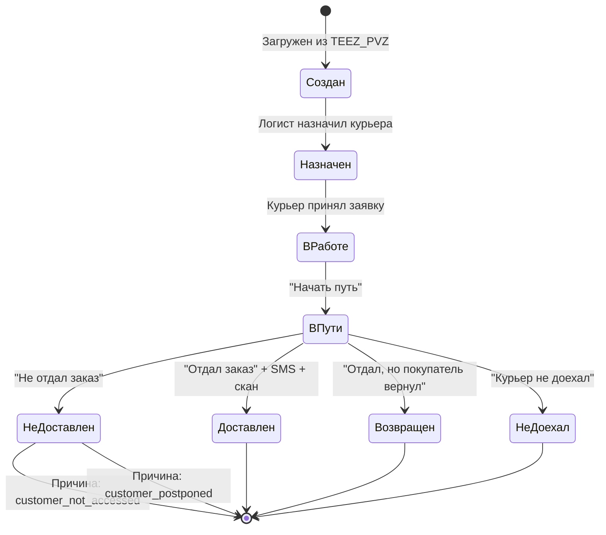
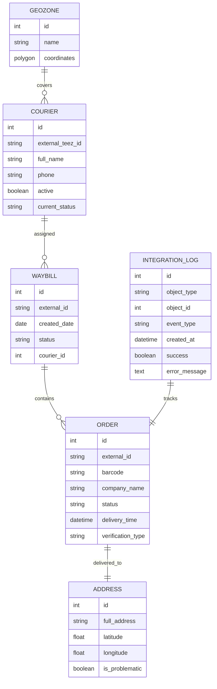

# Бизнес-процесс курьерской доставки (Mermaid)

## Sequence Diagram - Основной флоу



## Flowchart - Структура системы



## State Diagram - Статусы заказа



## Entity Relationship - Структура данных



## 🔥 Критические API Endpoints

### 1. Входящая интеграция от TEEZ_PVZ:
```
POST /api/v1/integration/teez/waybill/upload
```

### 2. Исходящая интеграция к TEEZ_PVZ:
```  
POST /api/waybill/results (к их системе)
```

### 3. Расширение Driver API:
```
PUT /api/v1/driver/orders/{id}/delivery-confirmation
POST /api/v1/driver/orders/{id}/scan-document  
PUT /api/v1/driver/orders/{id}/return-reason
```

---
*Диаграммы созданы с помощью Mermaid для визуализации в Markdown*