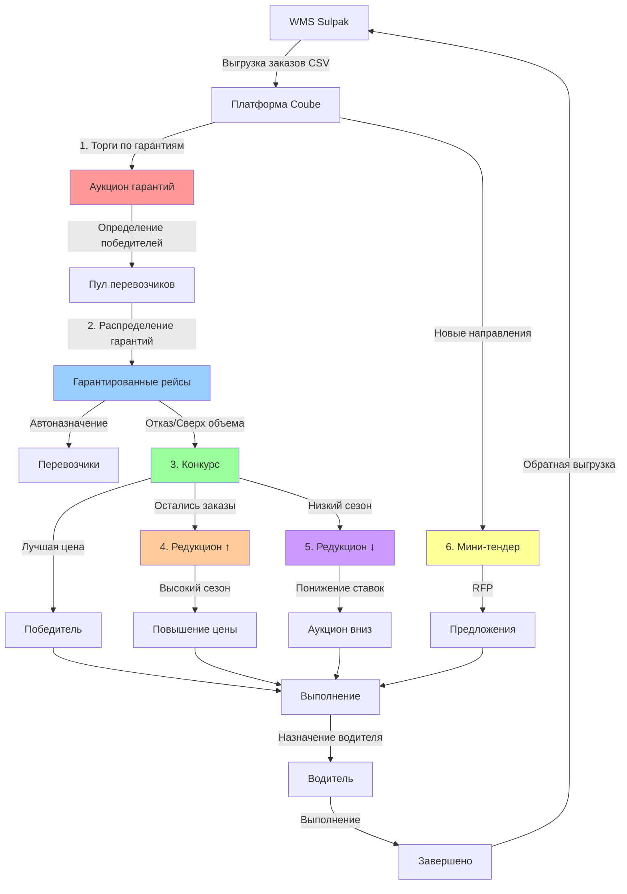
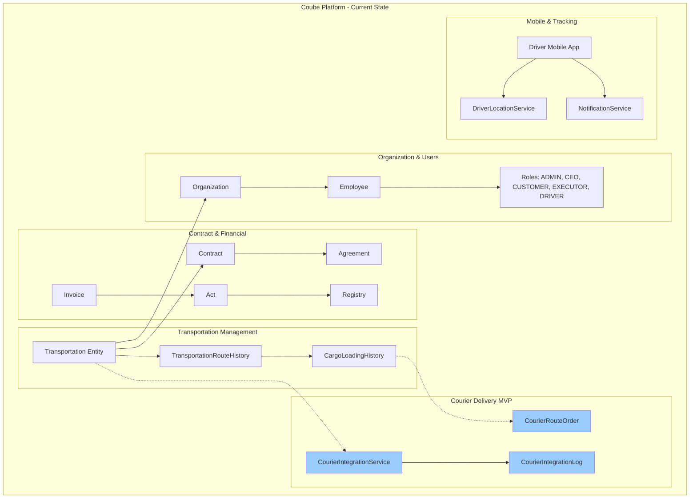
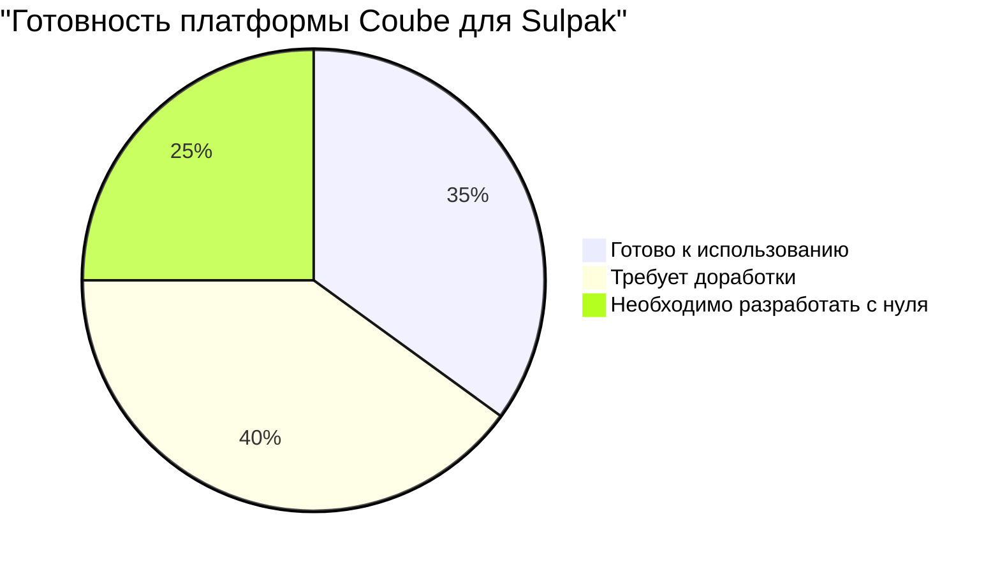
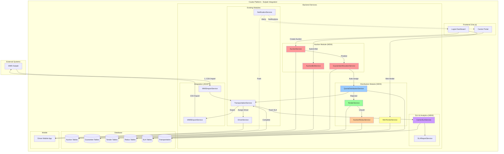
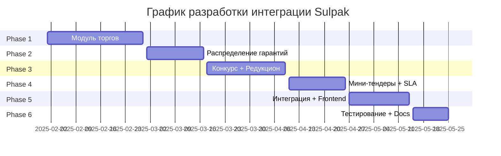

# Анализ интеграции платформы Coube с ТОО «Arena S» (Sulpak)

**Дата создания**: 2025-01-29
**Версия**: 1.0
**Статус**: 🔍 Аналитический отчет
**Приоритет**: 🔴 HIGH - Стратегическая интеграция

---

## 📋 Содержание

1. [Краткое резюме](#краткое-резюме)
2. [Описание бизнес-процесса Sulpak](#описание-бизнес-процесса-sulpak)
3. [Текущие возможности платформы Coube](#текущие-возможности-платформы-coube)
4. [Сопоставление требований](#сопоставление-требований)
5. [Готовые модули](#готовые-модули)
6. [Требуемые доработки](#требуемые-доработки)
7. [Подводные камни и сложности](#подводные-камни-и-сложности)
8. [Архитектурное решение](#архитектурное-решение)
9. [Оценка трудозатрат](#оценка-трудозатрат)
10. [Рекомендации и план действий](#рекомендации-и-план-действий)
11. [Выводы](#выводы)

---

## 🎯 Краткое резюме

### Возможность интеграции: ✅ **РЕАЛИЗУЕМО с доработками**

**Вердикт**: Платформа Coube **может быть адаптирована** под требования Sulpak, но требует **существенных доработок** в части функционала торгов, распределения гарантий и конкурсной системы.

### Ключевые цифры

| Параметр | Значение |
|----------|----------|
| **Готовность платформы** | 35-40% |
| **Объем доработок** | 60-65% новой функциональности |
| **Оценка времени** | 12-16 недель (3-4 месяца) |
| **Сложность** | 🔴 HIGH |
| **Риски** | 🟡 MEDIUM-HIGH |
| **Приоритет реализации** | 🔴 HIGH (крупный клиент) |

### Что уже готово ✅

- ✅ Базовая система заявок (Transportation)
- ✅ Управление маршрутами (RouteHistory, CargoLoadingHistory)
- ✅ Система организаций и пользователей
- ✅ Назначение водителей/перевозчиков
- ✅ Отслеживание выполнения заказов
- ✅ Мобильное приложение для водителей
- ✅ Уведомления (Push, SMS, Email)
- ✅ Загрузка файлов из WMS (CSV)

### Что нужно разработать 🆕

- 🆕 **Модуль торгов** (Auction Module) - полностью новый
- 🆕 **Система гарантий** (Guarantee Distribution System)
- 🆕 **Конкурсная система** (Tender/Competition Module)
- 🆕 **Редукцион на повышение/понижение** (Auction Bidding)
- 🆕 **Мини-тендеры** (Mini-tender Module)
- 🆕 **Квотирование и пропорциональное распределение**
- 🆕 **Детальная SLA аналитика и отчетность**
- 🆕 **Двусторонняя интеграция с WMS Sulpak**

---

## 📊 Описание бизнес-процесса Sulpak

### Общая схема процесса



### Детальное описание этапов

#### 1️⃣ **ТОРГИ ПО ГАРАНТИЯМ** (ежемесячно)

**Цель**: Распределить максимальный объем гарантированных рейсов по наилучшей цене

**Процесс**:
- 📅 20-го числа каждого месяца - рассылка приглашений
- 📊 Формирование лотов по направлениям и неделям
- 💰 Перевозчики указывают тариф и подтверждаемый объем
- 🔄 Двухэтапная система (первый этап → переторжка → итоги)
- 🎯 Результат: пул перевозчиков с зафиксированными ценами и объемами

**Требования к системе**:
- ✅ Шаблоны лотов (направление + неделя)
- ✅ Управление этапами торгов
- ✅ Сбор предложений от перевозчиков
- ✅ Автоматическое определение лучших цен
- ✅ Переторжка между равными предложениями
- ✅ Фиксация результатов (тариф + объем)

#### 2️⃣ **РАСПРЕДЕЛЕНИЕ ГАРАНТИЙ**

**Цель**: Автоматически назначить заказы победителям торгов

**Процесс**:
- 📥 Загрузка заказов из WMS (CSV)
- 🎲 **Пропорциональное квотирование** (например: 60/20/20)
- ⚖️ Ограничение объема на одного перевозчика
- ⏰ Таймер подтверждения (настраиваемый)
- 🔄 До 2 переходов при отказе
- ❌ После 2 отказов → переход в КОНКУРС

**Требования к системе**:
- ✅ Алгоритм пропорционального распределения
- ✅ Настройка квот и лимитов
- ✅ Таймер подтверждения с автопереходом
- ✅ Логика отказов и причин
- ✅ История всех действий перевозчика

#### 3️⃣ **КОНКУРС**

**Цель**: Распределить заказы сверх гарантий или после отказов

**Процесс**:
- 📢 Публикация в общий список
- 👀 Видят только участники торгов по данному направлению
- 💵 Цена зафиксирована из торгов (индивидуально)
- ⚡ Победитель - кто первый взял
- ⏰ Таймер подтверждения

**Требования к системе**:
- ✅ Marketplace функционал
- ✅ Фильтрация доступа (только участники торгов)
- ✅ First-come-first-served логика
- ✅ Таймаут без ответа → Редукцион

#### 4️⃣ **РЕДУКЦИОН НА ПОВЫШЕНИЕ** (высокий сезон)

**Цель**: Закрыть дефицитные заказы через повышение цены

**Процесс**:
- 🔴 Запускается вручную руководителем логистики
- 💰 Стартовая цена индивидуальна (из торгов)
- ⬆️ Перевозчик предлагает ОДНУ ставку (единожды!)
- 🔒 Есть верхняя граница (скрыта)
- 🏆 Победитель: минимальная ставка ≤ верхней границы
- ❌ Если все выше границы → письмо логисту

**Требования к системе**:
- ✅ Ручной запуск процесса
- ✅ Скрытая верхняя граница
- ✅ Одноразовая ставка (без пересмотра)
- ✅ Автоопределение победителя
- ✅ Уведомление при отсутствии победителя

#### 5️⃣ **РЕДУКЦИОН НА ПОНИЖЕНИЕ** (низкий сезон)

**Цель**: Снизить стоимость через конкуренцию

**Процесс**:
- 🟢 Запускается вручную руководителем
- ⬇️ Ставка должна быть ≤ цены из торгов
- 👁️ Перевозчик видит свое место в рейтинге
- 🔄 Можно корректировать до окончания времени
- 🏆 Победитель: минимальная ставка

**Требования к системе**:
- ✅ Ручной запуск
- ✅ Валидация ставок (≤ тарифа из торгов)
- ✅ Real-time рейтинг без раскрытия цен
- ✅ Таймер с обратным отсчетом
- ✅ Множественные обновления ставок

#### 6️⃣ **МИНИ-ТЕНДЕР**

**Цель**: Получить цены и транспорт по новым направлениям

**Процесс**:
- 🆕 Направления, не участвовавшие в торгах
- 📨 Запрос цен и наличия транспорта
- 💰 Победитель: лучшая цена

**Требования к системе**:
- ✅ RFP (Request for Proposal) функционал
- ✅ Быстрое создание лота
- ✅ Сбор предложений
- ✅ Сравнение и выбор

### Ключевые метрики SLA

**Обязательно отслеживать**:

1. **Гарантии**:
   - Сколько рейсов направлено перевозчику
   - Сколько принято
   - Сколько отказано (с причинами)
   - Процент исполнения гарантий

2. **Своевременность**:
   - Время на внесение данных водителя (< 3 часа до подачи ТС)
   - Время подтверждения/отказа
   - Корректность данных

3. **Отказы**:
   - От гарантированных рейсов (с причинами)
   - От подтвержденных заказов (с причинами)
   - История изменений

---

## 🏗️ Текущие возможности платформы Coube

### Реализованная архитектура



### Готовые модули (что уже есть)

#### ✅ 1. Управление заявками (Transportation)

**Entity**: `Transportation.java`

**Ключевые возможности**:
- ✅ Создание заявок на перевозку
- ✅ Типы: FTL, BULK, CITY, LTL, COURIER_DELIVERY
- ✅ Статусы: FORMING, CREATED, WAITING_DRIVER_CONFIRMATION, DRIVER_ACCEPTED, ON_THE_WAY, FINISHED
- ✅ Связь с организациями (заказчик + исполнитель)
- ✅ Назначение водителя/транспорта
- ✅ История изменений маршрута
- ✅ Интеграция с внешними системами (sourceSystem, externalWaybillId)

**Релевантность для Sulpak**: 🟢 **HIGH** - основа для заказов

#### ✅ 2. Управление маршрутами

**Entities**: `TransportationRouteHistory`, `CargoLoadingHistory`

**Ключевые возможности**:
- ✅ Версионирование маршрутов
- ✅ Точки загрузки/разгрузки с координатами
- ✅ Адреса, контакты, временные окна
- ✅ Отметки водителя (arrival/departure)
- ✅ Геолокация в реальном времени

**Релевантность для Sulpak**: 🟢 **HIGH** - маршруты доставки

#### ✅ 3. Система организаций и пользователей

**Entities**: `Organization`, `Employee`

**Ключевые возможности**:
- ✅ Многопользовательская система
- ✅ Роли: ADMIN, CEO, CUSTOMER, EXECUTOR, LOGISTICIAN, DRIVER
- ✅ Права доступа
- ✅ Keycloak интеграция

**Релевантность для Sulpak**: 🟢 **MEDIUM** - управление перевозчиками

#### ✅ 4. Мобильное приложение для водителей

**Service**: `DriverService`, `DriverLocationService`

**Ключевые возможности**:
- ✅ Просмотр заявок
- ✅ Принятие/отклонение
- ✅ Отметка точек маршрута
- ✅ Загрузка фото
- ✅ Геолокация
- ✅ Push-уведомления

**Релевантность для Sulpak**: 🟢 **HIGH** - работа водителей

#### ✅ 5. Уведомления

**Service**: `NotificationService`

**Ключевые возможности**:
- ✅ Push-уведомления (Firebase)
- ✅ SMS (через провайдеров)
- ✅ Email
- ✅ Шаблонизация

**Релевантность для Sulpak**: 🟢 **HIGH** - уведомления логистов

#### ✅ 6. Загрузка данных из CSV

**Service**: `CourierIntegrationService` (недавно добавлен)

**Ключевые возможности**:
- ✅ Парсинг CSV файлов
- ✅ Создание Transportation из внешних данных
- ✅ Валидация
- ✅ Логирование

**Релевантность для Sulpak**: 🟢 **HIGH** - интеграция с WMS

#### ✅ 7. Контракты и финансовые документы

**Entities**: `Contract`, `Agreement`, `Invoice`, `Act`

**Ключевые возможности**:
- ✅ Создание договоров
- ✅ Генерация документов (PDF)
- ✅ ЭЦП (Kalkan для РК)
- ✅ Счета и акты
- ✅ Реестры

**Релевантность для Sulpak**: 🟡 **MEDIUM** - финансовые документы

---

## 🔄 Сопоставление требований

### Матрица соответствия

| № | Требование Sulpak | Coube статус | Готовность | Трудоемкость доработки |
|---|------------------|--------------|-----------|----------------------|
| **ТОРГИ ПО ГАРАНТИЯМ** |
| 1.1 | Создание лотов по направлениям и неделям | ❌ Нет | 0% | 🔴 HIGH (2-3 недели) |
| 1.2 | Двухэтапная система торгов | ❌ Нет | 0% | 🔴 HIGH (2 недели) |
| 1.3 | Сбор ставок от перевозчиков | ❌ Нет | 0% | 🟡 MEDIUM (1 неделя) |
| 1.4 | Определение победителей (лучшая цена) | ❌ Нет | 0% | 🟡 MEDIUM (3-5 дней) |
| 1.5 | Переторжка при равных ценах | ❌ Нет | 0% | 🟡 MEDIUM (3 дня) |
| 1.6 | Фиксация результатов (тариф + объем) | ⚠️ Частично | 20% | 🟢 LOW (2-3 дня) |
| **РАСПРЕДЕЛЕНИЕ ГАРАНТИЙ** |
| 2.1 | Загрузка CSV из WMS | ✅ Готово | 90% | 🟢 LOW (1 день доработки) |
| 2.2 | Пропорциональное квотирование (60/20/20) | ❌ Нет | 0% | 🔴 HIGH (1-2 недели) |
| 2.3 | Автоназначение перевозчика | ⚠️ Частично | 40% | 🟡 MEDIUM (1 неделя) |
| 2.4 | Таймер подтверждения (настраиваемый) | ❌ Нет | 0% | 🟡 MEDIUM (3-5 дней) |
| 2.5 | Логика отказов с причинами | ⚠️ Частично | 50% | 🟢 LOW (2-3 дня) |
| 2.6 | Переход между перевозчиками (до 2 раз) | ❌ Нет | 0% | 🟡 MEDIUM (1 неделя) |
| 2.7 | Автопереход в КОНКУРС после 2 отказов | ❌ Нет | 0% | 🟡 MEDIUM (3-5 дней) |
| **КОНКУРС** |
| 3.1 | Публикация в общий список | ❌ Нет | 0% | 🟡 MEDIUM (1 неделя) |
| 3.2 | Фильтрация доступа (участники торгов) | ⚠️ Частично | 30% | 🟡 MEDIUM (3-5 дней) |
| 3.3 | First-come-first-served | ❌ Нет | 0% | 🟢 LOW (2-3 дня) |
| 3.4 | Индивидуальные цены из торгов | ❌ Нет | 0% | 🟡 MEDIUM (1 неделя) |
| **РЕДУКЦИОН НА ПОВЫШЕНИЕ** |
| 4.1 | Ручной запуск процесса | ⚠️ Частично | 20% | 🟢 LOW (2 дня) |
| 4.2 | Одноразовая ставка (без изменений) | ❌ Нет | 0% | 🟢 LOW (3 дня) |
| 4.3 | Скрытая верхняя граница | ❌ Нет | 0% | 🟢 LOW (2 дня) |
| 4.4 | Автоопределение победителя | ❌ Нет | 0% | 🟢 LOW (2 дня) |
| **РЕДУКЦИОН НА ПОНИЖЕНИЕ** |
| 5.1 | Ручной запуск | ⚠️ Частично | 20% | 🟢 LOW (2 дня) |
| 5.2 | Валидация ставок (≤ тарифа из торгов) | ❌ Нет | 0% | 🟢 LOW (2 дня) |
| 5.3 | Real-time рейтинг (без раскрытия цен) | ❌ Нет | 0% | 🔴 HIGH (1-2 недели) |
| 5.4 | Множественные обновления ставок | ❌ Нет | 0% | 🟡 MEDIUM (1 неделя) |
| 5.5 | Таймер с обратным отсчетом | ❌ Нет | 0% | 🟢 LOW (2-3 дня) |
| **МИНИ-ТЕНДЕР** |
| 6.1 | RFP функционал | ❌ Нет | 0% | 🟡 MEDIUM (1 неделя) |
| 6.2 | Быстрое создание лота | ⚠️ Частично | 30% | 🟢 LOW (3 дня) |
| 6.3 | Сбор и сравнение предложений | ❌ Нет | 0% | 🟡 MEDIUM (1 неделя) |
| **НАЗНАЧЕНИЕ И ВЫПОЛНЕНИЕ** |
| 7.1 | Назначение водителя | ✅ Готово | 95% | 🟢 LOW (1 день) |
| 7.2 | Внесение данных водителя (< 3 часа до подачи) | ⚠️ Частично | 60% | 🟢 LOW (2-3 дня) |
| 7.3 | Уведомление логиста при просрочке | ⚠️ Частично | 40% | 🟢 LOW (2 дня) |
| 7.4 | Изменение данных водителя | ✅ Готово | 90% | 🟢 LOW (1 день) |
| 7.5 | Отказ после подтверждения (с причиной) | ⚠️ Частично | 50% | 🟢 LOW (2 дня) |
| **SLA И АНАЛИТИКА** |
| 8.1 | История гарантий (направлено/принято/отказано) | ❌ Нет | 0% | 🔴 HIGH (2 недели) |
| 8.2 | Процент исполнения гарантий | ❌ Нет | 0% | 🟡 MEDIUM (1 неделя) |
| 8.3 | Своевременность подтверждений | ❌ Нет | 0% | 🟡 MEDIUM (1 неделя) |
| 8.4 | Корректность данных | ⚠️ Частично | 30% | 🟡 MEDIUM (1 неделя) |
| 8.5 | Гибкие отчеты (конструктор) | ❌ Нет | 0% | 🔴 HIGH (3-4 недели) |
| **ИНТЕГРАЦИЯ С WMS** |
| 9.1 | Импорт CSV (параметры заказа) | ✅ Готово | 90% | 🟢 LOW (1 день) |
| 9.2 | Экспорт CSV после назначения водителя | ❌ Нет | 0% | 🟡 MEDIUM (3-5 дней) |
| 9.3 | Двусторонняя синхронизация | ❌ Нет | 0% | 🔴 HIGH (2-3 недели) |

### Итоговая готовность по модулям



---

## ✅ Готовые модули (что можно использовать сразу)

### 1. Базовое управление заявками (35% готовности)

**Готовые компоненты**:
- ✅ `Transportation` - создание, просмотр, редактирование заявок
- ✅ Статусы жизненного цикла
- ✅ Связь с организациями
- ✅ Поддержка внешних систем (sourceSystem)

**Что нужно адаптировать**:
- 🔧 Добавить специфичные поля Sulpak
- 🔧 Новые статусы (GUARANTEE_ASSIGNED, IN_TENDER, IN_AUCTION)

### 2. Работа водителей (90% готовности)

**Готовые компоненты**:
- ✅ Мобильное приложение
- ✅ Принятие/отклонение заявок с причинами
- ✅ Отметки выполнения
- ✅ Геолокация
- ✅ Загрузка документов

**Что нужно адаптировать**:
- 🔧 Уведомление логиста при опоздании > 3 часов
- 🔧 Специфичные причины отказов Sulpak

### 3. Загрузка из WMS (90% готовности)

**Готовые компоненты**:
- ✅ Парсинг CSV
- ✅ Создание Transportation из файла
- ✅ Валидация данных
- ✅ Логирование

**Что нужно адаптировать**:
- 🔧 Формат CSV Sulpak
- 🔧 Маппинг полей
- 🔧 Обратная выгрузка (экспорт)

### 4. Уведомления (80% готовности)

**Готовые компоненты**:
- ✅ Push, SMS, Email
- ✅ Шаблоны

**Что нужно адаптировать**:
- 🔧 Специфичные уведомления Sulpak
- 🔧 Email-отчеты логистам

---

## 🆕 Требуемые доработки

### КРИТИЧНЫЕ (без них не работает) 🔴

#### 1. Модуль торгов (Auction Module)

**Описание**: Полностью новый модуль для проведения торгов по гарантиям

**Новые таблицы**:

```sql
-- 1. Аукцион (торги)
CREATE TABLE applications.auction (
  id BIGSERIAL PRIMARY KEY,
  name TEXT NOT NULL, -- "Торги на сентябрь 2024"
  auction_type TEXT NOT NULL, -- GUARANTEE_AUCTION, MINI_TENDER
  status TEXT NOT NULL, -- DRAFT, STAGE_1, STAGE_2, FINALIZED, CLOSED
  start_date TIMESTAMP NOT NULL,
  stage_1_end TIMESTAMP NOT NULL,
  stage_2_start TIMESTAMP,
  stage_2_end TIMESTAMP,
  finalization_date TIMESTAMP,
  guarantee_period_start DATE NOT NULL,
  guarantee_period_end DATE NOT NULL,
  created_by_id BIGINT NOT NULL,
  created_at TIMESTAMP NOT NULL DEFAULT CURRENT_TIMESTAMP,
  updated_at TIMESTAMP NOT NULL DEFAULT CURRENT_TIMESTAMP
);

-- 2. Лоты аукциона
CREATE TABLE applications.auction_lot (
  id BIGSERIAL PRIMARY KEY,
  auction_id BIGINT NOT NULL REFERENCES applications.auction(id),
  lot_number TEXT NOT NULL, -- "LOT-001"
  route_direction TEXT NOT NULL, -- "Алматы - Астана"
  week_number INT, -- Неделя месяца (1-5)
  estimated_volume INT NOT NULL, -- Ожидаемый объем рейсов
  description TEXT,
  created_at TIMESTAMP NOT NULL DEFAULT CURRENT_TIMESTAMP
);

-- 3. Ставки перевозчиков
CREATE TABLE applications.auction_bid (
  id BIGSERIAL PRIMARY KEY,
  auction_lot_id BIGINT NOT NULL REFERENCES applications.auction_lot(id),
  organization_id BIGINT NOT NULL REFERENCES users.organization(id),
  stage INT NOT NULL, -- 1 или 2
  price_with_vat NUMERIC(12,2) NOT NULL,
  confirmed_volume INT NOT NULL, -- Подтверждаемый объем
  submitted_at TIMESTAMP NOT NULL,
  is_winner BOOLEAN DEFAULT false,
  allocated_volume INT, -- Распределенный объем после торгов
  created_at TIMESTAMP NOT NULL DEFAULT CURRENT_TIMESTAMP
);

-- 4. Результаты торгов (гарантии)
CREATE TABLE applications.guarantee_allocation (
  id BIGSERIAL PRIMARY KEY,
  auction_id BIGINT NOT NULL REFERENCES applications.auction(id),
  auction_lot_id BIGINT NOT NULL REFERENCES applications.auction_lot(id),
  organization_id BIGINT NOT NULL REFERENCES users.organization(id),
  guaranteed_price NUMERIC(12,2) NOT NULL, -- Зафиксированная цена
  guaranteed_volume INT NOT NULL, -- Гарантированный объем рейсов
  quota_percentage NUMERIC(5,2), -- Процент квоты (60%, 20%, 20%)
  period_start DATE NOT NULL,
  period_end DATE NOT NULL,
  created_at TIMESTAMP NOT NULL DEFAULT CURRENT_TIMESTAMP
);

-- Индексы
CREATE INDEX idx_auction_status ON applications.auction(status);
CREATE INDEX idx_auction_lot_auction ON applications.auction_lot(auction_id);
CREATE INDEX idx_auction_bid_lot ON applications.auction_bid(auction_lot_id);
CREATE INDEX idx_auction_bid_org ON applications.auction_bid(organization_id);
CREATE INDEX idx_guarantee_allocation_org ON applications.guarantee_allocation(organization_id);
CREATE INDEX idx_guarantee_allocation_period ON applications.guarantee_allocation(period_start, period_end);
```

**Новые сервисы**:
- `AuctionService` - управление торгами
- `AuctionBidService` - прием и обработка ставок
- `GuaranteeAllocationService` - распределение гарантий

**Новые контроллеры**:
- `AuctionController` - API для логистов (создание, управление)
- `AuctionBidController` - API для перевозчиков (подача ставок)

**Трудоемкость**: 🔴 **3-4 недели**

#### 2. Система пропорционального квотирования

**Описание**: Алгоритм автоматического распределения заказов по гарантиям

**Логика**:
```java
// Пример: 10 заказов, 3 перевозчика (60/20/20)
// Результат: Carrier1=6, Carrier2=2, Carrier3=2

public class QuotaDistributionService {

  public Map<Organization, List<Transportation>> distributeByQuota(
      List<Transportation> orders,
      Map<Organization, GuaranteeAllocation> allocations) {

    // 1. Сортировка по приоритету (процент квоты)
    List<Entry<Organization, GuaranteeAllocation>> sorted = allocations.entrySet()
        .stream()
        .sorted((a, b) -> b.getValue().getQuotaPercentage()
                           .compareTo(a.getValue().getQuotaPercentage()))
        .toList();

    Map<Organization, List<Transportation>> result = new HashMap<>();
    int totalOrders = orders.size();
    int assignedCount = 0;

    // 2. Распределение пропорционально
    for (var entry : sorted) {
      Organization org = entry.getKey();
      GuaranteeAllocation allocation = entry.getValue();

      // Расчет количества заказов для организации
      int quotaCount = (int) Math.round(
          totalOrders * allocation.getQuotaPercentage() / 100.0
      );

      // Проверка лимита объема
      int maxVolume = allocation.getGuaranteedVolume();
      int assignCount = Math.min(quotaCount, maxVolume);
      assignCount = Math.min(assignCount, totalOrders - assignedCount);

      // Назначение заказов
      List<Transportation> assigned = orders.subList(
          assignedCount, assignedCount + assignCount
      );
      result.put(org, assigned);

      assignedCount += assignCount;

      if (assignedCount >= totalOrders) break;
    }

    return result;
  }
}
```

**Новые таблицы**:

```sql
-- Логи распределения гарантий
CREATE TABLE applications.guarantee_distribution_log (
  id BIGSERIAL PRIMARY KEY,
  transportation_id BIGINT NOT NULL REFERENCES applications.transportation(id),
  guarantee_allocation_id BIGINT REFERENCES applications.guarantee_allocation(id),
  organization_id BIGINT NOT NULL REFERENCES users.organization(id),
  assignment_order INT NOT NULL, -- Порядок назначения (1, 2, 3...)
  status TEXT NOT NULL, -- ASSIGNED, ACCEPTED, REJECTED, TRANSFERRED
  rejection_reason TEXT,
  timeout_at TIMESTAMP, -- Время истечения таймера
  assigned_at TIMESTAMP NOT NULL,
  responded_at TIMESTAMP,
  transferred_to_organization_id BIGINT REFERENCES users.organization(id),
  created_at TIMESTAMP NOT NULL DEFAULT CURRENT_TIMESTAMP
);

CREATE INDEX idx_guarantee_dist_transp ON applications.guarantee_distribution_log(transportation_id);
CREATE INDEX idx_guarantee_dist_org ON applications.guarantee_distribution_log(organization_id);
CREATE INDEX idx_guarantee_dist_status ON applications.guarantee_distribution_log(status);
```

**Трудоемкость**: 🔴 **1-2 недели**

#### 3. Конкурсная система (Tender/Competition)

**Описание**: Marketplace для заказов сверх гарантий

**Новые таблицы**:

```sql
-- Конкурсные заказы
CREATE TABLE applications.tender_order (
  id BIGSERIAL PRIMARY KEY,
  transportation_id BIGINT NOT NULL UNIQUE REFERENCES applications.transportation(id),
  published_at TIMESTAMP NOT NULL,
  status TEXT NOT NULL, -- PUBLISHED, TAKEN, EXPIRED, MOVED_TO_AUCTION
  taken_by_organization_id BIGINT REFERENCES users.organization(id),
  taken_at TIMESTAMP,
  timeout_at TIMESTAMP,
  created_at TIMESTAMP NOT NULL DEFAULT CURRENT_TIMESTAMP
);

-- Доступ к конкурсу (только участники торгов по направлению)
CREATE TABLE applications.tender_access (
  id BIGSERIAL PRIMARY KEY,
  tender_order_id BIGINT NOT NULL REFERENCES applications.tender_order(id),
  organization_id BIGINT NOT NULL REFERENCES users.organization(id),
  price_with_vat NUMERIC(12,2) NOT NULL, -- Индивидуальная цена из торгов
  can_view BOOLEAN NOT NULL DEFAULT true,
  created_at TIMESTAMP NOT NULL DEFAULT CURRENT_TIMESTAMP,
  UNIQUE(tender_order_id, organization_id)
);

CREATE INDEX idx_tender_order_status ON applications.tender_order(status);
CREATE INDEX idx_tender_access_org ON applications.tender_access(organization_id);
```

**Новые сервисы**:
- `TenderService` - управление конкурсом
- `TenderAccessService` - контроль доступа

**Трудоемкость**: 🟡 **2 недели**

#### 4. Редукцион (Auction Bidding)

**Новые таблицы**:

```sql
-- Редукцион (аукцион на повышение/понижение)
CREATE TABLE applications.auction_redux (
  id BIGSERIAL PRIMARY KEY,
  name TEXT NOT NULL,
  redux_type TEXT NOT NULL, -- INCREASE (повышение), DECREASE (понижение)
  status TEXT NOT NULL, -- DRAFT, ACTIVE, FINISHED, CANCELLED
  start_time TIMESTAMP NOT NULL,
  end_time TIMESTAMP NOT NULL,
  created_by_id BIGINT NOT NULL,
  created_at TIMESTAMP NOT NULL DEFAULT CURRENT_TIMESTAMP
);

-- Лоты редукциона
CREATE TABLE applications.auction_redux_lot (
  id BIGSERIAL PRIMARY KEY,
  auction_redux_id BIGINT NOT NULL REFERENCES applications.auction_redux(id),
  transportation_id BIGINT NOT NULL UNIQUE REFERENCES applications.transportation(id),
  base_price NUMERIC(12,2) NOT NULL, -- Базовая цена (из торгов)
  ceiling_price NUMERIC(12,2), -- Верхняя граница (только INCREASE, скрыта)
  floor_price NUMERIC(12,2), -- Нижняя граница (только DECREASE)
  winner_organization_id BIGINT REFERENCES users.organization(id),
  winner_price NUMERIC(12,2),
  created_at TIMESTAMP NOT NULL DEFAULT CURRENT_TIMESTAMP
);

-- Ставки в редукционе
CREATE TABLE applications.auction_redux_bid (
  id BIGSERIAL PRIMARY KEY,
  auction_redux_lot_id BIGINT NOT NULL REFERENCES applications.auction_redux_lot(id),
  organization_id BIGINT NOT NULL REFERENCES users.organization(id),
  bid_price NUMERIC(12,2) NOT NULL,
  submitted_at TIMESTAMP NOT NULL,
  is_valid BOOLEAN NOT NULL DEFAULT true, -- Проверка на соответствие правилам
  created_at TIMESTAMP NOT NULL DEFAULT CURRENT_TIMESTAMP
);

-- Для DECREASE: можно множество ставок, нужен рейтинг
CREATE INDEX idx_redux_bid_lot ON applications.auction_redux_bid(auction_redux_lot_id);
CREATE INDEX idx_redux_bid_org ON applications.auction_redux_bid(organization_id);
CREATE INDEX idx_redux_bid_price ON applications.auction_redux_bid(bid_price);
```

**Новые сервисы**:
- `AuctionReduxService` - управление редукционом
- `AuctionReduxBidService` - прием ставок
- `AuctionReduxRankingService` - real-time рейтинг (для DECREASE)

**Трудоемкость**: 🔴 **2-3 недели**

### ВАЖНЫЕ (сильно улучшают процесс) 🟡

#### 5. SLA аналитика и отчетность

**Новые таблицы**:

```sql
-- SLA метрики перевозчика
CREATE TABLE applications.carrier_sla_metrics (
  id BIGSERIAL PRIMARY KEY,
  organization_id BIGINT NOT NULL REFERENCES users.organization(id),
  period_start DATE NOT NULL,
  period_end DATE NOT NULL,

  -- Гарантии
  guarantees_assigned INT NOT NULL DEFAULT 0,
  guarantees_accepted INT NOT NULL DEFAULT 0,
  guarantees_rejected INT NOT NULL DEFAULT 0,
  guarantees_fulfillment_pct NUMERIC(5,2),

  -- Конкурсы
  tenders_taken INT NOT NULL DEFAULT 0,

  -- Своевременность
  avg_confirmation_time_minutes INT,
  late_confirmations_count INT NOT NULL DEFAULT 0,

  -- Отказы
  rejections_after_confirmation INT NOT NULL DEFAULT 0,

  -- Качество данных
  driver_data_corrections INT NOT NULL DEFAULT 0,

  calculated_at TIMESTAMP NOT NULL DEFAULT CURRENT_TIMESTAMP,
  UNIQUE(organization_id, period_start, period_end)
);

CREATE INDEX idx_carrier_sla_org ON applications.carrier_sla_metrics(organization_id);
CREATE INDEX idx_carrier_sla_period ON applications.carrier_sla_metrics(period_start, period_end);
```

**Новые сервисы**:
- `CarrierSLAService` - расчет метрик
- `SLAReportService` - генерация отчетов

**Трудоемкость**: 🟡 **2-3 недели**

#### 6. Мини-тендеры (RFP)

**Новые таблицы**:

```sql
-- Мини-тендер
CREATE TABLE applications.mini_tender (
  id BIGSERIAL PRIMARY KEY,
  name TEXT NOT NULL,
  route_direction TEXT NOT NULL,
  description TEXT,
  status TEXT NOT NULL, -- DRAFT, PUBLISHED, CLOSED
  deadline TIMESTAMP NOT NULL,
  created_by_id BIGINT NOT NULL,
  created_at TIMESTAMP NOT NULL DEFAULT CURRENT_TIMESTAMP
);

-- Предложения на мини-тендер
CREATE TABLE applications.mini_tender_proposal (
  id BIGSERIAL PRIMARY KEY,
  mini_tender_id BIGINT NOT NULL REFERENCES applications.mini_tender(id),
  organization_id BIGINT NOT NULL REFERENCES users.organization(id),
  price_with_vat NUMERIC(12,2) NOT NULL,
  available_vehicles INT,
  comments TEXT,
  submitted_at TIMESTAMP NOT NULL,
  is_winner BOOLEAN DEFAULT false,
  created_at TIMESTAMP NOT NULL DEFAULT CURRENT_TIMESTAMP
);

CREATE INDEX idx_mini_tender_status ON applications.mini_tender(status);
CREATE INDEX idx_mini_tender_proposal_tender ON applications.mini_tender_proposal(mini_tender_id);
```

**Новые сервисы**:
- `MiniTenderService`

**Трудоемкость**: 🟡 **1-2 недели**

#### 7. Экспорт данных в WMS Sulpak

**Описание**: После назначения водителя - экспорт в CSV для загрузки в WMS

**Новый сервис**:
```java
public class WMSExportService {

  public File exportToCSV(List<Transportation> transportations) {
    // Формат CSV:
    // order_id, driver_name, driver_phone, vehicle_number, assigned_at
    // ...
  }
}
```

**Трудоемкость**: 🟡 **3-5 дней**

### ЖЕЛАТЕЛЬНЫЕ (можно добавить позже) 🟢

#### 8. Конструктор гибких отчетов

**Трудоемкость**: 🔴 **3-4 недели**

#### 9. Real-time dashboard для логистов

**Трудоемкость**: 🟡 **2-3 недели**

#### 10. API интеграция (вместо CSV)

**Трудоемкость**: 🟡 **2 недели**

---

## ⚠️ Подводные камни и сложности

### 1. 🔴 КРИТИЧНЫЕ риски

#### 1.1. Сложность алгоритма распределения гарантий

**Проблема**:
- Пропорциональное квотирование с учетом лимитов объема
- Переходы между перевозчиками (до 2 раз)
- Синхронизация таймеров

**Сложность**: 🔴 HIGH

**Риски**:
- ❌ Ошибки в расчетах могут привести к недораспределению заказов
- ❌ Race conditions при параллельных отказах
- ❌ Сложная откатная логика

**Решение**:
- ✅ Использовать транзакции БД с pessimistic locking
- ✅ Детальное логирование каждого шага
- ✅ Unit тесты на все edge cases
- ✅ Пилотный запуск с ограниченным объемом

**Время на решение**: +1 неделя на тестирование

#### 1.2. Real-time рейтинг в редукционе на понижение

**Проблема**:
- Перевозчик должен видеть свое место в рейтинге БЕЗ раскрытия цен конкурентов
- Множественные обновления ставок
- Синхронизация в реальном времени

**Сложность**: 🔴 HIGH

**Риски**:
- ❌ Производительность при большом количестве участников
- ❌ WebSocket соединения для real-time обновлений
- ❌ Сложность UI на фронтенде

**Решение**:
- ✅ Redis для кеширования рейтинга
- ✅ WebSocket/Server-Sent Events для обновлений
- ✅ Дебаунсинг обновлений (обновлять рейтинг раз в 5-10 секунд)

**Время на решение**: +1-2 недели

#### 1.3. Двухэтапная система торгов с переторжкой

**Проблема**:
- Сложная логика переходов между этапами
- Переторжка при равных ценах
- Ручное управление процессом

**Сложность**: 🟡 MEDIUM

**Риски**:
- ❌ Ошибки при определении победителей
- ❌ Сложность UI для логистов

**Решение**:
- ✅ State machine для управления этапами
- ✅ Подробная документация процесса
- ✅ Обучение логистов

**Время на решение**: включено в оценку

### 2. 🟡 СРЕДНИЕ риски

#### 2.1. Интеграция с WMS Sulpak

**Проблема**:
- Неизвестный формат CSV
- Отсутствие документации по полям
- Версионность формата

**Риски**:
- ⚠️ Изменения формата со стороны Sulpak без уведомления
- ⚠️ Ошибки парсинга

**Решение**:
- ✅ Получить подробную спецификацию формата
- ✅ Версионирование парсеров
- ✅ Валидация с детальными ошибками

**Время на решение**: +3-5 дней на тестирование

#### 2.2. Производительность при большом объеме заказов

**Проблема**:
- Возможно 1000+ заказов в день
- Множество перевозчиков (50-100+)
- Конкурентный доступ

**Риски**:
- ⚠️ Медленные запросы БД
- ⚠️ Таймауты при распределении

**Решение**:
- ✅ Индексы БД (уже предусмотрены)
- ✅ Pagination для списков
- ✅ Кеширование результатов торгов (Redis)
- ✅ Асинхронная обработка тяжелых операций

**Время на решение**: включено в оценку

#### 2.3. Обучение пользователей

**Проблема**:
- Сложный бизнес-процесс
- Множество этапов
- Различные роли (логист, перевозчик, водитель)

**Риски**:
- ⚠️ Ошибки использования
- ⚠️ Сопротивление изменениям

**Решение**:
- ✅ Подробная документация
- ✅ Видео-инструкции
- ✅ Пилотный запуск с тренингами
- ✅ Техподдержка на первые 2 недели

**Время на решение**: +1-2 недели (параллельно с разработкой)

### 3. 🟢 НИЗКИЕ риски

#### 3.1. Масштабирование в будущем

**Проблема**:
- Возможное расширение на другие компании
- Новые типы торгов

**Решение**:
- ✅ Модульная архитектура
- ✅ Конфигурируемые правила
- ✅ Поддержка мультитенантности (уже есть в Coube)

#### 3.2. Безопасность данных

**Проблема**:
- Конфиденциальность ставок
- Защита от мошенничества

**Решение**:
- ✅ Роль-основанный доступ (RBAC) - уже есть
- ✅ Аудит всех действий
- ✅ Шифрование чувствительных данных

---

## 🏗️ Архитектурное решение

### Предлагаемая архитектура



### Новые таблицы БД (итоговый список)

| № | Таблица | Назначение | Приоритет |
|---|---------|-----------|-----------|
| 1 | `auction` | Торги по гарантиям | 🔴 CRITICAL |
| 2 | `auction_lot` | Лоты торгов (направление + неделя) | 🔴 CRITICAL |
| 3 | `auction_bid` | Ставки перевозчиков | 🔴 CRITICAL |
| 4 | `guarantee_allocation` | Результаты торгов (гарантии) | 🔴 CRITICAL |
| 5 | `guarantee_distribution_log` | Логи распределения гарантий | 🔴 CRITICAL |
| 6 | `tender_order` | Конкурсные заказы | 🔴 CRITICAL |
| 7 | `tender_access` | Доступ к конкурсу (фильтрация) | 🔴 CRITICAL |
| 8 | `auction_redux` | Редукцион (повышение/понижение) | 🟡 HIGH |
| 9 | `auction_redux_lot` | Лоты редукциона | 🟡 HIGH |
| 10 | `auction_redux_bid` | Ставки редукциона | 🟡 HIGH |
| 11 | `mini_tender` | Мини-тендеры | 🟡 MEDIUM |
| 12 | `mini_tender_proposal` | Предложения на мини-тендер | 🟡 MEDIUM |
| 13 | `carrier_sla_metrics` | SLA метрики перевозчика | 🟡 HIGH |

**Итого**: 13 новых таблиц

### Новые сервисы (итоговый список)

| № | Сервис | Назначение | Строк кода | Приоритет |
|---|--------|-----------|------------|-----------|
| 1 | `AuctionService` | Управление торгами | ~800 | 🔴 CRITICAL |
| 2 | `AuctionBidService` | Прием ставок | ~500 | 🔴 CRITICAL |
| 3 | `GuaranteeAllocationService` | Распределение гарантий | ~600 | 🔴 CRITICAL |
| 4 | `QuotaDistributionService` | Пропорциональное квотирование | ~700 | 🔴 CRITICAL |
| 5 | `TenderService` | Конкурсная система | ~600 | 🔴 CRITICAL |
| 6 | `TenderAccessService` | Контроль доступа к конкурсу | ~300 | 🔴 CRITICAL |
| 7 | `AuctionReduxService` | Редукцион | ~700 | 🟡 HIGH |
| 8 | `AuctionReduxBidService` | Ставки редукциона | ~400 | 🟡 HIGH |
| 9 | `AuctionReduxRankingService` | Real-time рейтинг | ~500 | 🟡 HIGH |
| 10 | `MiniTenderService` | Мини-тендеры | ~400 | 🟡 MEDIUM |
| 11 | `CarrierSLAService` | Расчет SLA | ~600 | 🟡 HIGH |
| 12 | `SLAReportService` | Отчеты SLA | ~500 | 🟡 HIGH |
| 13 | `WMSExportService` | Экспорт в WMS | ~300 | 🟡 MEDIUM |

**Итого**: ~6,900 строк нового кода (сервисы)

### Новые контроллеры (API endpoints)

| № | Контроллер | Endpoints | Приоритет |
|---|-----------|-----------|-----------|
| 1 | `AuctionController` | 8 endpoints | 🔴 CRITICAL |
| 2 | `AuctionBidController` | 5 endpoints | 🔴 CRITICAL |
| 3 | `TenderController` | 6 endpoints | 🔴 CRITICAL |
| 4 | `AuctionReduxController` | 7 endpoints | 🟡 HIGH |
| 5 | `MiniTenderController` | 5 endpoints | 🟡 MEDIUM |
| 6 | `SLAReportController` | 4 endpoints | 🟡 HIGH |

**Итого**: 35 новых API endpoints

---

## ⏱️ Оценка трудозатрат

### Детальная разбивка по этапам

#### Phase 1: Модуль торгов (4-5 недель)

| Задача | Описание | Трудозатрат |
|--------|----------|-------------|
| 1.1 | БД миграции (4 таблицы) | 2 дня |
| 1.2 | Entity + Repository | 2 дня |
| 1.3 | AuctionService (создание, этапы) | 5 дней |
| 1.4 | AuctionBidService (прием ставок) | 3 дня |
| 1.5 | GuaranteeAllocationService | 4 дня |
| 1.6 | Логика двух этапов + переторжка | 3 дня |
| 1.7 | API контроллеры (AuctionController, BidController) | 3 дня |
| 1.8 | DTO классы (~15 классов) | 2 дня |
| 1.9 | Unit тесты | 3 дня |
| **Итого Phase 1** | | **27 дней (5.4 недели)** |

#### Phase 2: Распределение гарантий (2-3 недели)

| Задача | Описание | Трудозатрат |
|--------|----------|-------------|
| 2.1 | БД миграции (1 таблица) | 1 день |
| 2.2 | QuotaDistributionService | 5 дней |
| 2.3 | Логика таймеров и отказов | 3 дня |
| 2.4 | Переходы между перевозчиками | 2 дня |
| 2.5 | Интеграция с TransportationService | 2 дня |
| 2.6 | Unit + Integration тесты | 3 дня |
| **Итого Phase 2** | | **16 дней (3.2 недели)** |

#### Phase 3: Конкурс + Редукцион (3-4 недели)

| Задача | Описание | Трудозатрат |
|--------|----------|-------------|
| 3.1 | БД миграции (5 таблиц) | 2 дня |
| 3.2 | TenderService + AccessService | 4 дня |
| 3.3 | TenderController | 2 дня |
| 3.4 | AuctionReduxService | 5 дней |
| 3.5 | Real-time рейтинг (WebSocket/SSE) | 4 дня |
| 3.6 | AuctionReduxController | 2 дня |
| 3.7 | Unit + Integration тесты | 3 дня |
| **Итого Phase 3** | | **22 дня (4.4 недели)** |

#### Phase 4: Мини-тендеры + SLA (2-3 недели)

| Задача | Описание | Трудозатрат |
|--------|----------|-------------|
| 4.1 | БД миграции (3 таблицы) | 1.5 дня |
| 4.2 | MiniTenderService | 3 дня |
| 4.3 | CarrierSLAService | 4 дня |
| 4.4 | SLAReportService | 3 дня |
| 4.5 | API контроллеры | 2 дня |
| 4.6 | Unit тесты | 2 дня |
| **Итого Phase 4** | | **15.5 дней (3.1 недели)** |

#### Phase 5: Интеграция WMS + Frontend (2-3 недели)

| Задача | Описание | Трудозатрат |
|--------|----------|-------------|
| 5.1 | Адаптация WMSImportService под Sulpak | 2 дня |
| 5.2 | WMSExportService (экспорт CSV) | 3 дня |
| 5.3 | Frontend: Auction UI (Vue.js) | 5 дней |
| 5.4 | Frontend: Tender/Redux UI | 4 дней |
| 5.5 | Frontend: SLA Dashboard | 3 дня |
| **Итого Phase 5** | | **17 дней (3.4 недели)** |

#### Phase 6: Тестирование + Документация (1-2 недели)

| Задача | Описание | Трудозатрат |
|--------|----------|-------------|
| 6.1 | E2E тестирование полного цикла | 4 дня |
| 6.2 | Performance тестирование | 2 дня |
| 6.3 | Документация API (Swagger) | 1 день |
| 6.4 | Пользовательская документация | 2 дня |
| 6.5 | Видео-инструкции | 1 день |
| **Итого Phase 6** | | **10 дней (2 недели)** |

### 📊 Итоговая оценка



### Итоговые цифры

| Параметр | Значение |
|----------|----------|
| **Общее время разработки** | **108 дней (~21.6 недели)** |
| **С учетом рисков (+20%)** | **130 дней (~26 недель / 6 месяцев)** |
| **Минимальный MVP** | **12 недель (только Phase 1-2)** |
| **Полная версия** | **16-20 недель** |
| **Рекомендуемая команда** | 2 backend + 1 frontend + 1 QA |
| **Оптимальное время** | **12-16 недель (3-4 месяца)** |

### Фазирование проекта (рекомендация)

#### ✅ MVP (12 недель)
- ✅ Phase 1: Модуль торгов
- ✅ Phase 2: Распределение гарантий
- ✅ Базовый функционал конкурса
- ✅ Интеграция с WMS (импорт)

**Результат**: Можно запустить базовый процесс торгов и распределения

#### ✅ Full Version (16-20 недель)
- ✅ MVP +
- ✅ Phase 3: Полный функционал конкурса + редукцион
- ✅ Phase 4: Мини-тендеры + SLA
- ✅ Phase 5: Frontend + экспорт WMS
- ✅ Phase 6: Тестирование + документация

**Результат**: Полная система со всеми функциями ТЗ

---

## 💡 Рекомендации и план действий

### Стратегия реализации

#### Вариант 1: Поэтапное внедрение (РЕКОМЕНДУЕТСЯ) ✅

**Преимущества**:
- ✅ Снижение рисков
- ✅ Возможность корректировки по ходу
- ✅ Быстрый запуск базового функционала
- ✅ Раннее получение обратной связи

**Этапы**:

1. **Этап 1 (12 недель) - MVP "Торги + Гарантии"**
   - ✅ Модуль торгов (двухэтапная система)
   - ✅ Распределение гарантий (пропорциональное квотирование)
   - ✅ Базовый функционал конкурса
   - ✅ Импорт из WMS
   - ✅ Назначение водителей
   - **Результат**: Можно проводить торги и распределять 80% заказов

2. **Этап 2 (4 недели) - Редукцион + Экспорт**
   - ✅ Редукцион на повышение
   - ✅ Редукцион на понижение
   - ✅ Экспорт в WMS
   - **Результат**: Закрываются все заказы, полная интеграция с WMS

3. **Этап 3 (4 недели) - Мини-тендеры + SLA**
   - ✅ Мини-тендеры
   - ✅ SLA аналитика
   - ✅ Гибкие отчеты
   - **Результат**: Полный функционал из ТЗ

**Итого**: 20 недель (5 месяцев)

#### Вариант 2: "Большой взрыв" (НЕ РЕКОМЕНДУЕТСЯ) ❌

**Недостатки**:
- ❌ Высокие риски
- ❌ Долгое ожидание результата (6 месяцев)
- ❌ Сложно корректировать
- ❌ Нет ранней обратной связи

### Рекомендации по команде

**Минимальная команда**:
- 1 Senior Backend Developer (Java/Spring Boot)
- 1 Middle Backend Developer (Java/Spring Boot)
- 1 Frontend Developer (Vue.js)
- 1 QA Engineer
- 1 Project Manager (part-time)

**Оптимальная команда** (для ускорения):
- 2 Senior Backend Developers
- 1 Middle Backend Developer
- 1 Senior Frontend Developer
- 1 QA Engineer
- 1 DevOps (part-time)
- 1 Business Analyst (first 2 weeks)

### Критически важные действия ПЕРЕД стартом

#### 1. Получить от Sulpak:

- 📄 **Точный формат CSV** из WMS (с примерами)
- 📄 **Спецификацию полей** (что означает каждое поле)
- 📄 **Требования к экспорту** (формат обратной выгрузки)
- 📄 **Доступы к тестовой среде WMS** (если возможно)
- 📄 **Контакты ответственных** (логист, руководитель логистики, IT)
- 📄 **Примеры реальных торгов** (документы, результаты)
- 📄 **Объемы данных** (сколько заказов в день, перевозчиков, направлений)

#### 2. Провести детальный workshop с Sulpak:

- 🎯 Пройти полный процесс шаг за шагом
- 🎯 Уточнить edge cases
- 🎯 Согласовать приоритеты функций
- 🎯 Определить критерии приемки

#### 3. Подготовить инфраструктуру:

- 🔧 Отдельная БД для Sulpak или общая?
- 🔧 Окружения: dev, staging, production
- 🔧 Мониторинг и алертинг
- 🔧 Бэкапы и disaster recovery

### Риск-митигация

| Риск | Вероятность | Влияние | Митигация |
|------|-------------|---------|-----------|
| Изменение требований в процессе | 🟡 MEDIUM | 🔴 HIGH | Гибкая методология, частые демо |
| Производительность при больших объемах | 🟡 MEDIUM | 🔴 HIGH | Нагрузочное тестирование на ранних этапах |
| Ошибки в алгоритме распределения | 🟡 MEDIUM | 🔴 HIGH | Детальное тестирование, пилот с малыми объемами |
| Интеграция с WMS | 🟢 LOW | 🟡 MEDIUM | Подробная спецификация, тестовая среда |
| Обучение пользователей | 🟡 MEDIUM | 🟡 MEDIUM | Документация, тренинги, support |

### Критерии успеха проекта

#### Технические:

- ✅ Все функции из ТЗ реализованы
- ✅ Производительность: обработка 1000+ заказов/день
- ✅ Доступность: 99.5% uptime
- ✅ Корректность распределения: 100% (проверка вручную vs автоматика)

#### Бизнес:

- ✅ Sulpak успешно проводит торги через систему
- ✅ Перевозчики активно участвуют
- ✅ Логисты довольны удобством
- ✅ SLA метрики помогают принимать решения
- ✅ Экономия времени: 80% vs ручной процесс (Excel + Email)

---

## 📝 Выводы

### ✅ Что хорошо

1. **Платформа Coube имеет прочную основу**:
   - ✅ Готовая система заявок (Transportation)
   - ✅ Управление организациями и пользователями
   - ✅ Мобильное приложение для водителей
   - ✅ Интеграция с внешними системами (CSV, API)
   - ✅ Уведомления и мониторинг

2. **Архитектура позволяет расширение**:
   - ✅ Модульная структура
   - ✅ Мультитенантность
   - ✅ Масштабируемость

3. **Бизнес-процесс Sulpak логичен и структурирован**:
   - ✅ Четкие этапы
   - ✅ Понятная логика принятия решений
   - ✅ Измеримые метрики (SLA)

### ⚠️ Что вызывает опасения

1. **Большой объем новой функциональности** (60-65%):
   - ⚠️ Модуль торгов - полностью новый
   - ⚠️ Редукцион - сложная логика
   - ⚠️ SLA аналитика - требует детального анализа

2. **Сложность алгоритмов**:
   - ⚠️ Пропорциональное квотирование с переходами
   - ⚠️ Real-time рейтинг без раскрытия цен
   - ⚠️ Двухэтапная система торгов

3. **Зависимость от внешних систем**:
   - ⚠️ Формат WMS может измениться
   - ⚠️ Необходима синхронизация

### 🎯 Финальная рекомендация

**ВЕРДИКТ**: ✅ **Проект РЕАЛИЗУЕМ и ЦЕЛЕСООБРАЗЕН**

**Обоснование**:
- ✅ Sulpak - крупный клиент (стратегическая важность)
- ✅ Платформа имеет достаточную базу (35-40% готовности)
- ✅ Трудозатраты реалистичны (12-16 недель MVP)
- ✅ Риски управляемы
- ✅ Опыт можно масштабировать на других клиентов

**Рекомендуемый подход**:
1. ✅ **Этап 1 (12 недель)**: MVP "Торги + Гарантии"
2. ✅ **Пилотный запуск** с ограниченным объемом
3. ✅ **Сбор обратной связи** и корректировка
4. ✅ **Этап 2-3** (8 недель): Полная версия

**Команда**: 2-3 backend + 1 frontend + 1 QA

**Общее время**: 16-20 недель (4-5 месяцев)

**ROI**: Высокий (крупный клиент + возможность масштабирования на рынок)

---

## 📎 Приложения

### A. Список документов для уточнения

1. Формат CSV из WMS Sulpak (import)
2. Формат CSV для WMS Sulpak (export)
3. Примеры реальных торгов (документы)
4. Объемы данных (заказы/день, перевозчики, направления)
5. SLA требования (доступность, производительность)

### B. Технологии и инструменты

**Backend**:
- Java 17+
- Spring Boot 3.x
- PostgreSQL 14+
- Redis (для кеширования и real-time)
- WebSocket / Server-Sent Events (для real-time рейтинга)
- Flyway (миграции БД)

**Frontend**:
- Vue.js 3
- TypeScript
- Pinia (state management)
- Chart.js / D3.js (графики SLA)

**DevOps**:
- Docker / Kubernetes
- CI/CD (GitLab CI / GitHub Actions)
- Мониторинг (Prometheus + Grafana)

### C. Контакты для вопросов

- **Проектная команда Coube**: [указать контакты]
- **Представители Sulpak**: [запросить контакты]
- **Техническая поддержка**: [указать]

---

**Дата последнего обновления**: 2025-01-29
**Версия документа**: 1.0
**Статус**: ✅ Готово к обсуждению
**Следующие шаги**: Workshop с представителями Sulpak

---

## 🔗 Ссылки

- [ТЗ от Sulpak](../ТЗ_решения_для_реализации_инструмента_гарантий_в_ТОО_Arena_S.md)
- [Документация Coube](../../README.md)
- [Courier Delivery MVP](../../tasks/backend/courier-delivery-integration-mvp/README.md)
- [Database Architecture](../../../coube-documentation/database-architecture/)
