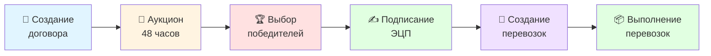
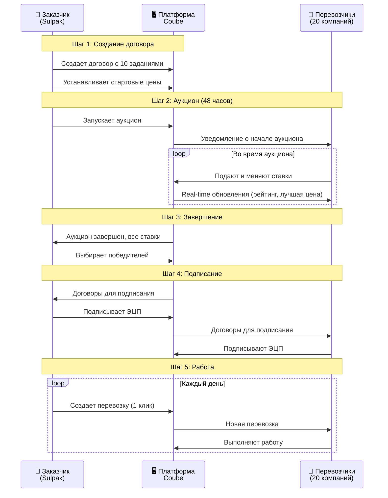

# Интеграция Sulpak - Бизнес-презентация

**Дата создания**: 2026-02-03
**Версия**: 2.0 (Бизнес-версия для партнеров)
**Статус**: ✅ Готово к обсуждению

---

## 💡 Суть решения

Новая функциональность платформы Coube для работы с массовыми перевозками через систему аукционов. Решение разработано специально для крупных заказчиков, таких как Sulpak, которым необходимо регулярно организовывать множество перевозок с оптимальными ценами.

### Основная идея

**Один рамочный договор → множество перевозок через аукцион**

**Было:**
- Создавать отдельную заявку для каждой перевозки
- Договариваться о цене каждый раз
- Подписывать документы ЭЦП для каждой перевозки

**Стало:**
- Создать один договор с несколькими заданиями
- Провести аукцион для определения лучших цен
- Подписать договор один раз
- Создавать множество перевозок без повторного подписания

---

## ✨ Основные преимущества

| Участник | Преимущества |
|----------|--------------|
| **💼 Заказчик (Sulpak)** | • Экономия 15-20% благодаря аукциону • Экономия времени - один договор вместо множества • Гибкость - можно выбрать нескольких победителей • Полная прозрачность и контроль |
| **🚚 Перевозчики** | • Доступ к крупным заказчикам • Честная конкуренция с прозрачными правилами • Можно менять ставки неограниченно • Долгосрочные договоры и предсказуемая загрузка |
| **🏆 Платформа Coube** | • Привлечение премиум-клиентов • Рост количества перевозок на 30-50% • Уникальная функция на рынке • Конкурентное преимущество |

---

## 🔄 Как это работает

### Общий процесс

### Детальный процесс аукциона

### Ключевые моменты процесса

1. **Создание договора** - Заказчик создает договор с заданиями (маршруты, груз, требования к транспорту)
2. **Аукцион** - Перевозчики конкурируют, видят свой рейтинг и лучшую цену в реальном времени
3. **Выбор победителей** - Заказчик сам выбирает (можно нескольких для одного задания)
4. **Подписание ЭЦП** - Делается один раз для всех будущих перевозок
5. **Создание перевозок** - Одним кликом, указывая только дату/время

---

## 📋 Пример: Sulpak - перевозки бытовой техники

**Ситуация:**
- 10 регулярных маршрутов по Казахстану
- Нужны конкурентные цены и надежность

### Процесс

```mermaid
gantt
    title Процесс работы с Sulpak
    dateFormat DD
    section Подготовка
    Создание договора с 10 заданиями    :done, 01, 1d

    section Аукцион
    20 перевозчиков подают ставки       :active, 01, 3d

    section Результаты
    Выбор победителей                   :03, 1d
    Подписание ЭЦП                      :04, 1d

    section Работа
    Создание перевозок (ежедневно)      :05, 26d
```

**Результаты:**

| Этап | Детали |
|------|--------|
| **День 1** | Договор создан, аукцион запущен (стартовые цены: 150,000-300,000 тг) |
| **День 1-3** | 20 перевозчиков конкурируют в реальном времени |
| **День 3** | Победители выбраны (итоговые цены: 120,000-250,000 тг, **экономия 15-20%**) |
| **День 4** | Все договоры подписаны ЭЦП |
| **День 5+** | Ежедневное создание перевозок одним кликом |

**Итого за месяц:**
- ✅ 1 аукцион
- ✅ 10 договоров с победителями
- ✅ 150+ перевозок выполнено
- ✅ Экономия ~15-20% на стоимости
- ✅ Экономия 60-70% времени сотрудников
- ✅ Полная прозрачность и контроль

---

## ⏱️ Сроки реализации

**Общий срок: 3-4 недели**

| Этап | Срок |
|------|------|
| Базовая версия (MVP) | 3 недели |
| Полировка и тестирование | 1 неделя |

**Что будет готово:**
✅ Создание договора с заданиями • ✅ Аукцион с real-time обновлениями • ✅ Выбор победителей • ✅ Подписание ЭЦП • ✅ Создание перевозок • ✅ Уведомления и отчеты

---

## 🎯 Следующие шаги

1. **Согласование** - Обсуждение с Sulpak и уточнение деталей
2. **Разработка** - 3-4 недели с еженедельными демонстрациями
3. **Пилотный запуск** - Тестирование на 1-2 реальных аукционах
4. **Полный запуск** - Масштабирование на всех участников

---

## 📊 Ожидаемые результаты

### Для Sulpak

| Метрика | Результат |
|---------|-----------|
| Экономия на стоимости перевозок | **15-20%** |
| Экономия времени сотрудников | **60-70%** |
| Количество перевозок в месяц | **100-200+** |
| Прозрачность процесса | **100%** |

### Для платформы Coube

| Метрика | Результат |
|---------|-----------|
| Новый тип клиентов | Крупные ритейлеры, производители |
| Рост количества перевозок | **+30-50%** |
| Конкурентное преимущество | Уникальная функция на рынке |
| Привлечение перевозчиков | Новые возможности для заработка |

---

## 📝 Заключение

Инновационное решение для массовых перевозок через систему аукционов обеспечивает **экономическую выгоду** для всех участников, **простоту использования** и **прозрачность процесса**.

Готовы к реализации за **3-4 недели**.

---

## 💼 Контакты

**Проектная команда Coube**: [контакты команды]
**Представители Sulpak**: [получить при согласовании]

---

**Дата обновления:** 2026-02-03 | **Версия:** 2.0 (Бизнес) | **Статус:** ✅ Готово к обсуждению
