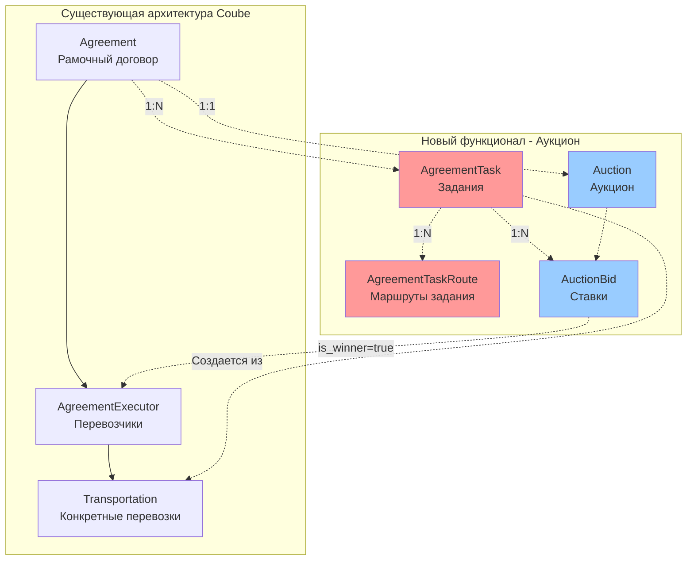
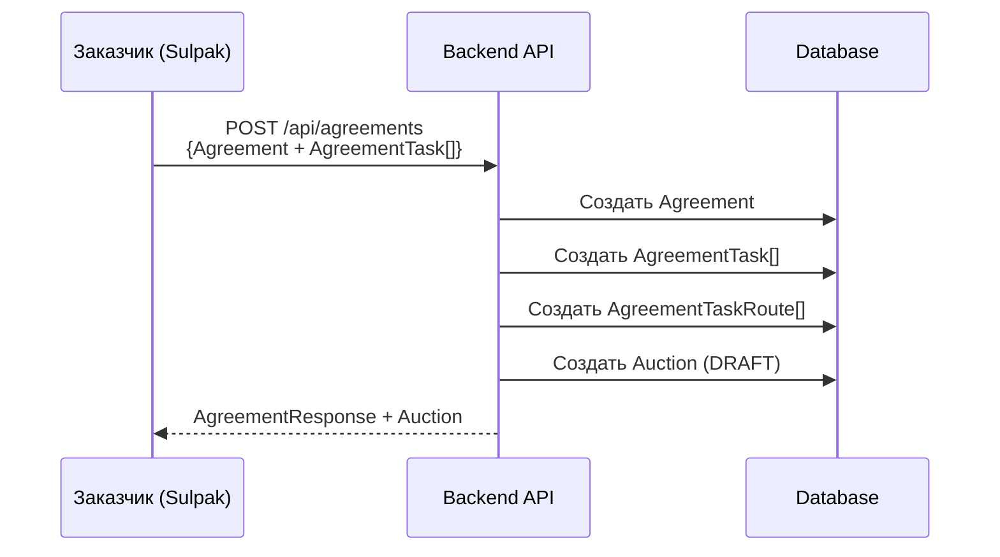
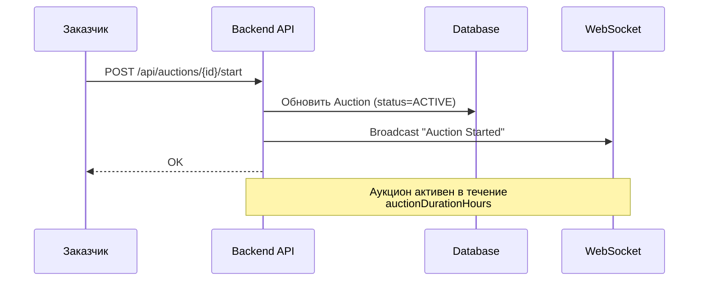
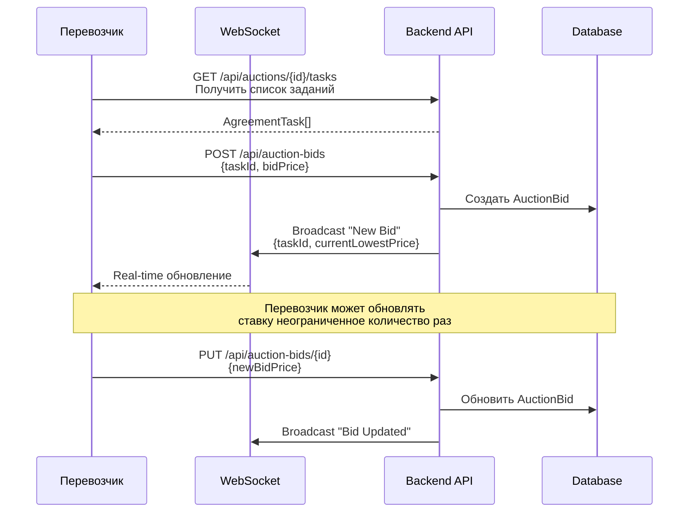
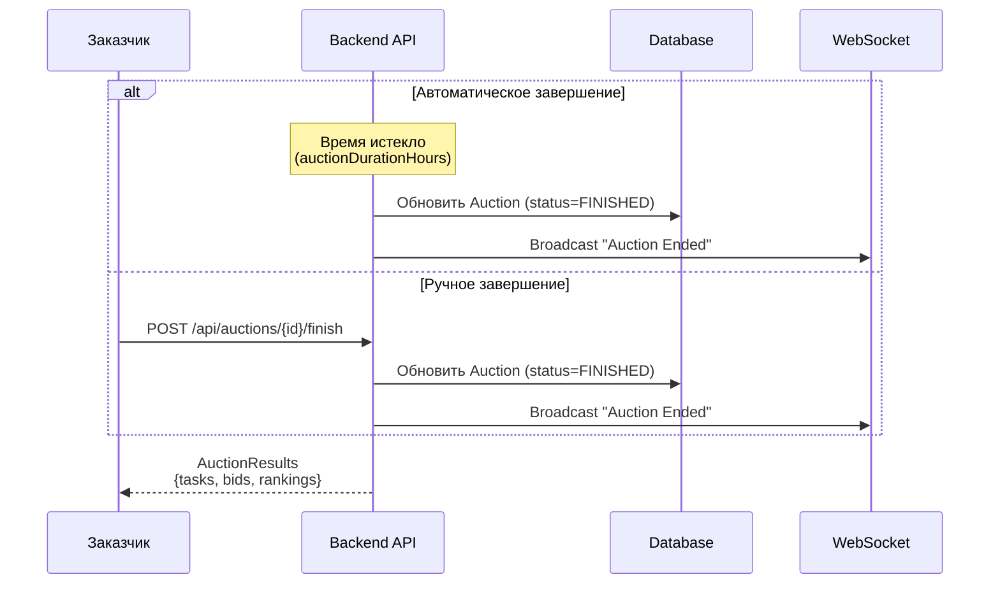
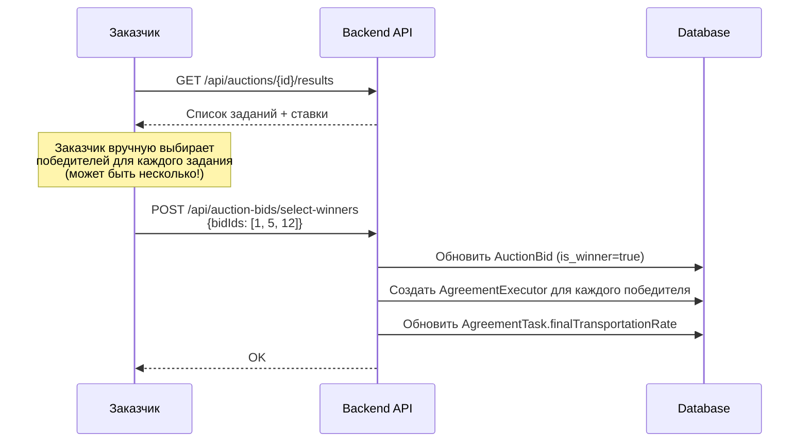
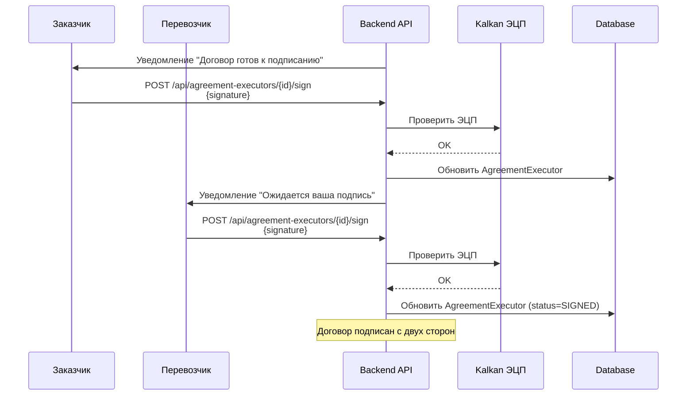
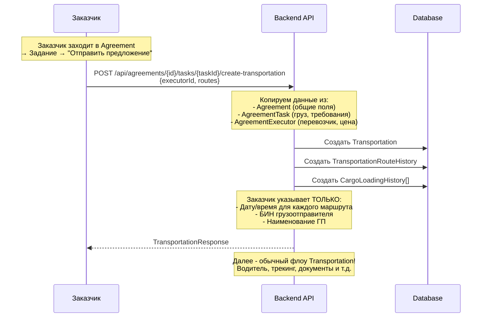

# Интеграция Sulpak - Версия 2 (Упрощенная)

**Дата создания**: 2026-02-03
**Версия**: 2.0
**Статус**: ✅ Готово к обсуждению
**Приоритет**: 🔴 HIGH - Стратегическая интеграция

---

## 📋 Содержание

1. [Краткое резюме](#краткое-резюме)
2. [Ключевые изменения](#ключевые-изменения)
3. [Архитектура решения](#архитектура-решения)
4. [Детальный флоу работы](#детальный-флоу-работы)
5. [Структура БД](#структура-бд)
6. [API Endpoints](#api-endpoints)
7. [Оценка трудозатрат](#оценка-трудозатрат)
8. [Сравнение с версией 1](#сравнение-с-версией-1)

---

## 🎯 Краткое резюме

### Основная идея

**Agreement (Договор о массовых перевозках)** становится **шаблоном** для создания множества **Transportation** через механизм **аукциона**.

### Ключевые преимущества ✅

- ✅ **Один договор → множество перевозок** (не нужно подписывать ЭЦП для каждой Transportation)
- ✅ **Аукцион определяет цены** для каждого задания
- ✅ **Real-time торги** через WebSocket
- ✅ **Гибкость:** один заказчик может выбрать несколько победителей для одного задания
- ✅ **Минимум изменений** в существующей архитектуре Coube

### Цифры

| Параметр | Значение |
|----------|----------|
| **Новые таблицы** | 4 (вместо 13 в v1) |
| **Изменения в Agreement** | +8 полей, -1 поле |
| **Новые сервисы** | 3-4 |
| **API endpoints** | ~15 |
| **Время разработки** | **3-4 недели** |
| **Риски** | 🟢 LOW |

---

## 🔄 Ключевые изменения

### 1. Изменения в Agreement (Договор)

#### ❌ Убираем:
- География договора (countries) - переносим в задания

#### ✅ Добавляем:
```java
@Column(name = "publication_end_date")
private LocalDateTime publicationEndDate; // Дата окончания публикации

@Column(name = "is_indefinite")
private Boolean isIndefinite = false; // Бессрочно

@Column(name = "contract_duration_days")
private Integer contractDurationDays; // Срок действия договора

@Column(name = "transportation_rate")
private BigDecimal transportationRate; // Тариф перевозки (базовый)

@Column(name = "downtime_cost_with_vat")
private BigDecimal downtimeCostWithVat; // Сумма простоя с НДС

@Column(name = "downtime_cost_without_vat")
private BigDecimal downtimeCostWithoutVat; // Сумма простоя без НДС

@Column(name = "advance_payment")
private BigDecimal advancePayment; // Аванс

@Column(name = "auction_duration_hours")
private Integer auctionDurationHours; // Время действия аукциона
```

#### 🔄 Перемещаем из Transportation в Agreement:
- ~~Быстрая оплата~~ → уже есть `useFactoring` ✅
- ~~Страхование~~ → остается в Transportation
- ~~Количество дней отсрочки~~ → уже есть `paymentDelay` ✅

---

### 2. Новая сущность: AgreementTask (Задание)

**Концепция:** Одно задание = один шаблон для одной или нескольких Transportation.

```java
@Entity
@Table(name = "agreement_task", schema = "applications")
public class AgreementTask extends BaseIdEntity {

  @ManyToOne(fetch = FetchType.LAZY)
  @JoinColumn(name = "agreement_id")
  private Agreement agreement;

  // === Данные груза ===
  @Column(name = "cargo_name")
  private String cargoName;

  @ManyToOne(fetch = FetchType.LAZY)
  @JoinColumn(name = "cargo_type_id")
  private CargoType cargoType;

  @Column(name = "cargo_weight")
  private BigDecimal cargoWeight;

  @Enumerated(EnumType.STRING)
  private WeightUnit cargoWeightUnit;

  @Column(name = "cargo_volume")
  private BigDecimal cargoVolume;

  @Enumerated(EnumType.STRING)
  private CapacityUnit capacityUnit;

  // === Требования к ТС ===
  @ManyToOne(fetch = FetchType.LAZY)
  @JoinColumn(name = "vehicle_body_type_id")
  private VehicleBodyType vehicleBodyType;

  @ManyToOne(fetch = FetchType.LAZY)
  @JoinColumn(name = "capacity_value_id")
  private CapacityValue capacityValue;

  // === Стоимость ===
  @Column(name = "base_transportation_rate")
  private BigDecimal baseTransportationRate; // Стартовая цена для аукциона

  @Column(name = "final_transportation_rate")
  private BigDecimal finalTransportationRate; // Победившая ставка

  // === Страхование ===
  @Column(name = "is_insurance_required")
  private Boolean isInsuranceRequired = false;

  // === Маршруты (связь с AgreementTaskRoute) ===
  @OneToMany(mappedBy = "agreementTask", cascade = CascadeType.ALL)
  private List<AgreementTaskRoute> routes = new ArrayList<>();

  // === Дополнительно ===
  @Column(name = "task_number")
  private String taskNumber; // Номер задания в рамках Agreement

  @Column(name = "additional_info")
  private String additionalInfo;
}
```

---

### 3. Новая сущность: AgreementTaskRoute (Маршруты задания)

**Важно:** Маршруты в задании **БЕЗ даты/времени**, БИН грузоотправителя и наименования ГП.

```java
@Entity
@Table(name = "agreement_task_route", schema = "applications")
public class AgreementTaskRoute extends BaseIdEntity {

  @ManyToOne(fetch = FetchType.LAZY)
  @JoinColumn(name = "agreement_task_id")
  private AgreementTask agreementTask;

  @Column(name = "route_order")
  private Integer routeOrder; // Порядок точки в маршруте

  @Column(name = "route_type")
  @Enumerated(EnumType.STRING)
  private RouteType routeType; // LOADING, UNLOADING

  // === Адрес ===
  @Column(name = "address")
  private String address;

  @Column(name = "city")
  private String city;

  @ManyToOne(fetch = FetchType.LAZY)
  @JoinColumn(name = "country_id")
  private Country country;

  @Column(name = "latitude")
  private BigDecimal latitude;

  @Column(name = "longitude")
  private BigDecimal longitude;

  // === Контакты ===
  @Column(name = "contact_person")
  private String contactPerson;

  @Column(name = "contact_phone")
  private String contactPhone;

  // ❌ НЕТ: дата/время, БИН, наименование ГП
  // Эти поля добавляются при создании Transportation!
}
```

---

### 4. Аукцион

#### 4.1. Auction (Аукцион)

```java
@Entity
@Table(name = "auction", schema = "applications")
public class Auction extends BaseIdEntity {

  @OneToOne(fetch = FetchType.LAZY)
  @JoinColumn(name = "agreement_id")
  private Agreement agreement;

  @Enumerated(EnumType.STRING)
  private AuctionStatus status; // DRAFT, ACTIVE, FINISHED, CANCELLED

  @Column(name = "start_time")
  private LocalDateTime startTime;

  @Column(name = "end_time")
  private LocalDateTime endTime;

  @ManyToOne(fetch = FetchType.LAZY)
  @JoinColumn(name = "created_by_id")
  private Employee createdBy;
}
```

#### 4.2. AuctionBid (Ставки перевозчиков)

```java
@Entity
@Table(name = "auction_bid", schema = "applications")
public class AuctionBid extends BaseIdEntity {

  @ManyToOne(fetch = FetchType.LAZY)
  @JoinColumn(name = "agreement_task_id")
  private AgreementTask agreementTask;

  @ManyToOne(fetch = FetchType.LAZY)
  @JoinColumn(name = "organization_id")
  private Organization organization; // Перевозчик

  @Column(name = "bid_price")
  private BigDecimal bidPrice; // Цена ставки

  @Column(name = "submitted_at")
  private LocalDateTime submittedAt;

  @Column(name = "is_winner")
  private Boolean isWinner = false; // Выбирает заказчик вручную

  // === Дополнительно ===
  @Column(name = "comment")
  private String comment; // Комментарий перевозчика
}
```

---

## 🏗️ Архитектура решения

### Общая схема



### Связь с существующей системой

**Используем без изменений:**
- ✅ `Organization` - заказчик, перевозчики
- ✅ `Employee` - пользователи системы
- ✅ `Agreement` - рамочный договор (+ новые поля)
- ✅ `AgreementExecutor` - создается после выбора победителя
- ✅ `Transportation` - создается из AgreementTask
- ✅ `Contract` - для разовых заявок (как раньше)
- ✅ Keycloak - авторизация
- ✅ Kalkan - ЭЦП

**Добавляем:**
- 🆕 `AgreementTask` - задания в договоре
- 🆕 `AgreementTaskRoute` - маршруты задания
- 🆕 `Auction` - аукцион
- 🆕 `AuctionBid` - ставки

---

## 📊 Детальный флоу работы

### Этап 1: Создание Agreement с заданиями



**Пример запроса:**

```json
{
  "customerOrganizationId": 123,
  "deadlineDate": "2026-03-01T00:00:00",
  "withoutDeadline": false,
  "transportationType": "FTL",
  "agreementEndDate": "2026-12-31T23:59:59",
  "publicationEndDate": "2026-02-15T23:59:59",
  "isIndefinite": false,
  "contractDurationDays": 30,
  "paymentDelay": 15,
  "transportationRate": 150000,
  "downtimeCostWithVat": 5000,
  "downtimeCostWithoutVat": 4200,
  "advancePayment": 50000,
  "auctionDurationHours": 48,
  "useFactoring": false,
  "useInsurance": false,
  "isSignedEds": true,

  "tasks": [
    {
      "taskNumber": "TASK-001",
      "cargoName": "Бытовая техника",
      "cargoTypeId": 5,
      "cargoWeight": 5000,
      "cargoWeightUnit": "KG",
      "cargoVolume": 30,
      "capacityUnit": "CBM",
      "vehicleBodyTypeId": 2,
      "capacityValueId": 3,
      "baseTransportationRate": 200000,
      "isInsuranceRequired": true,
      "routes": [
        {
          "routeOrder": 1,
          "routeType": "LOADING",
          "address": "ул. Складская 10",
          "city": "Алматы",
          "countryId": 1,
          "contactPerson": "Иванов И.И.",
          "contactPhone": "+77001234567"
        },
        {
          "routeOrder": 2,
          "routeType": "UNLOADING",
          "address": "пр. Абая 50",
          "city": "Астана",
          "countryId": 1,
          "contactPerson": "Петров П.П.",
          "contactPhone": "+77007654321"
        }
      ]
    },
    {
      "taskNumber": "TASK-002",
      "cargoName": "Электроника",
      "cargoTypeId": 6,
      "cargoWeight": 3000,
      "cargoWeightUnit": "KG",
      "cargoVolume": 20,
      "capacityUnit": "CBM",
      "vehicleBodyTypeId": 2,
      "capacityValueId": 2,
      "baseTransportationRate": 150000,
      "isInsuranceRequired": true,
      "routes": [...]
    }
  ]
}
```

---

### Этап 2: Запуск аукциона



---

### Этап 3: Подача ставок (Real-time)



**Важно:** Перевозчик видит только:
- Свою текущую ставку
- Лучшую (минимальную) ставку по заданию
- Свое место в рейтинге (1, 2, 3...)

**НЕ видит:**
- Конкретные ставки других перевозчиков
- Кто именно подал ставку

---

### Этап 4: Завершение аукциона



---

### Этап 5: Выбор победителей



**Пример запроса:**

```json
{
  "auctionId": 123,
  "winners": [
    {
      "taskId": 1,
      "bidIds": [15, 22] // Два победителя для TASK-001
    },
    {
      "taskId": 2,
      "bidIds": [33] // Один победитель для TASK-002
    }
  ]
}
```

**Результат:**
- Создается `AgreementExecutor` для каждого победителя
- `AgreementExecutor.agreementId` = Agreement.id
- Готов к подписанию ЭЦП

---

### Этап 6: Подписание договора (ЭЦП)



**Используем существующий функционал:**
- `AgreementService.sign()`
- `KalkanSignatureService`
- Все работает как обычно! ✅

---

### Этап 7: Создание Transportation из задания



**Пример запроса:**

```json
{
  "agreementId": 123,
  "taskId": 1,
  "executorId": 456, // AgreementExecutor.id
  "routes": [
    {
      "routeOrder": 1,
      "plannedDateTime": "2026-02-10T09:00:00", // ← НОВОЕ!
      "senderBin": "123456789012", // ← НОВОЕ!
      "senderName": "ТОО Поставщик" // ← НОВОЕ!
    },
    {
      "routeOrder": 2,
      "plannedDateTime": "2026-02-10T15:00:00", // ← НОВОЕ!
      "receiverBin": "987654321098", // ← НОВОЕ!
      "receiverName": "ТОО Получатель" // ← НОВОЕ!
    }
  ]
}
```

**Результат:**
```java
// Создается Transportation со всеми полями из:
transportation.setCustomerOrganization(agreement.getCustomerOrganization());
transportation.setExecutorOrganization(agreementExecutor.getOrganization());
transportation.setCargoName(agreementTask.getCargoName());
transportation.setCargoType(agreementTask.getCargoType());
transportation.setCargoWeight(agreementTask.getCargoWeight());
transportation.setVehicleBodyType(agreementTask.getVehicleBodyType());
transportation.setAgreementBased(true);
transportation.setAgreement(agreementExecutor);
// И т.д.

// Маршруты копируются из AgreementTaskRoute + добавляются дата/время
```

---

### Этап 8: Выполнение Transportation

**Используем 100% существующий функционал Coube:**

1. Перевозчик назначает водителя
2. Водитель видит заявку в мобильном приложении
3. Трекинг, отметки точек маршрута
4. Загрузка документов
5. Завершение, акты, счета
6. ЭЦП документов

✅ **Ничего не меняем!**

---

## 🗄️ Структура БД

### 1. Изменения в существующих таблицах

#### Agreement (applications.agreement)

```sql
-- Убираем
ALTER TABLE applications.agreement
  DROP COLUMN IF EXISTS countries; -- Переносим в задания

-- Добавляем
ALTER TABLE applications.agreement
  ADD COLUMN publication_end_date TIMESTAMP,
  ADD COLUMN is_indefinite BOOLEAN DEFAULT false,
  ADD COLUMN contract_duration_days INTEGER,
  ADD COLUMN transportation_rate NUMERIC(12,2),
  ADD COLUMN downtime_cost_with_vat NUMERIC(12,2),
  ADD COLUMN downtime_cost_without_vat NUMERIC(12,2),
  ADD COLUMN advance_payment NUMERIC(12,2),
  ADD COLUMN auction_duration_hours INTEGER;

-- Комментарии
COMMENT ON COLUMN applications.agreement.publication_end_date IS 'Дата окончания публикации аукциона';
COMMENT ON COLUMN applications.agreement.is_indefinite IS 'Бессрочный договор';
COMMENT ON COLUMN applications.agreement.contract_duration_days IS 'Срок действия договора (дней)';
COMMENT ON COLUMN applications.agreement.transportation_rate IS 'Базовый тариф перевозки';
COMMENT ON COLUMN applications.agreement.downtime_cost_with_vat IS 'Стоимость простоя с НДС';
COMMENT ON COLUMN applications.agreement.downtime_cost_without_vat IS 'Стоимость простоя без НДС';
COMMENT ON COLUMN applications.agreement.advance_payment IS 'Размер аванса';
COMMENT ON COLUMN applications.agreement.auction_duration_hours IS 'Продолжительность аукциона (часов)';
```

---

### 2. Новые таблицы

#### AgreementTask (applications.agreement_task)

```sql
CREATE TABLE applications.agreement_task (
  id BIGSERIAL PRIMARY KEY,
  agreement_id BIGINT NOT NULL REFERENCES applications.agreement(id) ON DELETE CASCADE,

  -- Идентификация
  task_number VARCHAR(50) NOT NULL, -- TASK-001

  -- Данные груза
  cargo_name TEXT,
  cargo_type_id BIGINT REFERENCES dictionaries.cargo_type(id),
  cargo_weight NUMERIC(12,2),
  cargo_weight_unit VARCHAR(10), -- KG, TON
  cargo_volume NUMERIC(12,2),
  capacity_unit VARCHAR(10), -- CBM, PALLET

  -- Требования к ТС
  vehicle_body_type_id BIGINT REFERENCES dictionaries.vehicle_body_type(id),
  capacity_value_id BIGINT REFERENCES dictionaries.capacity_value(id),

  -- Стоимость
  base_transportation_rate NUMERIC(12,2), -- Стартовая цена для аукциона
  final_transportation_rate NUMERIC(12,2), -- Победившая ставка (заполняется после аукциона)

  -- Страхование
  is_insurance_required BOOLEAN DEFAULT false,

  -- Дополнительно
  additional_info TEXT,

  -- Audit
  created_at TIMESTAMP DEFAULT CURRENT_TIMESTAMP,
  updated_at TIMESTAMP DEFAULT CURRENT_TIMESTAMP,
  created_by_id BIGINT REFERENCES users.employee(id),

  CONSTRAINT uk_agreement_task_number UNIQUE (agreement_id, task_number)
);

CREATE INDEX idx_agreement_task_agreement ON applications.agreement_task(agreement_id);
CREATE INDEX idx_agreement_task_cargo_type ON applications.agreement_task(cargo_type_id);

COMMENT ON TABLE applications.agreement_task IS 'Задания в рамках договора о массовых перевозках';
COMMENT ON COLUMN applications.agreement_task.base_transportation_rate IS 'Стартовая цена для аукциона';
COMMENT ON COLUMN applications.agreement_task.final_transportation_rate IS 'Победившая ставка после аукциона';
```

---

#### AgreementTaskRoute (applications.agreement_task_route)

```sql
CREATE TABLE applications.agreement_task_route (
  id BIGSERIAL PRIMARY KEY,
  agreement_task_id BIGINT NOT NULL REFERENCES applications.agreement_task(id) ON DELETE CASCADE,

  -- Порядок
  route_order INTEGER NOT NULL, -- 1, 2, 3...
  route_type VARCHAR(20) NOT NULL, -- LOADING, UNLOADING

  -- Адрес
  address TEXT,
  city VARCHAR(255),
  country_id BIGINT REFERENCES dictionaries.country(id),
  latitude NUMERIC(10,7),
  longitude NUMERIC(10,7),

  -- Контакты
  contact_person VARCHAR(255),
  contact_phone VARCHAR(50),

  -- ❌ БЕЗ: planned_date_time, sender_bin, sender_name, receiver_bin, receiver_name
  -- Эти поля добавляются при создании Transportation!

  -- Audit
  created_at TIMESTAMP DEFAULT CURRENT_TIMESTAMP,

  CONSTRAINT uk_task_route_order UNIQUE (agreement_task_id, route_order)
);

CREATE INDEX idx_agreement_task_route_task ON applications.agreement_task_route(agreement_task_id);

COMMENT ON TABLE applications.agreement_task_route IS 'Маршруты задания (шаблон без дат/времени)';
COMMENT ON COLUMN applications.agreement_task_route.route_type IS 'Тип точки: LOADING (погрузка) или UNLOADING (разгрузка)';
```

---

#### Auction (applications.auction)

```sql
CREATE TABLE applications.auction (
  id BIGSERIAL PRIMARY KEY,
  agreement_id BIGINT NOT NULL UNIQUE REFERENCES applications.agreement(id) ON DELETE CASCADE,

  -- Статусы
  status VARCHAR(20) NOT NULL DEFAULT 'DRAFT', -- DRAFT, ACTIVE, FINISHED, CANCELLED

  -- Временные рамки
  start_time TIMESTAMP,
  end_time TIMESTAMP,

  -- Автор
  created_by_id BIGINT NOT NULL REFERENCES users.employee(id),

  -- Audit
  created_at TIMESTAMP DEFAULT CURRENT_TIMESTAMP,
  updated_at TIMESTAMP DEFAULT CURRENT_TIMESTAMP,
  finished_at TIMESTAMP,

  CONSTRAINT chk_auction_status CHECK (status IN ('DRAFT', 'ACTIVE', 'FINISHED', 'CANCELLED'))
);

CREATE INDEX idx_auction_agreement ON applications.auction(agreement_id);
CREATE INDEX idx_auction_status ON applications.auction(status);
CREATE INDEX idx_auction_times ON applications.auction(start_time, end_time);

COMMENT ON TABLE applications.auction IS 'Аукцион для определения цен по заданиям';
COMMENT ON COLUMN applications.auction.status IS 'DRAFT - черновик, ACTIVE - идет торг, FINISHED - завершен, CANCELLED - отменен';
```

---

#### AuctionBid (applications.auction_bid)

```sql
CREATE TABLE applications.auction_bid (
  id BIGSERIAL PRIMARY KEY,
  agreement_task_id BIGINT NOT NULL REFERENCES applications.agreement_task(id) ON DELETE CASCADE,
  organization_id BIGINT NOT NULL REFERENCES users.organization(id),

  -- Ставка
  bid_price NUMERIC(12,2) NOT NULL,

  -- Статус
  is_winner BOOLEAN DEFAULT false, -- Выбирает заказчик вручную

  -- Дополнительно
  comment TEXT, -- Комментарий перевозчика

  -- Audit
  submitted_at TIMESTAMP DEFAULT CURRENT_TIMESTAMP,
  updated_at TIMESTAMP DEFAULT CURRENT_TIMESTAMP,

  CONSTRAINT chk_bid_price_positive CHECK (bid_price > 0)
);

CREATE INDEX idx_auction_bid_task ON applications.auction_bid(agreement_task_id);
CREATE INDEX idx_auction_bid_org ON applications.auction_bid(organization_id);
CREATE INDEX idx_auction_bid_winner ON applications.auction_bid(is_winner);
CREATE INDEX idx_auction_bid_price ON applications.auction_bid(agreement_task_id, bid_price);

-- Уникальность: один перевозчик - одна активная ставка на задание
-- (при обновлении ставки обновляется существующая запись)
CREATE UNIQUE INDEX uk_auction_bid_org_task
  ON applications.auction_bid(agreement_task_id, organization_id);

COMMENT ON TABLE applications.auction_bid IS 'Ставки перевозчиков в аукционе';
COMMENT ON COLUMN applications.auction_bid.is_winner IS 'Победитель, выбранный заказчиком вручную';
```

---

### 3. Enums

```java
// AuctionStatus.java
public enum AuctionStatus {
  DRAFT,      // Черновик
  ACTIVE,     // Идет торг
  FINISHED,   // Завершен
  CANCELLED   // Отменен
}

// RouteType.java (уже существует или добавляем)
public enum RouteType {
  LOADING,    // Погрузка
  UNLOADING   // Разгрузка
}
```

---

## 🔌 API Endpoints

### 1. Agreement + Tasks

```
POST   /api/agreements
  → Создать Agreement + AgreementTask[] + Auction

GET    /api/agreements/{id}
  → Получить Agreement с заданиями

PUT    /api/agreements/{id}
  → Обновить Agreement (если аукцион еще не начался)

DELETE /api/agreements/{id}
  → Удалить Agreement (каскадно удаляются задания и аукцион)

GET    /api/agreements/{id}/tasks
  → Получить список заданий

POST   /api/agreements/{id}/tasks
  → Добавить задание

PUT    /api/agreements/tasks/{id}
  → Обновить задание

DELETE /api/agreements/tasks/{id}
  → Удалить задание
```

---

### 2. Auction

```
GET    /api/auctions/{id}
  → Получить информацию об аукционе

POST   /api/auctions/{id}/start
  → Запустить аукцион (status=ACTIVE)

POST   /api/auctions/{id}/finish
  → Завершить аукцион вручную (status=FINISHED)

POST   /api/auctions/{id}/cancel
  → Отменить аукцион (status=CANCELLED)

GET    /api/auctions/{id}/results
  → Получить результаты аукциона (после завершения)
```

---

### 3. AuctionBid

```
GET    /api/auction-bids
  ?auctionId={id}
  ?taskId={id}
  ?organizationId={id}
  → Получить ставки (с фильтрами)

POST   /api/auction-bids
  → Подать ставку
  Body: {
    "agreementTaskId": 1,
    "bidPrice": 180000,
    "comment": "Готовы выполнить"
  }

PUT    /api/auction-bids/{id}
  → Обновить ставку (цену)

DELETE /api/auction-bids/{id}
  → Отозвать ставку

POST   /api/auction-bids/select-winners
  → Выбрать победителей
  Body: {
    "auctionId": 123,
    "winners": [
      {"taskId": 1, "bidIds": [15, 22]},
      {"taskId": 2, "bidIds": [33]}
    ]
  }
```

---

### 4. Transportation from Task

```
POST   /api/agreements/{id}/tasks/{taskId}/create-transportation
  → Создать Transportation из задания
  Body: {
    "executorId": 456, // AgreementExecutor.id
    "routes": [
      {
        "routeOrder": 1,
        "plannedDateTime": "2026-02-10T09:00:00",
        "senderBin": "123456789012",
        "senderName": "ТОО Поставщик"
      },
      {
        "routeOrder": 2,
        "plannedDateTime": "2026-02-10T15:00:00",
        "receiverBin": "987654321098",
        "receiverName": "ТОО Получатель"
      }
    ]
  }

GET    /api/agreements/{id}/transportations
  → Получить все Transportation созданные из Agreement
```

---

### 5. WebSocket (Real-time)

```
WS     /ws/auctions/{auctionId}
  → Real-time обновления во время аукциона

Events:
  - AUCTION_STARTED
  - NEW_BID { taskId, currentLowestPrice, bidCount }
  - BID_UPDATED { taskId, currentLowestPrice }
  - AUCTION_FINISHED
  - WINNERS_SELECTED { taskId, winnerIds[] }
```

---

## 📦 Сервисы Backend

### 1. AgreementTaskService.java

```java
@Service
public class AgreementTaskService {

  // Создание задания
  public AgreementTask createTask(AgreementTaskCreateRequest request);

  // Обновление задания
  public AgreementTask updateTask(Long id, AgreementTaskUpdateRequest request);

  // Получение заданий по Agreement
  public List<AgreementTask> getTasksByAgreement(Long agreementId);

  // Удаление задания
  public void deleteTask(Long id);

  // Создать Transportation из задания
  public Transportation createTransportationFromTask(
    Long taskId,
    Long executorId,
    TransportationRouteRequest[] routes
  );
}
```

---

### 2. AuctionService.java

```java
@Service
public class AuctionService {

  // Создать аукцион (автоматически при создании Agreement)
  public Auction createAuction(Agreement agreement);

  // Запустить аукцион
  public Auction startAuction(Long auctionId);

  // Завершить аукцион
  public Auction finishAuction(Long auctionId);

  // Отменить аукцион
  public Auction cancelAuction(Long auctionId);

  // Получить результаты
  public AuctionResultsDto getResults(Long auctionId);

  // Автоматическое завершение по таймеру
  @Scheduled(fixedDelay = 60000) // Каждую минуту
  public void checkExpiredAuctions();
}
```

---

### 3. AuctionBidService.java

```java
@Service
public class AuctionBidService {

  // Подать ставку
  public AuctionBid submitBid(AuctionBidRequest request);

  // Обновить ставку
  public AuctionBid updateBid(Long bidId, BigDecimal newPrice);

  // Отозвать ставку
  public void withdrawBid(Long bidId);

  // Получить ставки по заданию
  public List<AuctionBid> getBidsByTask(Long taskId);

  // Получить текущую ставку перевозчика
  public AuctionBid getCurrentBid(Long taskId, Long organizationId);

  // Выбрать победителей
  public void selectWinners(SelectWinnersRequest request);

  // Получить рейтинг ставок по заданию
  public List<BidRankingDto> getRanking(Long taskId);
}
```

---

### 4. AuctionWebSocketService.java

```java
@Service
public class AuctionWebSocketService {

  @Autowired
  private SimpMessagingTemplate messagingTemplate;

  // Broadcast новой ставки
  public void broadcastNewBid(Long auctionId, Long taskId, AuctionBid bid) {
    messagingTemplate.convertAndSend(
      "/topic/auction/" + auctionId,
      new AuctionEvent("NEW_BID", taskId, getCurrentLowestPrice(taskId))
    );
  }

  // Broadcast завершения аукциона
  public void broadcastAuctionFinished(Long auctionId) {
    messagingTemplate.convertAndSend(
      "/topic/auction/" + auctionId,
      new AuctionEvent("AUCTION_FINISHED")
    );
  }
}
```

---

## ⏱️ Оценка трудозатрат

### Backend

| Задача | Трудозатрат |
|--------|-------------|
| **1. Миграции БД** | |
| - Изменения в Agreement | 0.5 дня |
| - AgreementTask + Routes | 1 день |
| - Auction + Bids | 1 день |
| **2. Entity + Repository** | |
| - AgreementTask, Route | 1 день |
| - Auction, AuctionBid | 1 день |
| **3. Services** | |
| - AgreementTaskService | 2 дня |
| - AuctionService | 3 дня |
| - AuctionBidService | 3 дня |
| - AuctionWebSocketService | 2 дня |
| **4. Controllers (API)** | |
| - AgreementTaskController | 1 день |
| - AuctionController | 1 день |
| - AuctionBidController | 2 дня |
| **5. Integration** | |
| - Agreement → Task → Transportation | 2 дня |
| - WebSocket конфигурация | 1 день |
| **6. Testing** | |
| - Unit тесты | 3 дня |
| - Integration тесты | 2 дня |
| **ИТОГО Backend** | **22 дня (4.4 недели)** |

---

### Frontend

| Задача | Трудозатрат |
|--------|-------------|
| **1. Agreement UI** | |
| - Форма создания Agreement + Tasks | 3 дня |
| - Список заданий | 1 день |
| **2. Auction UI** | |
| - Страница аукциона | 2 дня |
| - Real-time обновления (WebSocket) | 2 дня |
| - Подача ставок (перевозчики) | 2 дня |
| - Выбор победителей (заказчик) | 2 дня |
| **3. Transportation from Task** | |
| - Форма создания Transportation из задания | 2 дня |
| **4. Testing + Polish** | |
| - Тестирование | 2 дня |
| **ИТОГО Frontend** | **16 дней (3.2 недели)** |

---

### Общая оценка

| Компонент | Трудозатрат |
|-----------|-------------|
| Backend | 22 дня |
| Frontend | 16 дней |
| **Параллельная разработка** | **~3 недели** |
| **+ Резерв (20%)** | **+1 неделя** |
| **ИТОГО** | **3-4 недели** |

**Команда:**
- 1-2 Backend разработчика
- 1 Frontend разработчик
- 0.5 QA (part-time)

---

## 📊 Сравнение с версией 1

| Параметр | Версия 1 (сложная) | Версия 2 (упрощенная) | Разница |
|----------|--------------------|-----------------------|---------|
| **Таблицы БД** | 13 | **4** | ↓ 69% |
| **Новые сервисы** | 13 | **4** | ↓ 69% |
| **API endpoints** | 35 | **~15** | ↓ 57% |
| **Время разработки** | 12-16 недель | **3-4 недели** | ↓ 75% |
| **Команда** | 2-3 backend + 1 frontend | **1-2 backend + 1 frontend** | ↓ 33% |
| **Сложность** | HIGH | **LOW** | ✅ |
| **Риски** | MEDIUM-HIGH | **LOW** | ✅ |

---

### Что упростили:

| Функционал v1 | В v2 | Причина |
|---------------|------|---------|
| Двухэтапная система торгов | ❌ Убрали | Один аукцион проще |
| Пропорциональное квотирование (60/20/20) | ❌ Убрали | Заказчик сам выбирает победителей |
| Автоматические таймеры и переходы | ❌ Убрали | Ручное управление проще |
| Редукцион вверх/вниз | ❌ Убрали | Один аукцион достаточно |
| Мини-тендеры | ❌ Убрали | Можно добавить позже |
| Real-time рейтинг БЕЗ раскрытия цен | ✅ Оставили | Ключевая фича |
| Неограниченные ставки | ✅ Оставили | Как требуется |
| Ручной выбор победителей | ✅ Оставили | Гибкость для заказчика |
| Несколько победителей на задание | ✅ Оставили | Как требуется |

---

## ✅ Итоговые преимущества решения

### 1. Бизнес-ценность
- ✅ Один договор → множество перевозок (не нужно подписывать ЭЦП каждый раз)
- ✅ Аукцион определяет лучшие цены
- ✅ Гибкость: заказчик сам выбирает победителей
- ✅ Прозрачность: все ставки в системе
- ✅ Автоматизация: минимум ручной работы

### 2. Технические преимущества
- ✅ **Минимум изменений** в существующей архитектуре
- ✅ **Используем 80%** готового функционала Coube
- ✅ **Чистая архитектура:** новые таблицы не ломают старые
- ✅ **Масштабируемость:** легко добавить новые типы аукционов
- ✅ **Безопасность:** все на уровне Agreement → проверенный функционал

### 3. Разработка
- ✅ **3-4 недели** вместо 12-16
- ✅ **Низкие риски** - простая логика
- ✅ **Легко тестировать** - понятный флоу
- ✅ **Быстрый MVP** - можно запустить за 3 недели

---

## 🚀 План запуска

### Фаза 1: MVP (3 недели)
**Цель:** Базовый аукцион работает

- ✅ Agreement + AgreementTask + Routes
- ✅ Auction + AuctionBid
- ✅ API для создания/управления
- ✅ WebSocket для real-time ставок
- ✅ Выбор победителей
- ✅ Создание Transportation из задания

**Результат:** Можно провести аукцион и создать перевозки

---

### Фаза 2: Полировка (1 неделя)
**Цель:** Удобный UX и все edge cases

- ✅ UI/UX полировка
- ✅ Уведомления (email, push)
- ✅ Отчеты по аукционам
- ✅ Тестирование со Sulpak
- ✅ Документация

**Результат:** Полноценная система готова к продакшену

---

### Фаза 3: Масштабирование (опционально, позже)
**Если понадобится:**

- Автоматические таймеры и переходы
- Пропорциональное распределение
- Редукцион вверх/вниз
- Мини-тендеры
- Сложная SLA аналитика

---

## 📝 Выводы

### ✅ Готовность к реализации

**Оценка:** 🟢 **ГОТОВО К РАЗРАБОТКЕ**

**Обоснование:**
1. ✅ Архитектура продумана и опирается на существующий код
2. ✅ Минимум изменений = минимум рисков
3. ✅ Четкий флоу понятен и разработчикам, и бизнесу
4. ✅ Реалистичные сроки (3-4 недели)
5. ✅ Легко масштабировать в будущем

---

### 🎯 Следующие шаги

1. **Согласование с руководством** (этот документ)
2. **Уточнение деталей** с представителями Sulpak
3. **Разработка** (3-4 недели)
4. **Тестирование** на реальных данных
5. **Запуск** в продакшен

---

## 📎 Приложения

### A. Пример полного флоу

```
День 1: Заказчик (Sulpak)
  → Создает Agreement на февраль 2026
  → Добавляет 10 заданий (маршруты по Казахстану)
  → Стартовые цены: 150,000 - 300,000 тг
  → Запускает аукцион на 48 часов

День 1-3: Перевозчики (20 компаний)
  → Видят список заданий
  → Подают ставки (можно менять неограниченно)
  → Видят свой рейтинг и лучшую цену
  → Конкурируют в реальном времени

День 3: Аукцион завершается
  → Sulpak видит все ставки
  → Выбирает победителей (для некоторых заданий - по 2-3 перевозчика)
  → Система создает AgreementExecutor для каждого победителя

День 4: Подписание ЭЦП
  → Sulpak подписывает договоры
  → Перевозчики подписывают
  → Договоры активны

День 5+: Создание Transportation
  → Sulpak заходит в Agreement → Задание #1 → "Отправить предложение"
  → Указывает дату/время маршрутов
  → Создается Transportation #1
  → Перевозчик назначает водителя
  → Стандартный флоу Coube

Итого: 10 заданий → 10+ Transportation → 1 аукцион → 1 раз ЭЦП
```

---

### B. Риски и митигация

| Риск | Вероятность | Влияние | Митигация |
|------|-------------|---------|-----------|
| WebSocket нагрузка при большом количестве участников | 🟡 MEDIUM | 🟡 MEDIUM | Redis pub/sub, throttling обновлений |
| Конфликты при одновременном обновлении ставок | 🟡 MEDIUM | 🔴 HIGH | Pessimistic locking, транзакции БД |
| Изменение требований в процессе | 🟡 MEDIUM | 🟡 MEDIUM | Гибкая методология, итерации |

---

**Контакты для вопросов:**
- Проектная команда Coube: [указать]
- Представители Sulpak: [получить при согласовании]

---

**Дата последнего обновления:** 2026-02-03
**Версия документа:** 2.0
**Готово к обсуждению:** ✅
