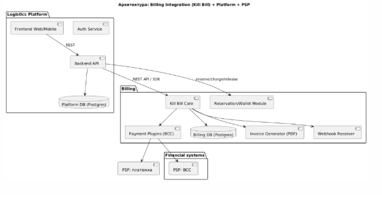
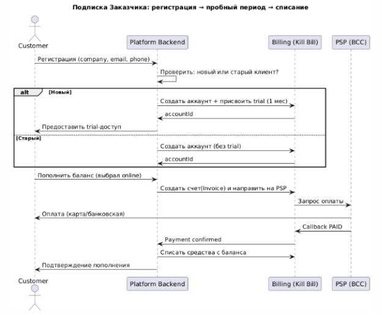
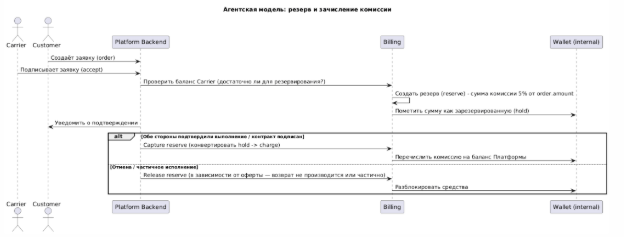

**Ключевые бизнес-правила**

1. **Взаиморасчёты между Заказчиком и Исполнителем проходят напрямую.** Платформа не участвует в переводах между ними, но:
   1. ведёт баланс пользователей (авансовые платежи) и списывает с баланса комиссию / плату за подписку / резервирует средства;
   1. генерирует документы (счета, АВР/АКТ, отчёты)
1. **Монетизация:**
   1. 2A — Подписка (только для Заказчика). Оплата ежемесячно; платёж идёт с баланса; есть пробный период для «новых» клиентов.
   1. 2B — Агентская модель (только для Исполнителя). Комиссия 5% от суммы заявки; резервирование суммы и последующее зачисление комиссии на баланс платформы при подтверждении.
1. **Клиенты: новые и старые**
   1. «Новый» = впервые зарегистрировался.
   1. Для новых = пробный/тестовый период (стандартно 1 месяц).
   1. Для старых = индивидуальные условия (отсрочка, частичная оплата).
1. **Баланс и резервирование:**
   1. Баланс = аванс для оплаты подписки/комиссии. Пополнение: выставление счёта (авто) или онлайн-оплата (интеграция сначала с BCC).
   1. Платформа отображает ежедневное уменьшение баланса (стоимость 1 дня) и показывает зарезервированные средства для заявок.
   1. Оповещения при низком балансе (email/веб-уведомление/SMS).
1. **Документооборот:** все проводки и АВР формируются платформой

**Техническое задание**

\
**Цель:** Внедрение готового биллинг-решения (Kill Bill) для работы с подписками и оплатой услуг платформы

**Источник:** <https://github.com/killbill/killbill>

**Общие требования**

1. Система должна обеспечивать:
   1. Создание тарифных планов (подписка, разовый платёж, оплата за использование).
   1. Выставление инвойсов (счетов) пользователям.
   1. Автоматическую генерацию PDF/электронных счетов.
   1. Интеграцию с локальными платёжными шлюзами (платежка/BCC) — через API.
   1. REST API для взаимодействия с нашей платформой.
1. Возможность развертывания в контейнерах (Docker) для упрощения деплоя.

**Архитектурные требования**

- **Язык реализации:** Java (Kill Bill)
- **База данных:** PostgreSQL
- **API взаимодействия:** REST, JSON
- **UI:** веб-интерфейс Kill Bill Admin + кастомная интеграция в нашу платформу
- **Инфраструктура:**
  - Разворачиваем в Docker
  - Отдельная БД для биллинга
  - Поддержка логирования и мониторинга

**Примечания:**

- Отдельные БД: платформа и биллинг (чтобы разграничивать ответственность, упростить /миграции).
- Kill Bill выступает центральной системой учёта подписок, инвойсов, платежей, резервов.
- Webhook Receiver — обязательная часть для обработки callback'ов от PSP (на второй этап реализации)

  ·  **Система биллинга:** рекомендую Kill Bill (модель подписок, резервы/оплаты, плагины для PSP). Требует JVM, PostgreSQL и docker-compose.

  ·  **Pop-up / Webhook:** отдельно реализовать endpoint /billing/webhook/{psp} для обработки callback'ов от платежки (позже).

  ·  **Ежедневный** job, который:

- считает дневную амортизацию подписки (daily\_cost = monthly\_fee / days\_in\_month) и уменьшает баланс (или помечает для списания);
- уведомляет пользователей при пороге (например, < 3 дня).

  ·  **Резервы:** implement hold/reserve pattern: при создании резерва создаём запись Reservation (status=HOLD), уменьшаем available\_balance (но не total\_balance). Capture/Release в зависимости от результата.

  ·  **Документы:** каждая финансовая операция — source of truth в Billing; есть экспорт (REST/CSV/XML) с сопроводительными метаданными (номер счёта, дата, суммы, тип операции, контрагент).

  ·  **Отчётность:** бинго-файлы/отчёты по АВР, по комиссии (по клиенту, по периоду).

  ·  **Безопасность:** все API calls от платформы к биллингу — по mTLS / JWT; подпись webhook'ов от PSP.

  ·  **Разделение прав:** админская часть для управления тарифами, пробным периодом и политиками блокировок.

# **Сущности (минимальный ER)**
- User (id, company\_name, email, phone, role [customer/carrier], status, created\_at, deleted\_at)
- AccountBilling (id, user\_id, kb\_account\_id, balance, reserved\_amount, is\_new\_flag, trial\_ends\_at)
- Order (id, customer\_id, carrier\_id, amount\_total, status, created\_at)
- Reservation (id, account\_id, order\_id, amount, currency, status, created\_at)
- Invoice (id, kb\_invoice\_id, account\_id, amount, type [subscription/agent/payout], status, created\_at)
- Payment (id, kb\_payment\_id, invoice\_id, amount, status, psp\_txn\_id)
- Document (id, invoice\_id, type [AVR, invoice], file\_url)

**Endpoints API**

коллекция ключевых endpoint'ов и примеры curl. Kill Bill используется как биллинг-ядро; часть логики (определение new/old, блокировки, UI) — в Platform Backend.

Примечание: пути и поля — рекомендательные
### 1) Регистрация пользователя на платформе → создание биллинг-аккаунта
POST /api/v1/billing/accounts

Headers: Authorization: Bearer <platform\_token>

Body:

{

`  `"externalKey": "company\_123",

`  `"name": "ООО РЕЙС-1",

`  `"email": "acc@example.kz",

`  `"phone": "+7701XXXXXXX",

`  `"isNew": true

}

**Пример curl**

curl -X POST https://platform.example/api/v1/billing/accounts \

`  `-H "Authorization: Bearer ${TOKEN}" \

`  `-H "Content-Type: application/json" \

`  `-d '{"externalKey":"company\_123","name":"ООО РЕЙС-1","email":"acc@example.kz","phone":"+7701XXXXXXX","isNew":true}'

**Ответ**

{

`  `"accountId": "uuid-1234",

`  `"kbAccountId": "kb-uuid-5678",

`  `"trialEndsAt": "2025-11-01T00:00:00Z"

}

### 2) Создать/назначить подписку (подписка ежемесячная)
POST /api/v1/billing/subscriptions

Body:

{

`  `"kbAccountId":"kb-uuid-5678",

`  `"planKey":"standard-monthly",

`  `"startDate":"2025-10-01"

}

curl:

curl -X POST https://platform.example/api/v1/billing/subscriptions \

`  `-H "Authorization: Bearer ${TOKEN}" \

`  `-d '{"kbAccountId":"kb-uuid-5678","planKey":"standard-monthly","startDate":"2025-10-01"}'
### 3) Создать инвойс на пополнение баланса (выставление счёта)
POST /api/v1/billing/invoices/create

Body:

{

`  `"kbAccountId":"kb-uuid-5678",

`  `"amount": 100000,

`  `"currency":"KZT",

`  `"description":"Пополнение баланса Coube"

}

Ответ содержит: invoiceId, paymentLink (если online).
### 4) Обработка callback от PSP (универсальный)
POST /api/v1/billing/webhook/jusan

Body (пример):

{

`  `"invoiceId": "inv-123",

`  `"status": "PAID",

`  `"pspTransactionId": "JUSAN-987654",

`  `"amount": 100000,

`  `"currency": "KZT"

}

— После получения: в billing отмечаем оплату, увеличиваем balance, создаём запись Payment и экспортируем АВР.
### 5) Резервирование комиссии при подписании заявки (агентская модель)
POST /api/v1/billing/reservations

Body:

{

`  `"kbAccountId":"kb-uuid-carrier",

`  `"orderId":"order-999",

`  `"amount": 5000,       // 5% комиссии (например)

`  `"currency":"KZT",

`  `"reason":"commission\_reserve"

}

**При успешном:** возвращаем reservationId, reserved\_amount, available\_balance.
### 6) Подтверждение заявки (capture reserve)
POST /api/v1/billing/reservations/{reservationId}/capture

Body:

{

`  `"confirmBy":"system",

`  `"captureAmount": 5000

}

— В результате: сумма переводится в баланс платформы (или выставляется Invoice платформе), создаётся проводка и экспорт в 1С.
### 7) Освобождение резерва (release)
POST /api/v1/billing/reservations/{reservationId}/release

Body:

{

`  `"releasedBy":"carrier",

`  `"reason":"order\_cancelled"

}

### 8) Получение баланса и детального статуса (для ЛК)
GET /api/v1/billing/accounts/{kbAccountId}/balance

Response:

{

`  `"total\_balance": 150000,

`  `"available\_balance": 140000,

`  `"reserved\_balance": 10000,

`  `"currency":"KZT",

`  `"next\_subscription\_charge": "2025-11-01",

`  `"trialEndsAt": "2025-11-01"

}

**Политики и сценарии (ключевые проверки)**

1. **Определение new/old** — при регистрации проверять существующие записи по сочетанию (company\_name OR email OR phone). Если совпадение и deleted\_at != null → считать «старой» (как написано в документе). Логика для пробного тарифa должна учитывать именно это правило.
1. **Блокировка при отрицательном балансе** — политика:
   1. при balance < 0 → отправить уведомление + временно закрыть публикацию новых заявок/доступ к премиум-функциям;
   1. напоминания: за 7, 3, 1 день до окончания средств.
1. **Резервы и отмены** — корнер-кейс: если оферта говорит, что при отмене возврат не проводится, то release может быть запрещён — тогда при отмене сумма остаётся у платформы; такие правила отражаются в настройках договора/типа заявки.
1. **Документы** — каждый факт списания/начисления должен иметь «проводку» и файл (PDF счёт/АКТ) и быть доступен в ЛК.

**Подзадачи для разработчиков (пошагово)**

1. **Установка окружения:**
   1. Поднять контейнер с PostgreSQL
   1. Поднять контейнер с Kill Bill (последний релиз с GitHub Docker Hub)
   1. Проверить доступность админки Kill Bill
1. **Первичная настройка:**
   1. Создать тестовый аккаунт клиента
   1. Создать тестовый тарифный план (например: "Подписка за 10 000₸/мес")
   1. Выставить инвойс тестовому клиенту через API
   1. Проверить автогенерацию счетов
1. **Интеграция с нашей платформой:**
   1. Настроить REST API взаимодействие 
   1. Подключить вызов API для создания инвойса при оказании услуги
   1. Сделать ручной вызов "оплаты" (пока заглушка)
1. **Подготовка к проду:**
   1. Настроить резервное копирование БД
   1. Подключить мониторинг контейнера (healthcheck)
   1. Задокументировать API-вызовы (Swagger/Postman коллекция)

**На выходе**

- Рабочий стенд Kill Bill в Docker
- Действующая админка Kill Bill
- Тестовые тарифы и счета
- Документация по установке и интеграции
- Подготовленные API-методы для работы нашей платформы с биллингом

**Тарифные планы заказчика**

Подписка на платформу применяется только для Роли Заказчик. Возникает только один ежемесячный тариф, в который включен весь функционал Платформы. Оплата за Платформу происходит ежемесячно, при этом будет генерироваться  АВР за услуги платформы.

Оплата будет происходит за счет средств, размещенных на балансе клиента. Баланс клиента представляет собой авансовый платеж за услуги Платформы. Для пополнения баланса в Личном кабинете, возможны два варианта:

\- выписать счет на предоставление услуг Платформы Coube (счет должен выставляться автоматически)

\- пополнить счет через платежную систему.

Техническая реализация:

- - необходимо вести учет «старых» и «новых» клиентов в разрезе оплаты. БП по блокировки «старых» и «новых» клиентов будет различный. «Новый клиент» - это клиент, который впервые зарегистрировался на платформе. Обратить внимание, что удаление учетной записи компании должно быть логическим и новая учетная запись, с существующими ранее данными считается «старой» компанией в разрезе Пробного тарифа и «новой» компанией для всего остального функционала.

  Для «новых» клиентов:

- ` `Действует пробный тариф. На старте проекта, длительность Пробного периода - 1месяц
- Функционал, стоимость (0 -.. тенге) и длительность регулируется администратором Платформы.

Для «старых» клиентов:

- отсрочка платежа / частичная оплата рассматривается индивидуально
- доступный ограниченный функционал системы
- в ЛК необходимо показывать ежедневное уменьшение баланса на величину стоимости 1-го дня (переменная величина для разных месяцев и для разных клиентов)
- анализ баланса и своевременное оповещение клиента об отсутствие средств на балансе

**Тарифные планы исполнителя**

На первом этапе будет только один тариф, в который включен весь функционал Платформы и составляет 5% от суммы заявки. 

Критерии для резервирования / «зачисления» средств с Баланса клиента на баланс Платформы:

\- При подписании Заявки к контракту или разового контракта/заявки, происходит резервирование средств Исполнителя

\- При подтверждении Заявки второй стороной происходит «зачисление средств на счет» Платформы

\- При отмене Заявки, частичного исполнения, … Возврат ДС не происходит (описано в оферте)

Оплата за Платформу будет происходить Ежемесячно, при этом будет генерироваться АВР за услуги платформы в разрезе Процентной ставки каждого клиента

## На этапе, когда ещё нет интеграции с банками и платёжками, биллинг не сможет сам проверить факт оплаты. Тогда используется ручное подтверждение админом в админке Kill Bill
1. Клиент в ЛК нажимает «Пополнить баланс» → система генерирует **счёт (PDF)**.
1. Клиент оплачивает его через банк (обычным переводом).
1. Деньги приходят на расчётный счёт компании (см. выписку в банке или 1С).
1. Администратор в «админке» биллинга вручную отмечает оплату:
   1. выбирает счёт,
   1. вводит сумму и дату,
   1. система увеличивает баланс клиента.

