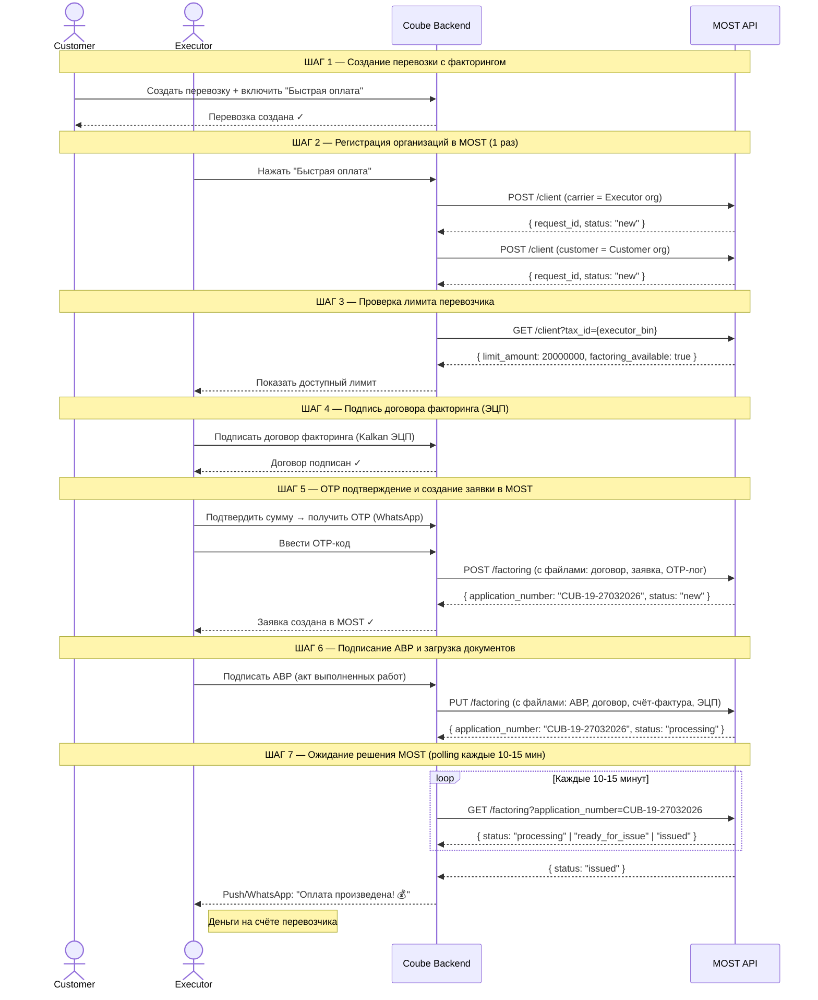
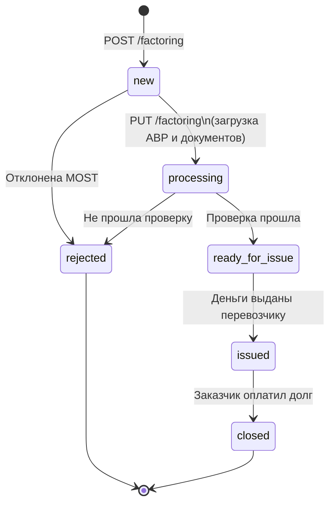

# MOST FinTech — Process Flow

Визуальное описание того, как работает интеграция факторинга между Coube и MOST FinTech.

---

## 1. Участники системы

```
┌─────────────┐     ┌─────────────┐     ┌─────────────────────┐
│  CUSTOMER   │     │   COUBE     │     │    MOST FinTech      │
│  Заказчик   │────▶│  Платформа  │────▶│  Факторинговая       │
│ перевозки   │     │  (бэкенд)   │     │  компания (API)      │
└─────────────┘     └─────────────┘     └─────────────────────┘
                           │
                    ┌──────▼──────┐
                    │  EXECUTOR   │
                    │ Перевозчик  │
                    │ (получает   │
                    │   деньги)   │
                    └─────────────┘
```

- **Customer** — компания, которая заказывает перевозку груза
- **Executor** — перевозчик, который везёт груз и хочет получить деньги быстро (не ждать оплаты)
- **Coube** — платформа, которая управляет перевозками и общается с MOST через API
- **MOST FinTech** — факторинговая компания, которая выплачивает деньги перевозчику авансом

---

## 2. Полный жизненный цикл факторинговой заявки



---

## 3. Детальный флоу API-вызовов

### 3.1 Регистрация клиентов (ШАГ 2)

> Выполняется **один раз** при первом обращении организации к факторингу.
> Повторно — не вызывается (Coube сохраняет `most_registered_at`).

```
Executor нажимает "Быстрая оплата"
              │
              ▼
┌─────────────────────────────────┐
│ Coube проверяет: организация    │
│ уже зарегистрирована в MOST?    │
│ (most_registered_at IS NOT NULL)│
└─────────────────────────────────┘
         │              │
        ДА             НЕТ
         │              │
         │              ▼
         │   POST /client (carrier)
         │   ┌────────────────────────┐
         │   │ tax_id    = Executor.bin
         │   │ title     = Org.name   │
         │   │ role      = "carrier"  │
         │   │ ceo_*     = директор   │
         │   │ contact_* = подписант  │
         │   └────────────────────────┘
         │              │
         │              ▼
         │   POST /client (customer)
         │   ┌────────────────────────┐
         │   │ tax_id    = Customer.bin
         │   │ title     = Org.name   │
         │   │ role      = "customer" │
         │   └────────────────────────┘
         │              │
         └──────────────▼
              Продолжить
```

---

### 3.2 Проверка лимита (ШАГ 3)

```
GET /client?tax_id={executor_bin}
              │
    ┌─────────▼──────────┐
    │  limit_amount = ?  │
    └─────────┬──────────┘
              │
    ┌─────────┴──────────┐
    │                    │
   null           число (напр. 20000000)
    │                    │
    ▼                    ▼
Показать:           Показать:
"Организация        "Доступный лимит:
проходит            20 000 000 ₸"
проверку.
Факторинг
недоступен"
[Кнопка заблокирована]
```

---

### 3.3 Создание заявки (ШАГ 5)

> Срабатывает **после подтверждения OTP**.

```
POST /factoring
┌──────────────────────────────────────────┐
│ environment       = "test" / "prod"       │
│ coube_application_id = transportation.id  │
│                                           │
│ carrier_tax_id    = Executor.bin          │
│ carrier_iban      = Executor.bankAccount  │
│ carrier_contact_* = подписант             │
│                                           │
│ customer_tax_id   = Customer.bin          │
│ customer_contact_* = контакт заказчика   │
│                                           │
│ service_amount    = полная сумма перевозки│
│ factoring_amount  = запрошенная сумма     │
│ tariff            = тариф комиссии        │
│                                           │
│ [PDF] factoring_agreement — договор факт. │
│ [PDF] factoring_payout    — заявка на факт│
│ [TXT] otp_validation      — лог OTP       │
└──────────────────────────────────────────┘
              │
              ▼
     { application_number: "CUB-19-27032026",
       status: "new" }
              │
              ▼
   Coube сохраняет most_application_number
   в payout_request
```

---

### 3.4 Загрузка документов (ШАГ 6)

> Срабатывает **после подписания АВР** (scheduled job каждые 5 мин).

```
PUT /factoring
┌──────────────────────────────────────────┐
│ environment          = "test" / "prod"    │
│ coube_application_id = transportation.id  │
│ application_number   = "CUB-19-27032026" │
│                                           │
│ carrier_tax_id, carrier_iban — те же!     │
│ customer_tax_id               — тот же!  │
│ service_amount, factoring_amount, tariff  │
│                        — те же значения!  │
│                                           │
│ [PDF] avr      — акт выполненных работ    │
│ [PDF] contract — договор перевозки        │
│ [PDF] invoice  — счёт-фактура             │
│ [P7S] cms      — CMS-подпись (PKCS7)      │
└──────────────────────────────────────────┘
              │
              ▼
     { application_number: "CUB-19-27032026",
       status: "processing" }
```

> **Важно:** все числовые поля и реквизиты должны **совпадать** с теми, что были в POST.
> При несовпадении → `422` с указанием расходящихся полей.

---

## 4. Статусы факторинговой заявки



| Статус MOST | Что означает | Действие Coube |
|---|---|---|
| `new` | Заявка создана, ждёт документов | — |
| `processing` | Документы загружены, MOST проверяет | — |
| `ready_for_issue` | Проверка прошла | Уведомить (опционально) |
| `issued` | Деньги перечислены перевозчику | → статус PAID, уведомление |
| `rejected` | Заявка отклонена | → статус REJECTED, уведомление |
| `closed` | Заказчик вернул деньги MOST | → статус PAID (если не был) |

---

## 5. Статусы внутри Coube (PayoutRequest)

```
INITIATED ──▶ SMS_PENDING ──▶ CONFIRMED ──▶ DOCUMENTS_SENT ──▶ AVR_DOCS_SENT ──▶ PAID
                                                                                    ▲
                                                                          REJECTED ─┘
                                                                          (если MOST отклонил)
```

| Статус Coube | Что произошло |
|---|---|
| `INITIATED` | Перевозчик нажал "Быстрая оплата" |
| `SMS_PENDING` | OTP отправлен по WhatsApp |
| `CONFIRMED` | OTP подтверждён, заявка создана в MOST |
| `DOCUMENTS_SENT` | Email с документами отправлен |
| `AVR_DOCS_SENT` | АВР подписан, документы загружены в MOST |
| `PAID` | MOST выплатил деньги |
| `REJECTED` | MOST отклонил заявку |

---

## 6. Коды ошибок API

| HTTP код | Когда возникает | Что делать |
|---|---|---|
| `401` | Неверный или отсутствующий `X-API-Key` | Проверить ключ в конфигурации |
| `404` | Клиент или заявка не найдена | Зарегистрировать клиента / проверить номер |
| `409` | PUT при статусе заявки не `new` | Проверить текущий статус через GET |
| `422` | Ошибка валидации или несовпадение полей | Смотреть `detail.fields` — там список расхождений |

**Пример 422 при несовпадении полей:**
```json
{
  "detail": {
    "message": "field mismatch",
    "fields": ["service_amount", "carrier_iban"]
  }
}
```

---

## 7. Retry-механизм (Outbox)

Вызовы к MOST могут падать из-за сетевых ошибок. Coube использует **Outbox-паттерн**:

```
Событие (OTP подтверждён / АВР подписан)
              │
              ▼
┌─────────────────────────────┐
│  most_api_outbox (таблица)  │
│  operation: CREATE / UPLOAD │
│  status: PENDING            │
│  attempts: 0                │
└─────────────────────────────┘
              │
              ▼ каждую минуту
┌─────────────────────────────┐
│  Scheduler проверяет outbox │
│  → вызывает MOST API        │
│  → при успехе: COMPLETED    │
│  → при ошибке: retry через  │
│    1 → 2 → 4 → 8 → 16 мин  │
│  → после 5 попыток: FAILED  │
└─────────────────────────────┘
```

---

## 8. Схема данных (что откуда берётся)

```
Coube → MOST: маппинг полей
─────────────────────────────────────────────────────────────
MOST поле                ←  Coube источник
─────────────────────────────────────────────────────────────
carrier_tax_id           ←  Organization.bin (executor)
carrier_iban             ←  BankRequisite.account (executor)
carrier_contact_fullname ←  Employee.fullName (подписант)
carrier_contact_phone    ←  Employee.phone (подписант)
carrier_contact_email    ←  Employee.email (подписант)
─────────────────────────────────────────────────────────────
customer_tax_id          ←  Organization.bin (customer)
customer_contact_*       ←  контактное лицо customer
─────────────────────────────────────────────────────────────
service_amount           ←  Transportation cost (полная)
factoring_amount         ←  PayoutRequest.financingAmount
tariff                   ←  FactorTariff.name / percentage
─────────────────────────────────────────────────────────────
factoring_agreement      ←  PDF подписанного договора факт.
factoring_payout         ←  PDF заявки на факторинг
otp_validation           ←  TXT лог OTP-подтверждения
─────────────────────────────────────────────────────────────
avr                      ←  PDF акта выполненных работ
contract                 ←  PDF договора перевозки
invoice                  ←  PDF счёт-фактуры
cms                      ←  P7S файл ЭЦП (PKCS7)
─────────────────────────────────────────────────────────────
```

---

## 9. Быстрая шпаргалка по API

```bash
BASE_URL="https://testcf.mfomost.kz/api/v1/coube"
API_KEY="7hDa3pXnQkLMV2rTyUz8JcWbNsFqReH1"

# Проверить клиента
curl -H "X-API-Key: $API_KEY" "$BASE_URL/client?tax_id=240940029297"

# Зарегистрировать клиента
curl -X POST -H "X-API-Key: $API_KEY" \
  -F "environment=test" -F "tax_id=991100223344" \
  -F "title=ТОО Перевозчик" -F "role=carrier" \
  "$BASE_URL/client"

# Проверить статус заявки
curl -H "X-API-Key: $API_KEY" "$BASE_URL/factoring?application_number=CUB-19-27032026"

# Создать факторинговую заявку
curl -X POST -H "X-API-Key: $API_KEY" \
  -F "environment=test" \
  -F "coube_application_id=COUBE-001" \
  -F "carrier_tax_id=991100223344" \
  -F "carrier_iban=KZ123456789012345678" \
  -F "customer_tax_id=991100223355" \
  -F "service_amount=500000.00" \
  -F "factoring_amount=400000.00" \
  -F "tariff=2.5" \
  -F "factoring_agreement=@agreement.pdf;type=application/pdf" \
  -F "factoring_payout=@payout.pdf;type=application/pdf" \
  -F "otp_validation=@otp.txt;type=text/plain" \
  "$BASE_URL/factoring"

# Загрузить документы (перевести в processing)
curl -X PUT -H "X-API-Key: $API_KEY" \
  -F "environment=test" \
  -F "application_number=CUB-19-27032026" \
  -F "coube_application_id=COUBE-001" \
  -F "carrier_tax_id=991100223344" \
  -F "carrier_iban=KZ123456789012345678" \
  -F "customer_tax_id=991100223355" \
  -F "service_amount=500000.00" \
  -F "factoring_amount=400000.00" \
  -F "tariff=2.5" \
  -F "avr=@avr.pdf;type=application/pdf" \
  -F "contract=@contract.pdf;type=application/pdf" \
  -F "invoice=@invoice.pdf;type=application/pdf" \
  -F "cms=@signature.p7s;type=application/pkcs7-signature" \
  "$BASE_URL/factoring"
```
