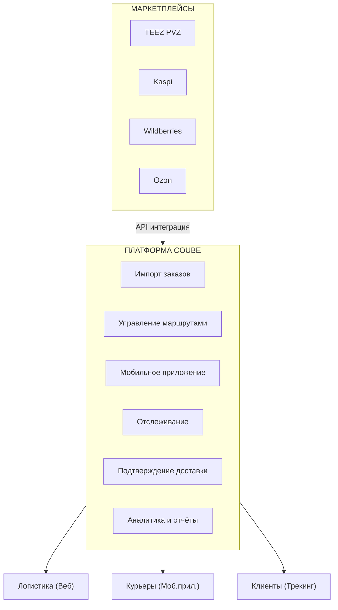
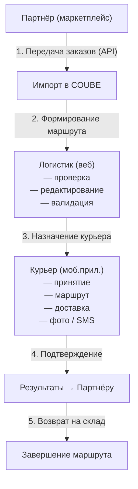
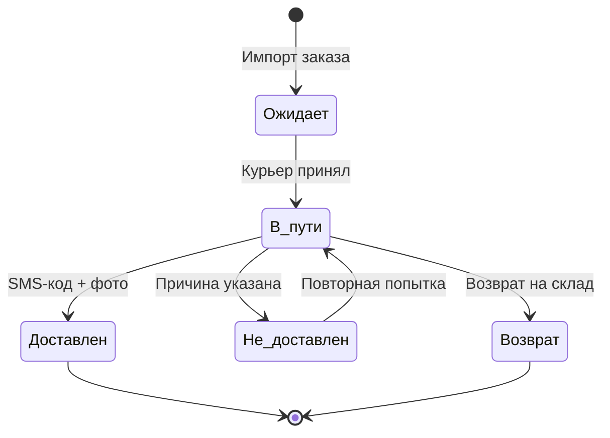
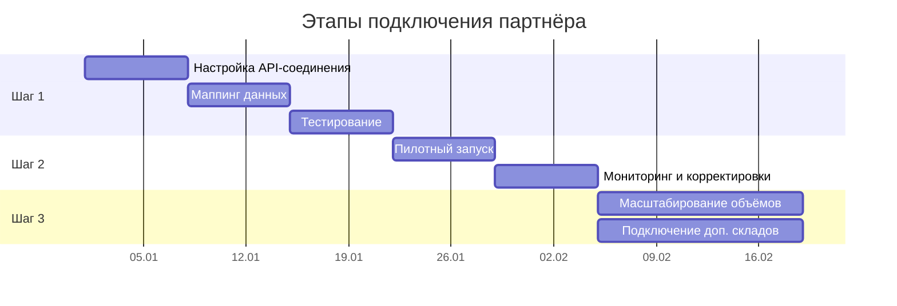

# Коммерческое предложение

## Платформа COUBE — Курьерская доставка

---

## О платформе

**COUBE** — транспортно-логистическая платформа, объединяющая заказчиков, перевозчиков и курьеров в единую цифровую экосистему.

Платформа уже работает в сегменте грузоперевозок (FTL, LTL, городские перевозки) и расширяет возможности в направлении **курьерской доставки последней мили**.

**Первый партнёр — TEEZ PVZ** — успешно интегрирован и работает на платформе.

---

## Проблемы рынка

| Проблема | Последствия |
|----------|-------------|
| Разрозненные системы учёта заказов | Потеря посылок, задержки, ошибки |
| Отсутствие прозрачности доставки | Клиенты не знают, где их заказ |
| Ручное распределение маршрутов | Неэффективное использование курьеров |
| Нет единого окна для нескольких маркетплейсов | Логисты работают в 3–5 системах одновременно |
| Сложность контроля курьеров | Нет подтверждения доставки, фото, SMS |

---

## Решение COUBE

### Единая платформа для управления курьерской доставкой

---

## Функциональные возможности

### 1. Интеграция с маркетплейсами и партнёрами

- **Автоматический импорт заказов** через API (накладные, маршруты, адреса)
- **Универсальный коннектор** — одна интеграция для подключения к любой площадке
- **Поддержка источников**: TEEZ PVZ, Kaspi, Wildberries, Ozon и другие
- **Двусторонний обмен** — приём заказов и автоматическая отправка результатов доставки
- **Полный аудит** — логирование всех API-вызовов с телом запроса/ответа

### 2. Веб-кабинет логистика

- **Список маршрутных листов** с фильтрацией по статусу, дате, курьеру
- **Редактирование маршрутов** — добавление, удаление и изменение точек доставки
- **Валидация маршрутов** — автоматическая проверка адресов и геокодирование
- **Назначение курьеров** — с транспортом или без (пеший курьер)
- **Управление складами и ПВЗ** — справочник точек приёма/выдачи
- **Мониторинг доставок** в реальном времени
- **Генерация ссылок отслеживания** для отправки клиентам

### 3. Мобильное приложение курьера (iOS / Android)

- **Приём и отклонение заказов** с push-уведомлениями
- **Маршрутный лист** с навигацией по точкам
- **Обновление статуса доставки**:
  - Доставлено (с SMS-кодом подтверждения + фото)
  - Возврат (с указанием причины)
  - Не доставлено (с причиной и возможностью перенести дату)
- **Фото-подтверждение** — загрузка фотографий при доставке
- **SMS-верификация** — подтверждение получения заказа через код
- **Геолокация** — отслеживание местоположения курьера
- **SOS-кнопка** — экстренная связь

### 4. Отслеживание в реальном времени

- **Публичная страница трекинга** — клиент видит курьера на карте без регистрации
- **Данные отслеживания**:
  - Текущая геопозиция курьера
  - Прогресс маршрута (X из Y точек выполнено)
  - Расчётное время прибытия (ETA)
  - Контактные данные курьера
- **Обновление каждые 15–30 секунд**

### 5. Управление складами и ПВЗ

- **Типы точек**: ПВЗ, склад, сортировочный центр
- **Привязка к партнёрам** — внешние ID для синхронизации
- **Назначение логистов** к конкретным складам
- **Геолокация складов** — координаты на карте

### 6. Документооборот и подтверждение

- **Электронные накладные**
- **Акты выполненных работ**
- **Фото-фиксация** доставки и возвратов
- **SMS-коды** подтверждения получения
- **История изменений** маршрутов и статусов

---

## Схема процесса доставки

---

## Статусы заказов

| Статус | Описание |
|--------|----------|
| **Ожидает** | Заказ импортирован, ожидает назначения |
| **В пути** | Курьер выехал на маршрут |
| **Доставлен** | Получатель подтвердил получение (SMS + фото) |
| **Возврат** | Заказ возвращён на склад |
| **Не доставлен** | Доставка не удалась (с указанием причины) |

**Причины недоставки:**
- Клиент недоступен
- Клиент перенёс доставку
- Неверный адрес
- Форс-мажор

---

## Технические преимущества

### Надёжность
- **Механизм повторных попыток** — автоматическая пересылка результатов при сбоях (каждые 30 мин, до 24 часов)
- **Полный аудит** — логирование всех интеграционных вызовов
- **Валидация данных** — проверка маршрутов перед отправкой курьеру

### Безопасность
- **API-ключи** для аутентификации партнёров
- **Ролевая модель доступа** — логистик, курьер, администратор
- **Шифрование данных** при передаче

### Масштабируемость
- **Универсальный API** — подключение нового партнёра за 2–3 недели
- **Мультиязычность** — русский, казахский, английский, китайский
- **Поддержка неограниченного количества** партнёров, складов, курьеров

### Интеграция
- **REST API** с полной документацией
- **Webhook-уведомления** о статусах
- **Yandex Maps** — геокодирование и навигация

---

## Преимущества для партнёров

### Для маркетплейсов и ритейлеров

| Что получаете | Результат |
|---------------|-----------|
| Единый API для передачи заказов | Быстрая интеграция за 2–3 недели |
| Прозрачность доставки в реальном времени | Снижение обращений в поддержку |
| Фото- и SMS-подтверждение | Доказательная база по каждой доставке |
| Автоматический возврат результатов | Без ручной обработки статусов |
| Аналитика и отчёты | Контроль качества доставки |

### Для логистических компаний

| Что получаете | Результат |
|---------------|-----------|
| Единый кабинет для всех маркетплейсов | Работа в одном окне вместо 3–5 систем |
| Управление курьерами через мобильное приложение | Полный контроль без звонков |
| Автоматическая валидация маршрутов | Снижение ошибок доставки |
| Публичный трекинг для клиентов | Лояльность конечных получателей |
| Гибкая модель курьеров | С транспортом и без (пешие курьеры) |

---

## Модель подключения

---

## Уже работает

- **TEEZ PVZ** — первый партнёр, интеграция завершена
- Обработка маршрутных листов с множеством точек доставки
- Мобильное приложение курьера (iOS / Android)
- Веб-кабинет логистика
- Публичный трекинг для конечных получателей
- Справочник складов и ПВЗ

---

## Поддерживаемые сценарии

- **Last-mile доставка** — от склада до двери получателя
- **Доставка из ПВЗ** — сбор и развоз заказов между пунктами выдачи
- **Мультиточечные маршруты** — один курьер, множество точек
- **Возвраты** — обработка и возврат на склад с фиксацией причины
- **Доставка без транспорта** — поддержка пеших курьеров

---

## Контакты

**COUBE** — платформа для транспортной логистики

- Веб: [coube.kz](https://coube.kz)
- Email: info@coube.kz

---

*Готовы обсудить условия сотрудничества и провести демонстрацию платформы.*
