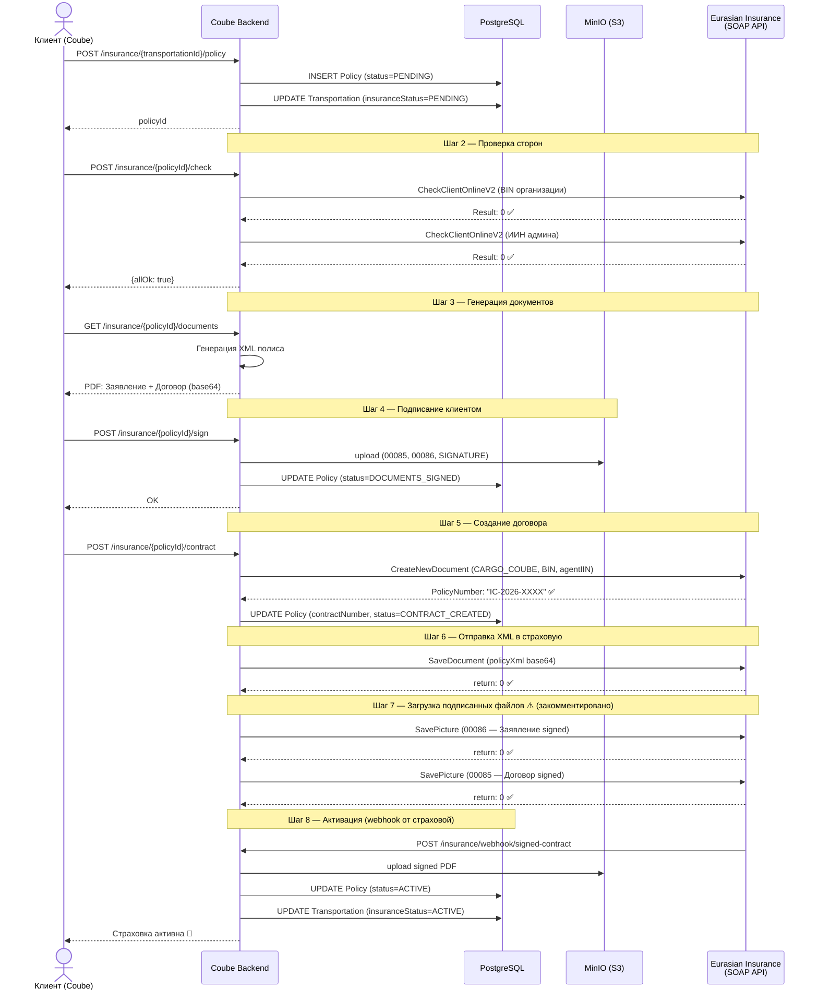

# Eurasia Insurance API — Тест и Process Flow

## Архитектурное решение

**Используем BPM REST API** — не прямой SOAP.

BPM включает верификацию клиента через ГБД/БМГ/ПОДФТ, генерацию документов и управление состоянием процесса на стороне Eurasian. SOAP потребовал бы реализации всего этого самостоятельно.

Единственный блокер: шаг `docs_get_signed` требует `system_id` от signing-микросервиса Eurasian — **запрошено, ожидаем документацию.**

---

## Среды и credentials

| Сервис | URL | Логин | Пароль | Протокол |
|---|---|---|---|---|
| SOAP API | `wstest.theeurasia.kz:2190/ws/wsNovelty.1cws` | `Novelty` | `noveltytest` | SOAP 1.1 + Basic Auth |
| BPM REST API | `gates-test.theeurasia.kz/api/bpm` | `coube` | `TheEurasiaCoube87@37#4` | REST + Basic Auth |

**Дата тестирования:** 2026-04-01

---

## Результаты тестирования — SOAP API


| # | Метод | Статус | Ответ | Примечание |
|---|---|---|---|---|
| 1 | `GetHello` | ✅ | `"Hello"` | Connectivity OK |
| 2 | `CheckClientOnlineV2` (физ. лицо) | ✅ | `Result: 0` | Клиент чистый |
| 3 | `CheckClientOnlineV2` (юр. лицо) | ✅ | `Result: 0` | Клиент чистый |
| 4 | `CheckClientPODFT` | ✅ | `true` | ПОДФТ пройден |
| 5 | `CheckClientOnRedList` | ✅ | `"Совпадения не найдены"` | Не в красном списке |
| 6 | `GetMiddlemanInfo` | ✅ | `DocNumber: 05-04-2025-526` | Агент `871103300964` найден |
| 7 | `GetIndividualData` | ✅ | ФИО, документ, адрес | Полные данные физ. лица |
| 8 | `GetOKED` | ✅ | Список видов деятельности | Справочник работает |
| 9 | `GetRegions` | ✅ | Список регионов КЗ | Справочник работает |
| 10 | `SaveDocument` | ⚠️ | `return: 3` | Ожидаемо — договор `9999` не существует |
| 11 | `SavePicture` | ⚠️ | `return: 999` | Ожидаемо — договор не найден |
| 12 | `CreateNewDocument` | ✅ | `return: 0, PolicyNumber: 16-18-05-2026-00568` | Работает с реальным BIN страхователя |
| 13 | `SaveDocument` (с policy XML) | ⚠️ | `return: 112` | XML принят, но не прошёл валидацию — нужны все обязательные поля |

---

## Результаты тестирования — BPM REST API

| # | Метод | Статус | Результат | Примечание |
|---|---|---|---|---|
| 1 | `its_get_customer_ul` (init) | ✅ | `step_status: 2, inst_id: 16037325` | Процесс запустился |
| 2 | `its_get_customer_ul` (polling) | ✅ | `step_status: 10` за ~9 сек | Клиент прошёл все проверки |
| 3 | `its_get_customer` (init) | ✅ | `step_status: 2, inst_id: 16037323` | Процесс запустился |
| 4 | `its_get_customer` (polling) | ❌ | `step_status: 9, rejected` | ИИН не прошёл верификацию БМГ — телефон не совпал с гос. базой |
| 5 | `its_conclusion_cargo` (init) | ✅ | `step_status: 2, inst_id: 16037327` | Процесс запустился |
| 6 | `its_conclusion_cargo` → `docs_get_confirm` | ✅ | `step_status: 0` | 2 PDF документа получены (Заявление + Договор) |
| 7 | `its_conclusion_cargo` → `docs_get_signed` | ❌ | `step_status: 9` | Требует `system_id` от signing-микросервиса Eurasian |

### Обязательные поля для `its_get_customer_ul`

```json
{
  "bp_name": "its_get_customer_ul",
  "params": {
    "type": 0,
    "bin": "221040021025",
    "company_name": "ПОЛНОЕ НАИМЕНОВАНИЕ ТОО",
    "company_name_short": "ТОО КРАТКОЕ",
    "bank_account": {
      "bank": "KASPI BANK",
      "bik": "CASPKZKA",
      "iik": "KZ..."
    },
    "owners": [
      {
        "name": "ИМЯ",
        "surename": "ФАМИЛИЯ",
        "patronymic": "ОТЧЕСТВО",
        "birthday": "06.05.1968",
        "iin": "680506350235",
        "country": "KZ",
        "number": "055387358",
        "issuer": "МВД РК",
        "issued": "18.05.2023"
      }
    ]
  }
}
```

> **Важно:** объект `leader` передавать не нужно — данные руководителя автоматически подтягиваются из ГБД по БИН. Передача `leader` вызывает ошибку валидации `leader_short`.

### Что возвращает `its_get_customer_ul` при `step_status: 10`

```json
{
  "company_name": "Товарищество с ограниченной ответственностью \"Cargo Trans Solution\"",
  "company_name_full": "...",
  "iin_bin": "221040021025",
  "gbd_verify": 1,
  "gbd_verify_date": "01.04.2026",
  "country": "KZ",
  "economics_sector": 8,
  "resident": 1,
  "registration_date": "12.10.2022",
  "contacts": {
    "address_actual": "Карагандинская область, г. Карагандa, ул. Ермекова, зд. 29",
    "address_legal": "...",
    "phone": "(701) 845-85-23"
  },
  "leader": {
    "iin_bin": "811204350384",
    "name": "МАДИЯР",
    "surname": "КАШАНОВ",
    "patronymic": "СЕРИКБАЕВИЧ",
    "birthday": "04.12.1981",
    "document": { "number": "N11750955", "issued": "23.04.2018", "issuer": "МВД РК", "until": "23.04.2028" },
    "gbd_verify": 0,
    "resident": 1,
    "sex": 1
  },
  "owners": [
    {
      "iin": "680506350235",
      "fio": "КАБУЛОВ ЖАНДОС АЗНАБАЕВИЧ",
      "birthday": "06.05.1968",
      "gbd_verify": 0
    }
  ]
}
```

### BPM: `its_conclusion_cargo` — Детальный flow

> BPM-процесс для оформления страховки по грузу. Работает **параллельно** или **вместо** прямого SOAP-флоу.

```
POST /api/bpm/process/init
  body: { bp_name: "its_conclusion_cargo", params: { inst_id, cargo, insurer, ... } }
        ↓ inst_id (уникальный ID процесса, Eurasian гарантирует уникальность через DB constraint)

POLLING GET /api/bpm/process/get-status?inst_id=16037327
   step_code: "its_get_customer_ul" → step_status: 10 → данные ЮЛ из ГБД
   step_code: "its_get_customer"    → step_status: 10 → данные ФЛ + верификация БМГ
   step_code: "docs_get_confirm"    → step_status: 0  → PDF готовы, ждём set-param
                ↓ set-param: { success: 1 } (подтверждаем)
   step_code: "docs_get_signed"     → step_status: 0  → ждём подписанные PDF + system_id
                ↓ set-param: { success: 1, system_id, application, contract, invoice }
   step_code: "final"               → step_status: 10 → ГОТОВО
```

**Что возвращает `docs_get_confirm` (step_status: 0, нужен set-param):**
```json
{
  "step_code": "docs_get_confirm",
  "step_status": 0,
  "params": {
    "application": "<base64 PDF — Заявление-анкета>",
    "contract": "<base64 PDF — Договор страхования>"
  }
}
```

**Что нужно передать в `docs_get_signed`:**
```json
{
  "inst_id": "16037327",
  "step_code": "docs_get_signed",
  "params": {
    "success": 1,
    "contract_id": "COUBE-CONTRACT-ID",
    "system_id": "<от Eurasian signing microservice>",
    "application": "<base64 подписанный PDF>",
    "contract": "<base64 подписанный PDF>",
    "invoice": ""
  }
}
```

> ⚠️ `system_id` генерируется **отдельным микросервисом Eurasian**. Без него шаг падает с ошибкой:
> `"Неправильная схема использования сервиса, используйте методы микросервиса"`

---

### Polling — как правильно реализовать

```
Интервал: 3 секунды (рекомендация Eurasian)
Таймаут:  до конца дня (окончательного SLA нет)

step_status = 1  → продолжаем polling (in progress)
step_status = 2  → переход к следующему шагу (продолжаем polling)
step_status = 0  → нужен set-param (ждём действия клиента)
step_status = 9  → ФИНАЛЬНЫЙ ОТКАЗ (retry бесполезен)
step_status = 10 → УСПЕХ (данные в params[].system_data)
```

---

## Process Flow — Страхование груза

### Общая схема



---

### Детальный flow по шагам

#### Шаг 1 — Инициация

```
Клиент нажимает "Оформить страховку"
        │
        ▼
POST /api/insurance/{transportationId}/policy
        │
        ├─ Policy.status         = PENDING
        └─ Transportation.insuranceStatus = PENDING
```

---

#### Шаг 2 — Проверка сторон (AML / ПОДФТ)

> **Статус в коде:** частично реализован. `CheckClientPODFT` и `CheckClientOnRedList` не вызываются.

```
checkPartiesForInsurance(transportationId)
        │
        ├─── ЮЛ (Страхователь — организация клиента)
        │         │
        │         ├─ [РЕАЛИЗОВАНО]  CheckClientOnlineV2(BIN, orgName)
        │         │       Result=0 → ✅  Result≠0 → ❌ REJECTED
        │         │
        │         ├─ [НЕ РЕАЛИЗОВАНО] CheckClientPODFT(BIN)
        │         │       true → ✅  false → ❌ REJECTED
        │         │
        │         └─ [НЕ РЕАЛИЗОВАНО] CheckClientOnRedList(orgName, NaturalPerson=false, BIN)
        │                 "Совпадения не найдены" → ✅  иначе → ❌ REJECTED
        │
        └─── ФЛ (Админ организации)
                  │
                  ├─ [РЕАЛИЗОВАНО]  CheckClientOnlineV2(IIN, lastName, firstName, middleName)
                  │       Result=0 → ✅  Result≠0 → ❌ REJECTED
                  │
                  ├─ [НЕ РЕАЛИЗОВАНО] CheckClientPODFT(IIN)
                  │       true → ✅  false → ❌ REJECTED
                  │
                  └─ [НЕ РЕАЛИЗОВАНО] CheckClientOnRedList(fullName, NaturalPerson=true, IIN)
                          "Совпадения не найдены" → ✅  иначе → ❌ REJECTED

        ─────────────────────────────────────────────────────
        Все ✅ → продолжаем
        Хоть одна ❌ → Transportation.insuranceStatus = REJECTED
                       Policy.status = CLIENT_CHECK_FAILED
```

---

#### Шаг 3 — Генерация документов

```
GET /api/insurance/{policyId}/documents
        │
        ├─ InsurancePolicyXmlBuilder.generate(policy, transportation)
        │       ├─ Данные груза (наименование, вес, объём, упаковка)
        │       ├─ Маршрут (откуда → куда, метод перевозки)
        │       ├─ Суммы (страховая сумма, премия)
        │       └─ Стороны (страхователь, выгодоприобретатель)
        │
        └─ Frontend отображает клиенту для ознакомления:
               • Заявление-анкета  (будет документ 00086)
               • Договор страхования (будет документ 00085)
```

---

#### Шаг 4 — Подписание документов (ЭЦП)

```
POST /api/insurance/{policyId}/sign
        │
        ├─ Принимает:
        │       signedDocuments: [
        │           { fileId, fileName, documentTypeCode: "00086" },  ← Заявление
        │           { fileId, fileName, documentTypeCode: "00085" },  ← Договор
        │       ]
        │       signatureData: base64(cms-signature)
        │
        ├─ Загружает файлы в MinIO
        ├─ Сохраняет Document записи в БД (insurance.documents)
        └─ Policy.status → DOCUMENTS_SIGNED
```

---

#### Шаг 5 — Создание договора в Eurasian

> **Статус:** ✅ Работает. `CARGO_COUBE` подтверждён в test среде (ID=44).

```
POST /api/insurance/{policyId}/contract
        │
        └─ SOAP: CreateNewDocument
                ┌─────────────────────────────────────────┐
                │  ID             = policy.id             │
                │  OperationType  = "новый договор"       │
                │  InsuranceProduct = "CARGO_COUBE"  ✅   │  ← ID=44, работает в test
                │  Insured        = org.BIN               │
                │  Middleman      = "871103300964"        │  ← ИИН агента Coube
                │  InsuredName    = ceo.fullName          │
                └─────────────────────────────────────────┘
                        │
                        ├─ return=0, PolicyNumber="XXX" → Policy.contractNumber = PolicyNumber
                        │                                  Policy.status → CONTRACT_CREATED
                        └─ return≠0 → InsuranceException (прерываем)
```

---

#### Шаг 6 — Отправка XML полиса

```
saveDocumentDetails(policyId)  ← вызывается сразу после Шага 5
        │
        ├─ Генерирует policy XML (InsurancePolicyXmlBuilder)
        ├─ Валидирует XML (SAX парсер)
        │
        └─ SOAP: SaveDocument
                ┌────────────────────────────────────────────────────┐
                │  ID             = policy.id                        │
                │  OperationType  = "новый договор"                  │
                │  DocumentXML    = base64(policyXml)                │
                │                                                    │
                │  ⚠️ ContractNumber отсутствует в шаблоне!         │
                │     Уточнить у Eurasian нужен ли этот параметр    │
                └────────────────────────────────────────────────────┘
                        │
                        ├─ return=0 → OK
                        └─ return≠0 → InsuranceException
```

---

#### Шаг 7 — Загрузка подписанных файлов

> **Статус:** ⚠️ Закомментировано в `InsuranceServiceImpl` (строки 226–229). Требует доработки.

```
[ДОЛЖНО ВЫПОЛНЯТЬСЯ после Шага 5, сейчас пропущено]

        Для каждого подписанного документа (00085, 00086):
        │
        └─ SOAP: SavePicture
                ┌──────────────────────────────────────────────────────┐
                │  ID             = policy.id                          │
                │  DestinationID  = "00085" или "00086"               │
                │  ClientName     = org.name                          │
                │  ClientID       = org.BIN                           │
                │  ObjectName     = transportation.cargoName          │
                │  DocumentXML    = base64(signedPdf)                 │
                │  ContractNumber = policy.contractNumber             │
                │  FileName       = document.fileName                 │
                │  CRC32          = crc32(signedPdf)                  │
                │  GUID           = ??? (в WSDL есть, в шаблоне нет) │
                └──────────────────────────────────────────────────────┘
                        │
                        ├─ return=0 → OK
                        └─ return≠0 → InsuranceException
```

---

#### Шаг 8 — Активация (webhook от Eurasian)

```
POST /api/insurance/webhook/signed-contract
        │
        ├─ Принимает: contractNumber + signedPdf (bytes)
        ├─ Сохраняет подписанный PDF в MinIO
        ├─ Policy.status              → ACTIVE
        └─ Transportation.insuranceStatus → ACTIVE
```

---

### Жизненный цикл Policy

```
PENDING
   │
   ├──[checkParties fail]──────────────────► CLIENT_CHECK_FAILED (финал)
   │
   ├──[checkParties OK]
   │        │
   │        ▼
   │   [клиент подписывает]
   │        │
   │        ▼
   │  DOCUMENTS_SIGNED
   │        │
   │        ├──[createContract fail]────────► (остаётся DOCUMENTS_SIGNED, retry)
   │        │
   │        ▼
   │  CONTRACT_CREATED
   │        │
   │        ├──[saveDocument fail]──────────► (InsuranceException)
   │        │
   │        ▼
   │  [webhook от страховой]
   │        │
   │        ▼
   │      ACTIVE  ✅
   │
   └──[отмена]──────────────────────────────► CLIENT_CHECK_FAILED (cancelInsurance)
```

---

## Проблемы и что нужно сделать

### ✅ Разблокировано — `CreateNewDocument` работает

**Результат:** `return: 0`, `PolicyNumber: 16-18-05-2026-00568`

**Причина прошлой ошибки (код 6):** Тестовый BIN `154675000034` не зарегистрирован в Eurasian. `CARGO_COUBE` существует в test среде — нужен реальный BIN страхователя из базы Eurasian.

**Продукт в XML:** `INSURANCE_PRODUCT.ID = 44`, `INSURANCE_PRODUCT.VALUE = CARGO_COUBE`

**Важно:** BIN страхователя должен быть зарегистрирован в системе Eurasian Insurance. При первой интеграции нового клиента может потребоваться его предварительная регистрация.

---

### ⚠️ `SaveDocument` — код 112 (валидация XML)

**Симптом:** XML принимается (нет SOAP Fault), но возвращает `return: 112`.  
**Причина:** В тестовом XML отсутствуют или некорректны обязательные поля для продукта CARGO_COUBE (тестовые данные неполные).  
**Действие:** Уточнить у Eurasian Insurance обязательный минимум полей в `<POLICY>` XML для `SaveDocument`. Сверить с `InsurancePolicyXmlBuilder` — все ли поля генерируются.

---

### ⚠️ Обязательно — `SavePicture` закомментирован

**Файл:** `InsuranceServiceImpl.java:226–229`  
**Действие:** Реализовать загрузку обоих подписанных документов (00085 и 00086) сразу после успешного `CreateNewDocument`. Также уточнить у Eurasian обязательность поля `GUID`.

---

### ⚠️ Обязательно — `CheckClientPODFT` не вызывается

**Действие:** Добавить вызов в `checkPartiesForInsurance()` для каждой стороны (ЮЛ и ФЛ). По законодательству РК проверка ПОДФТ обязательна перед заключением договора страхования.

---

### ⚠️ Желательно — `CheckClientOnRedList` не вызывается

**Действие:** Добавить в `checkPartiesForInsurance()` рядом с ПОДФТ. Два доступных метода:
- `CheckClientOnRedList(ClientName, NaturalPerson, IIN)` — детальный
- `CheckClientRedList(IDNumber, Name)` — упрощённый

---

### ⚠️ Желательно — `GetIndividualData` не используется

**Возможность:** Метод возвращает полные данные физ. лица по ИИН (ФИО, документ, адрес, дату рождения).  
**Применение:** Автоматически заполнять реквизиты страхователя/выгодоприобретателя без ручного ввода.

```
GetIndividualData(IIN) → {
  FirstName, LastName, MiddleName,
  Gender, Birthday,
  Address,
  DocumentType, DocumentNumber, IssuedBy, DateOfIssue
}
```

---

### ⚠️ Уточнить — `ContractNumber` в `SaveDocument`

**Ситуация:** WSDL-схема не объявляет `ContractNumber` как поле `SaveDocument`, но `return: 3` может означать, что договор не привязан.  
**Действие:** Уточнить у Eurasian нужно ли передавать `ContractNumber` и добавить в шаблон `save-document.xml` если да.

---

## Анализ ЭЦП — может ли Coube подписать документы для `docs_get_signed`?

**Вопрос:** Подойдёт ли собственная реализация ЭЦП в `coube-backend` для шага `docs_get_signed`?

**Ответ: Нет — в нынешнем виде не подойдёт.**

### Что есть в Coube сейчас

| Компонент | Файл | Что делает |
|---|---|---|
| `CmsService` | `cmsverify/service/CmsService.java` | **Верифицирует** CMS-подписи через Kalkan library |
| `SignClient` | `cmsverify/service/SignClient.java` | Верифицирует CMS с 1 или 2 подписантами, проверяет ИИН/БИН |
| `SignVerifyService` | `cmsverify/SignVerifyService.java` | Делегирует к `SignClient` |
| `SignatureService` | `signature/SignatureService.java` | Штампует визуальную подпись на PDF, создаёт ZIP-архивы |
| `SignatureClient` | `signature/internal/SignatureClient.java` | Верифицирует CMS и сохраняет метаданные подписи в БД |

**Ключевой вывод:** Coube-бэкенд умеет только **проверять** CMS-подписи. **Создавать** CMS-подписи бэкенд не умеет.

### Как реально работает подписание в Coube

```
Пользователь (браузер/приложение)
        │
        ├─ NCALayer (клиентское ПО Казахстана)
        │       └─ Берёт личный сертификат пользователя
        │       └─ Подписывает документ → создаёт CMS (base64)
        │
        └─ Отправляет CMS на Coube Backend
                └─ Backend только ВЕРИФИЦИРУЕТ:
                        ├─ CmsService.verify() — проверяет подпись
                        ├─ SignClient — проверяет ИИН/БИН в сертификате
                        └─ Сохраняет метаданные в БД
```

### Что нужно для `docs_get_signed`

1. **`system_id`** — генерируется **signing-микросервисом Eurasian**. Coube не может его создать самостоятельно. Нужно запросить у Eurasian: документацию на этот микросервис, endpoint и формат запроса.

2. **Подписанные PDF** — технически можно реализовать через NCALayer на фронтенде (у Coube должен быть корпоративный ЭЦП-сертификат). Но это требует **новой фронтенд-интеграции**, которой сейчас нет для страхового модуля.

### Что запросить у Eurasian

- [ ] Документацию на **signing microservice** (как получить `system_id`)
- [ ] Нужна ли физическая ЭЦП Coube или достаточно серверного подписания
- [ ] Можно ли B2B интеграция без NCALayer (server-to-server подписание)

---

## Полный каталог методов WSDL

### Используются в Coube

| Метод | Статус интеграции | Файл |
|---|---|---|
| `CheckClientOnlineV2` | ✅ Реализован | `InsuranceApiClient.checkClient()` |
| `CreateNewDocument` | ✅ Реализован (❌ test env) | `InsuranceApiClient.createNewDocument()` |
| `SaveDocument` | ✅ Реализован | `InsuranceApiClient.saveDocument()` |
| `SavePicture` | ⚠️ Закомментирован | `InsuranceApiClient.savePicture()` |

### Доступны, но не интегрированы

| Метод | Назначение | Приоритет |
|---|---|---|
| `CheckClientPODFT` | Проверка финмониторинга (ПОДФТ) | 🔴 Обязательно |
| `CheckClientOnRedList` | Красный список | 🟡 Желательно |
| `GetIndividualData` | Данные физ. лица по ИИН | 🟡 Желательно |
| `CheckClientRedList` | Красный список (упрощённый) | 🟡 Желательно |
| `GetMiddlemanInfo` | Данные агента | 🟢 Опционально |
| `GetRegions` | Справочник регионов | 🟢 Опционально |
| `GetOKED` | Справочник ОКВЭД | 🟢 Опционально |
| `CheckDebt` | Проверка задолженностей | 🟢 Опционально |
| `HaveActiveInsuraneEvent` | Активный страховой случай | 🟢 Опционально |
| `GetMarks` / `GetModels` | Справочник авто | 🟢 Опционально |
| `CreateCheque` | Создание чека | 🟢 Опционально |
| `SendSms` / `SendEmail` | Уведомления | 🟢 Опционально |

---

## Чеклист для завершения интеграции

### SOAP интеграция

- [x] **[Готово]** `CreateNewDocument` работает — `CARGO_COUBE` (ID=44) существует в test среде
- [x] **[Готово]** `CheckClientOnlineV2` работает для ЮЛ и ФЛ
- [ ] **[Обязательно]** Реализовать `SavePicture` для 00085 и 00086 после `CreateNewDocument` (сейчас закомментировано)
- [ ] **[Обязательно]** Добавить `CheckClientPODFT` в `checkPartiesForInsurance()`
- [ ] **[Уточнить у Eurasian]** Нужен ли `ContractNumber` в `SaveDocument` → добавить в шаблон если да
- [ ] **[Уточнить у Eurasian]** Обязательность поля `GUID` в `SavePicture`
- [ ] **[Уточнить у Eurasian]** Правильная структура XML для `SaveDocument` — почему `return: 112`
- [ ] **[Желательно]** Добавить `CheckClientOnRedList` в `checkPartiesForInsurance()`
- [ ] **[Желательно]** Использовать `GetIndividualData` для авто-заполнения реквизитов

### BPM интеграция (`its_conclusion_cargo`)

- [x] **[Готово]** `its_get_customer_ul` — работает, данные ЮЛ из ГБД за ~9 сек
- [ ] **[Нужен реальный ИИН]** `its_get_customer` (ФЛ) — падает на верификации БМГ с тестовыми ИИН
- [x] **[Готово]** `docs_get_confirm` — PDF документы получены (Заявление + Договор)
- [ ] **[Заблокировано]** `docs_get_signed` — нужна документация на signing microservice Eurasian
- [ ] **[Запросить у Eurasian]** Документацию на signing microservice (endpoint, формат, как получить `system_id`)
- [ ] **[Решить]** Как Coube будет подписывать PDF: NCALayer на фронте или server-to-server

### E2E

- [ ] **[E2E тест]** Прогнать полный SOAP-цикл с реальным клиентом после решения `SaveDocument` (код 112)
- [ ] **[E2E тест]** Прогнать полный BPM-цикл после получения доступа к signing microservice
