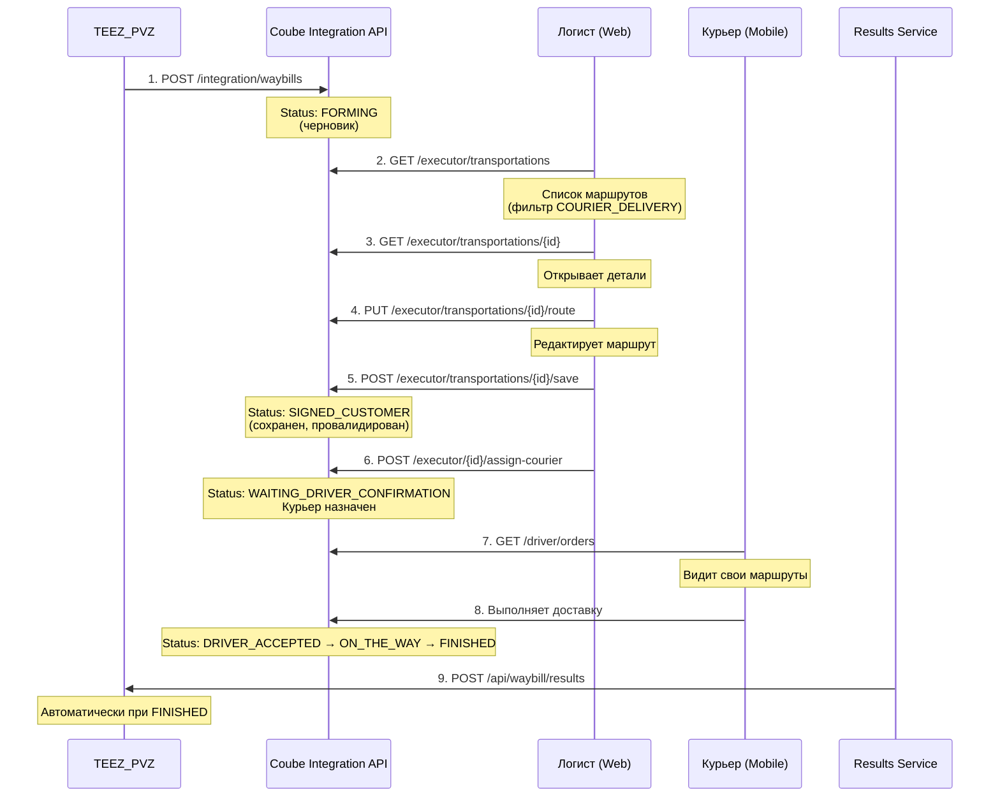

# Курьерская доставка MVP - Итоговая сводка

## 📋 Краткое описание

Упрощенная версия курьерской доставки с **максимальным переиспользованием** существующего кода Coube.

**Ключевое отличие**: Минимум новых таблиц и сервисов, используем `Transportation`, `CargoLoadingHistory` и `DriverController`.

---

## ⏱️ Оценка времени

### **2.5-3.5 недели** (1 разработчик)

**Разбивка**:
- Week 1: БД + Entity + Repository + API Key Auth (5 дней)
- Week 2: Integration API + Logist Web API (5 дней)  
- Week 3-3.5: Mobile additions + Results + Testing (5-7 дней)

**Экономия**: 7-11 недель по сравнению с полной версией (10-14 недель)

---

## 🎯 Полный бизнес-флоу (согласно ТЗ)



---

## 📊 Что нужно создать

### Изменения в БД

**4 миграции**:
1. Добавить `COURIER_DELIVERY` в enum `TransportationType`
2. Добавить 3 поля в `Transportation`
3. Добавить 3 поля в `CargoLoadingHistory`
4. Создать 2 новые таблицы

**2 новые таблицы**:
- `courier_route_order` - заказы в точках
- `courier_integration_log` - логи интеграций

**6 новых полей** в существующих таблицах

### Новый код

**Entity**: 2 класса  
**Repository**: 2 интерфейса  
**Service**: 4 класса  
**Controller**: 2 класса + 1 метод в существующий  
**DTO**: ~20 классов  
**Enum**: 4 класса  
**Config/Security**: 2 класса (API Key)

### Что переиспользуем

**Entity**: 4 класса (Transportation, TransportationRouteHistory, CargoLoadingHistory, Employee)  
**Controllers**: 1 класс (DriverController - 95% готов)  
**Services**: 6 классов (DriverService, TransportationService, RouteService, FileService, NotificationService, LocationService)

**Итого**: ~2000 строк нового кода (вместо ~8000 в полной версии)

---

## 🔑 Ключевые архитектурные решения

### 1. Одна роль для водителей и курьеров

❌ **НЕ** добавляем новую роль `COURIER`  
✅ Используем существующую роль `DRIVER`

**Различие** по типу Transportation:
```java
// FLT водитель
transportation.setTransportationType(TransportationType.FLT);

// Курьер
transportation.setTransportationType(TransportationType.COURIER_DELIVERY);
```

### 2. CargoLoadingHistory = точки доставки

❌ **НЕ** создаем новую таблицу `courier_route_point`  
✅ Используем существующую `CargoLoadingHistory`

**Преимущество**: переиспользуем всю логику маршрутов!

### 3. Курьер БЕЗ транспортного средства

**Проблема**: В FLT водитель назначается только через `Transport`

**Решение**: Используем поле `Transportation.executorEmployee`
```java
// Курьер БЕЗ ТС
transportation.setExecutorEmployee(courier);
transportation.setTransport(null);

// Курьер С ТС (опционально)
transportation.setExecutorEmployee(courier);
transportation.setTransport(transport);
```

### 4. Упрощенная API Key аутентификация

❌ **НЕ** создаем таблицу `integration_api_keys` с БД и Admin UI  
✅ Статический ключ в `application.yml` через environment variable

**Экономия**: 2-3 дня работы

### 5. Функционал логиста (по ТЗ!)

**ВАЖНО**: Добавлен полный функционал редактирования для логиста:
- Просмотр списка маршрутов
- Редактирование маршрута (добавление/удаление точек)
- Валидация маршрута
- Назначение курьера
- Закрытие маршрута

**Endpoints для логиста** (используем существующие пути):
```
GET    /api/v1/executor/transportations              # Список (фильтр COURIER_DELIVERY)
GET    /api/v1/executor/transportations/{id}         # Детали
PUT    /api/v1/executor/transportations/{id}/route   # Редактирование
POST   /api/v1/executor/transportations/{id}/save    # Сохранение с валидацией
POST   /api/v1/executor/{id}/assign-courier          # Назначение курьера
```

---

## 📁 Структура документации

| Файл | Описание | Время чтения |
|------|----------|--------------|
| **00-SUMMARY.md** | Этот файл - краткая сводка | 5 мин |
| **README.md** | Общий обзор MVP | 10 мин |
| **01-mvp-plan.md** | Детальный план с кодом | 30 мин |
| **02-implementation-checklist.md** | Пошаговый чеклист (2.5-3.5 недели) | 20 мин |
| **03-api-examples.md** | Примеры API запросов/ответов | 15 мин |
| **04-api-key-authentication-simplified.md** | Упрощенная аутентификация | 15 мин |
| **05-courier-without-transport.md** | Назначение курьера без ТС | 15 мин |
| **06-logist-edit-flow-analysis.md** | Функционал логиста (по ТЗ) | 20 мин |

**Рекомендуемый порядок чтения**:
1. README.md (обзор)
2. 00-SUMMARY.md (сводка)
3. 02-implementation-checklist.md (чеклист)
4. 01-mvp-plan.md (детальный план при необходимости)

---

## ✅ Что точно работает (проверено по ТЗ)

### Импорт от TEEZ
- ✅ POST /api/v1/integration/waybills
- ✅ Создание Transportation с типом COURIER_DELIVERY
- ✅ Статус: IMPORTED (непровалидированный черновик)
- ✅ Проверка дубликатов по external_waybill_id
- ✅ Блокировка обновления после валидации
- ✅ Логирование всех интеграций

### Логист (редактирование)
- ✅ Просмотр списка маршрутов
- ✅ Открытие деталей маршрута
- ✅ Редактирование точек (добавление/удаление)
- ✅ Сохранение с валидацией: геокодирование адресов, временные окна, последняя точка = склад
- ✅ Статус: FORMING → SIGNED_CUSTOMER
- ✅ Роль: LOGISTICIAN

### Логист (назначение курьера)
- ✅ POST /api/v1/executor/{id}/assign-courier
- ✅ Назначение БЕЗ транспорта (пешком/на своем авто)
- ✅ Назначение С транспортом (опционально)
- ✅ Статус: SIGNED_CUSTOMER → WAITING_DRIVER_CONFIRMATION

### Курьер (мобильное приложение)
- ✅ Видит свои маршруты через DriverController
- ✅ Принимает/отклоняет маршрут
- ✅ Отмечает точки (arrival/departure)
- ✅ Обновляет статусы заказов
- ✅ Загружает фото подтверждений
- ✅ SOS функционал (переиспользуется)
- ✅ Геолокация (переиспользуется)

### Отправка результатов в TEEZ
- ✅ POST {teez_api_url}/api/waybill/results
- ✅ Автоматическая отправка при статусе FINISHED
- ✅ Логирование
- ✅ Показ ошибок логисту

---

## 🚫 Что НЕ включено в MVP

Эти фичи можно добавить позже без больших изменений:

| Фича | Зачем нужна | Время добавления |
|------|-------------|------------------|
| Асинхронная отправка результатов с retry | Reliability | 1-2 дня |
| Геокодирование адресов | Удобство | 2-3 дня |
| Сложная валидация маршрутов | Quality | 1 день |
| Управление складами через UI | Convenience | 2-3 дня |
| Детальная аналитика | BI | 3-5 дней |
| История изменений маршрутов | Audit | 1-2 дня |
| Поддержка нескольких маркетплейсов | Scale | 2-3 дня |
| Полная система управления API ключами | Security | 2-3 дня |
| IP whitelist и rate limiting | Security | 1-2 дня |

**Итого на все**: +3-4 недели

---

## 🎯 Success Criteria

MVP считается успешным если:

### Технические
- ✅ TEEZ может импортировать маршрутные листы через API
- ✅ Логист может редактировать маршрут в веб-интерфейсе
- ✅ Логист может валидировать маршрут
- ✅ Логист может назначить курьера (с ТС или без)
- ✅ Курьер видит свои маршруты в мобильном приложении
- ✅ Курьер может выполнить доставку
- ✅ Coube отправляет результаты обратно в TEEZ
- ✅ Все интеграции логируются

### Бизнес-процесс
- ✅ Флоу из ТЗ работает от начала до конца
- ✅ Логист может редактировать импортированные маршруты
- ✅ Блокировка обновления после валидации работает
- ✅ Существующая логика FLT перевозок не сломана

### Качество
- ✅ Unit тесты покрывают новую логику (90%+)
- ✅ Integration тесты проверяют API endpoints
- ✅ E2E тест проверяет полный флоу
- ✅ Код прошел code review
- ✅ API документация актуальна (Swagger)

---

## 🚀 Быстрый старт для разработчика

### День 1: Подготовка
```bash
# 1. Изучить существующий код (2-3 часа)
cat coube-backend/src/main/java/kz/coube/backend/applications/entity/Transportation.java
cat coube-backend/src/main/java/kz/coube/backend/driver/api/DriverController.java

# 2. Прочитать документацию (1-2 часа)
cat courier-delivery-integration-mvp/README.md
cat courier-delivery-integration-mvp/02-implementation-checklist.md

# 3. Создать ветку
git checkout -b feature/courier-delivery-mvp
```

### Week 1: БД + Entity + API Key
- Следовать `02-implementation-checklist.md` → Phase 1
- Создать 4 миграции
- Создать 2 Entity
- Настроить API Key аутентификацию

### Week 2: Integration API + Logist API
- Следовать `02-implementation-checklist.md` → Phase 2
- Создать CourierIntegrationService + Controller
- Создать CourierWaybillService + Controller (для логиста)
- Integration тесты

### Week 3-3.5: Mobile + Results + Testing
- Следовать `02-implementation-checklist.md` → Phase 3
- Дополнить DriverController
- Создать CourierResultsService
- E2E тесты
- Bug fixing
- Документация

---

## ⚠️ Важные моменты

### 1. Не ломаем существующую логику
- ✅ Все изменения только для `TransportationType.COURIER_DELIVERY`
- ✅ FLT перевозки работают как раньше
- ✅ Существующие тесты проходят

### 2. Соответствие ТЗ
- ✅ Логист МОЖЕТ редактировать маршруты (из ТЗ!)
- ✅ Логист валидирует перед назначением курьера
- ✅ Блокировка обновления после валидации
- ✅ Флоу точно как в ТЗ

### 3. Безопасность
- ✅ API Key через environment variable (не в коде!)
- ✅ HTTPS обязательно
- ✅ Валидация всех входящих данных
- ✅ Роли и права доступа (LOGISTICIAN, DRIVER)

---

## 📞 Поддержка

**Вопросы по реализации**:
1. Сначала: `02-implementation-checklist.md` (пошаговый план)
2. Детали: `01-mvp-plan.md` (полный код примеров)
3. Специфика: соответствующий документ (04, 05, 06)

**Проблемы**:
- Создать issue в проекте
- Указать номер шага из чеклиста
- Приложить логи/скриншоты

---

**Дата создания**: 2025-01-07  
**Версия**: MVP 1.1  
**Статус**: ✅ Ready for Development  
**Приоритет**: 🔴 High  
**Оценка**: ⏱️ 2.5-3.5 недели (1 разработчик)  
**Экономия**: 💰 7-11 недель vs полная версия
