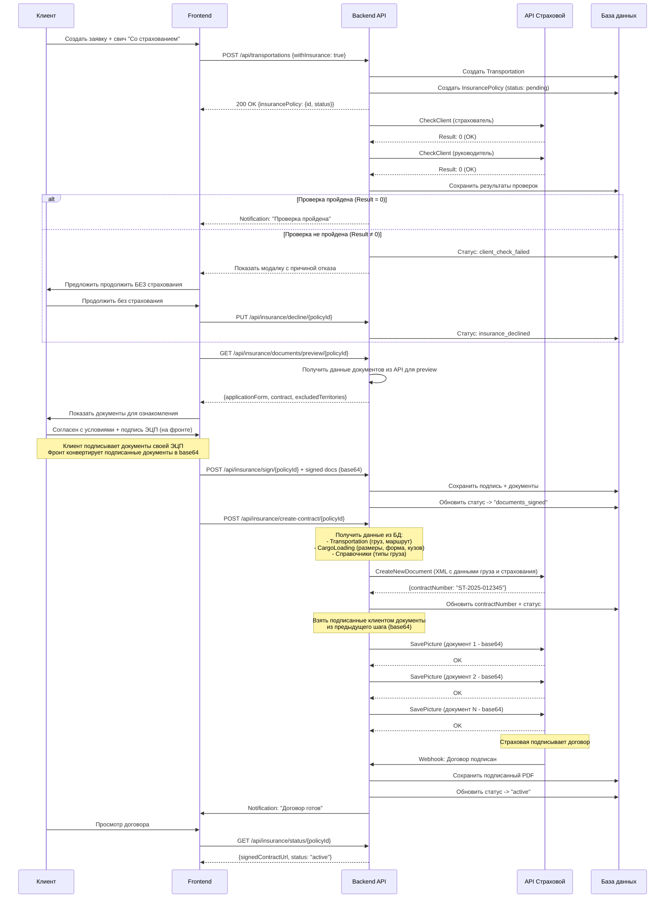
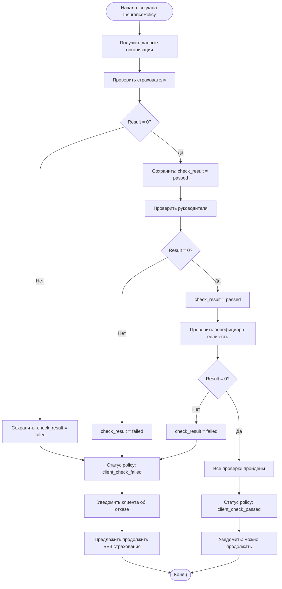
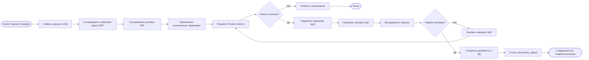
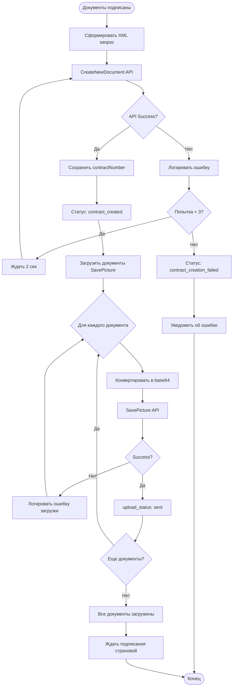
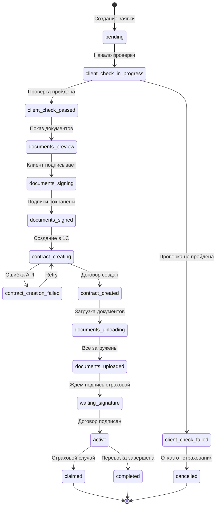
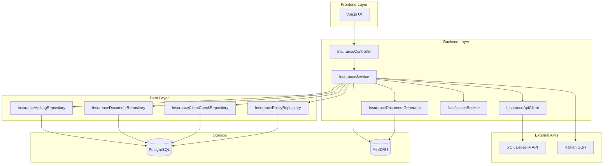
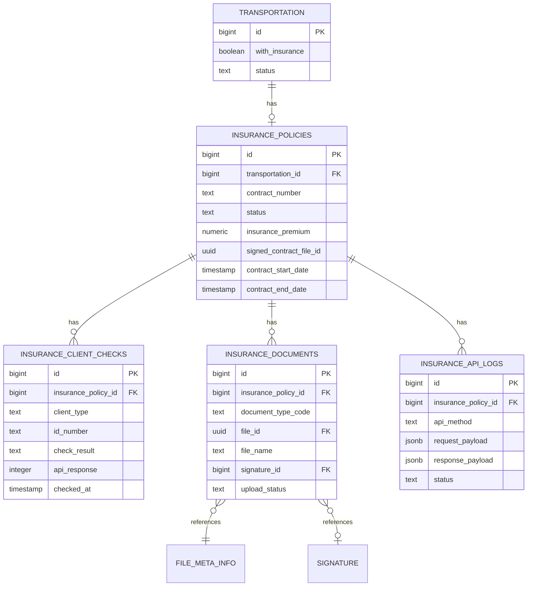
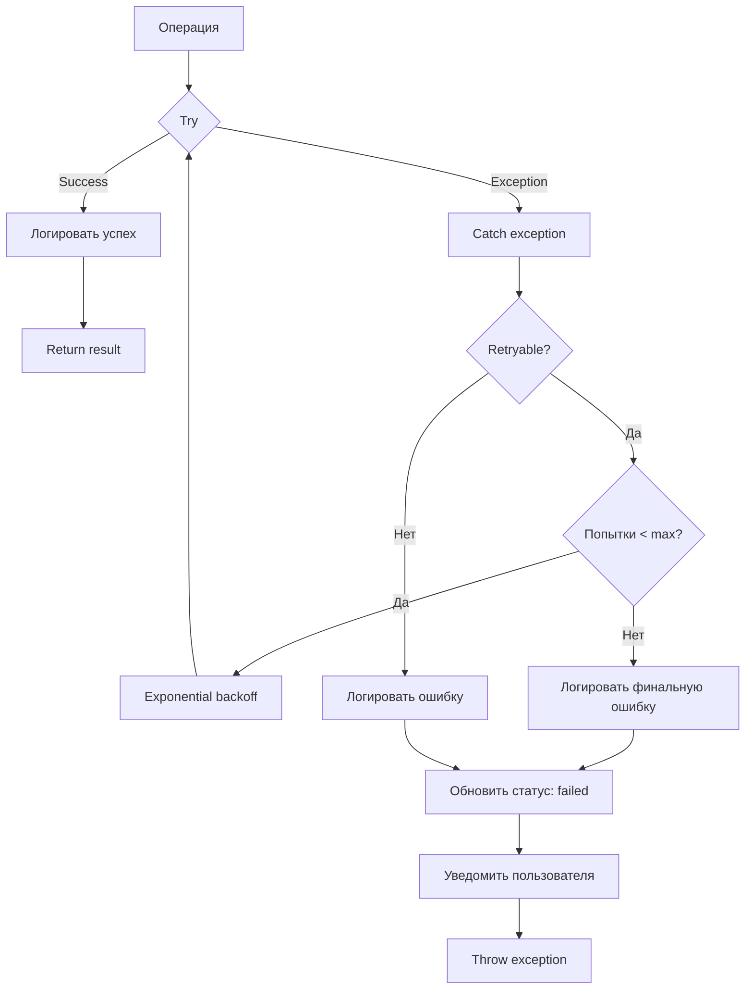

# Диаграммы процесса страхования

## 1. Общий флоу процесса

## 2. Проверка клиента (CheckClient)

## 3. Генерация и подписание документов

## 4. Создание договора в страховой

## 5. Статусы InsurancePolicy

## 6. Архитектура компонентов

## 7. ER-диаграмма таблиц

## 8. Обработка ошибок

