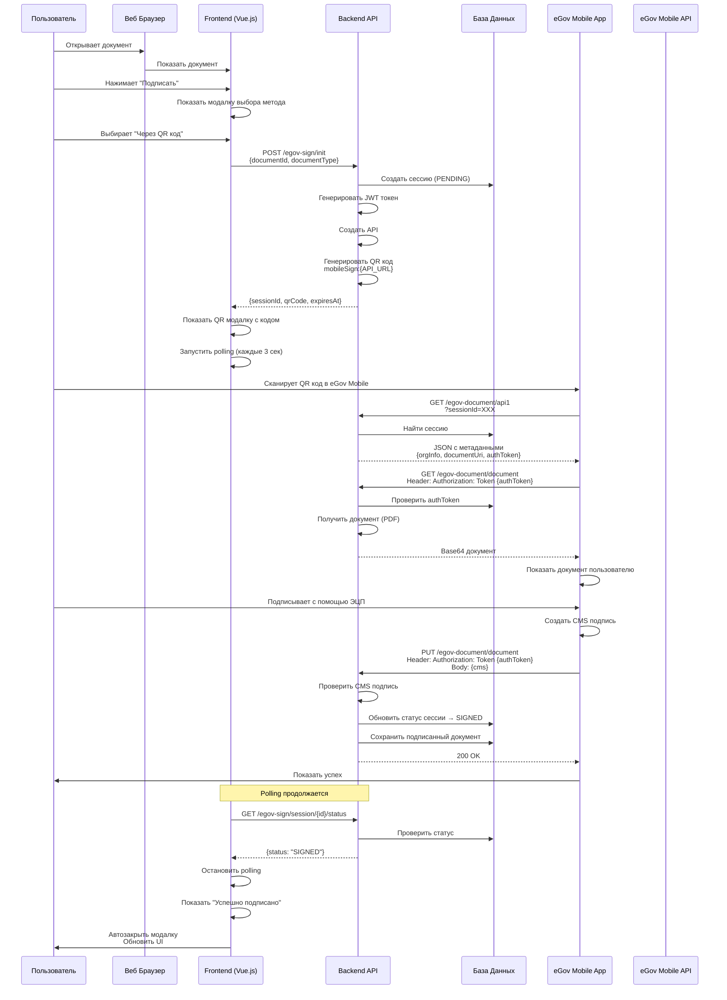
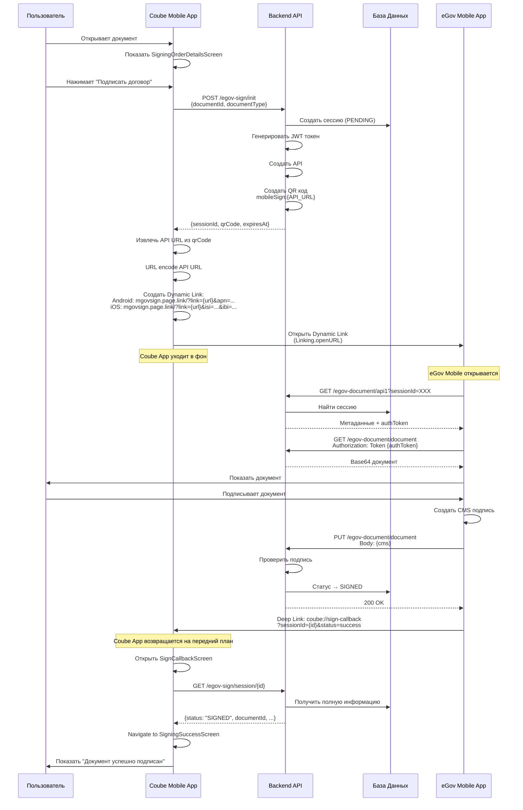
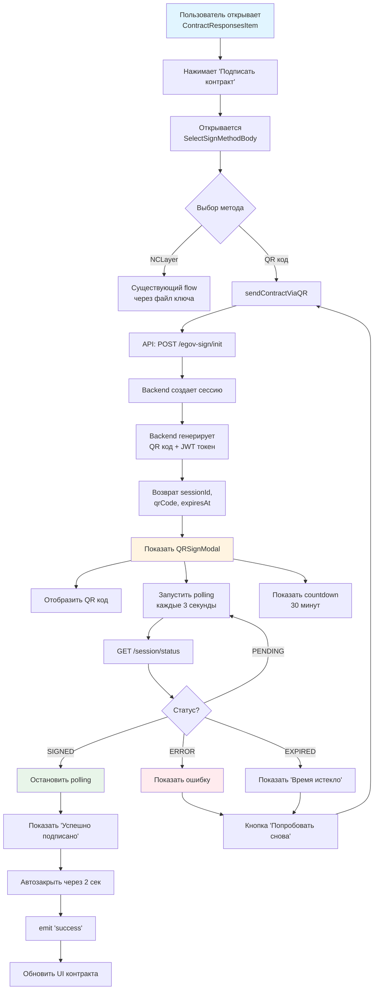
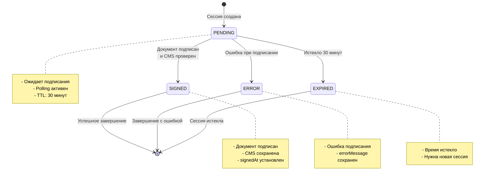
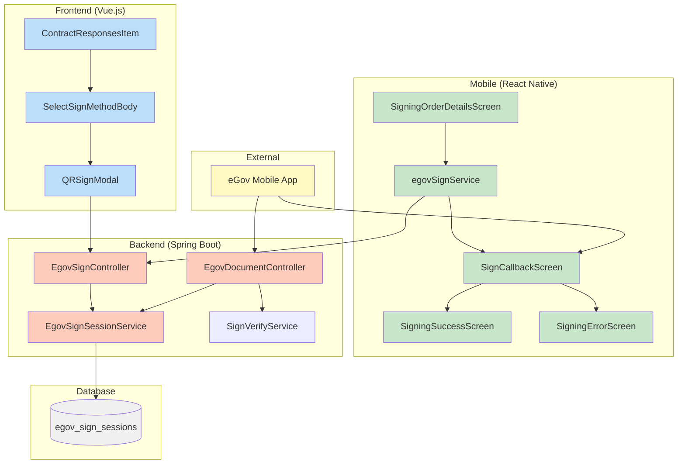
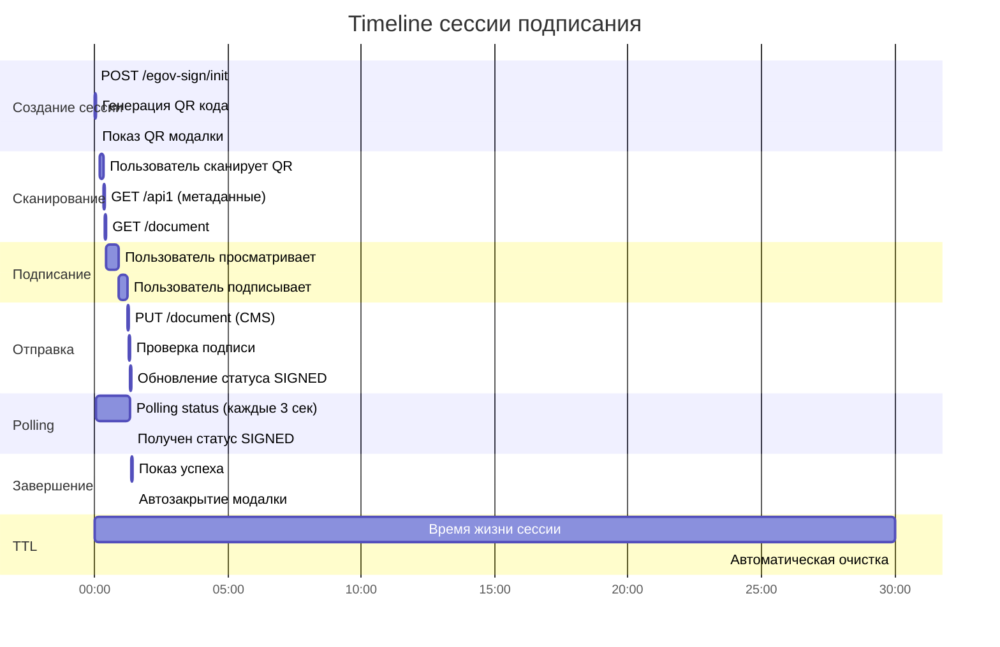
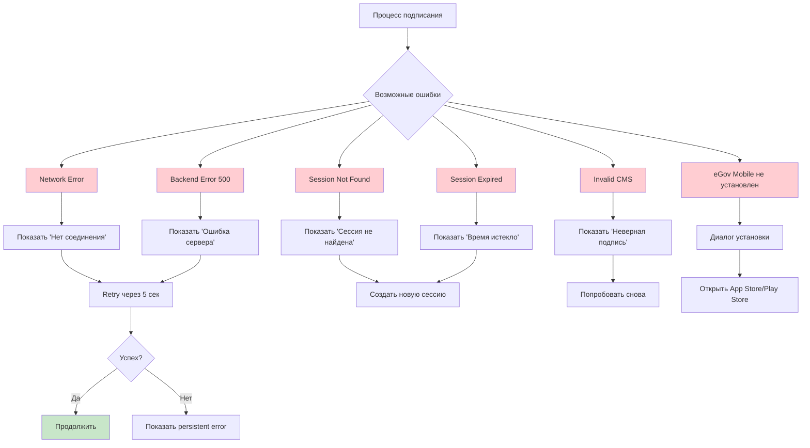

# Диаграммы Flow для eGov QR Подписания

## 1. Web Flow (QR Код Подписание)



## 2. Mobile Flow (Cross Подписание)



## 3. Детальный Flow компонентов (Web)



## 4. Детальный Flow компонентов (Mobile)

```mermaid
graph TD
    A[Пользователь открывает<br/>SigningOrderDetailsScreen] --> B[Нажимает 'Подписать договор']

    B --> C[handleSignContract]
    C --> D[Статус: creating_session]
    D --> E[egovSignService.signWithEgovMobile]

    E --> F[API: POST /egov-sign/init]
    F --> G[Backend создает сессию]
    G --> H[Возврат sessionId, qrCode]

    H --> I[Извлечь API URL из qrCode]
    I --> J[Создать Dynamic Link<br/>для Android или iOS]
    J --> K{eGov Mobile<br/>установлен?}

    K -->|Нет| L[Показать диалог установки]
    L --> M[Открыть App Store/Play Store]

    K -->|Да| N[Статус: opening_egov]
    N --> O[Linking.openURL<br/>с Dynamic Link]

    O --> P[eGov Mobile открывается]
    P --> Q[Coube App в фоне]
    Q --> R[Статус: waiting_signature]
    R --> S[Запустить polling]

    S --> T[GET /session/status<br/>каждые 3 сек]
    T --> U{Статус?}

    U -->|PENDING| T
    U -->|SIGNED| V[Остановить polling]
    U -->|ERROR| W[Показать ошибку]
    U -->|EXPIRED| X[Показать 'Время истекло']

    P --> Y[Пользователь подписывает<br/>в eGov Mobile]
    Y --> Z[eGov отправляет CMS<br/>на backend]
    Z --> AA[Backend обновляет статус]

    AA --> AB[eGov Mobile делает<br/>redirect на coube://]
    AB --> AC[Coube App возвращается<br/>на передний план]

    AC --> AD[SignCallbackScreen]
    AD --> AE[GET /session/{id}]
    AE --> AF{Статус?}

    AF -->|SIGNED| AG[Navigate to<br/>SigningSuccessScreen]
    AF -->|ERROR| AH[Navigate to<br/>SigningErrorScreen]
    AF -->|PENDING| AI[Показать 'Не завершено'<br/>Предложить вернуться]

    AG --> AJ[Показать успех ✅]
    AJ --> AK[Обновить данные заказа]
    AK --> AL[Кнопка 'Вернуться на главную']

    style A fill:#e1f5ff
    style P fill:#fff4e1
    style AG fill:#e8f5e9
    style AH fill:#ffebee
```

## 5. Backend API Flow

```mermaid
graph LR
    A[Frontend/Mobile] --> B[POST /egov-sign/init]
    B --> C[EgovSignController.initSession]
    C --> D[EgovSignSessionService.createSession]
    D --> E[Создать UUID sessionId]
    E --> F[Генерировать JWT authToken]
    F --> G[Создать API #1 URL]
    G --> H[Генерировать QR код]
    H --> I[Сохранить в DB<br/>статус: PENDING]
    I --> J[Вернуть response]

    K[eGov Mobile] --> L[GET /egov-document/api1]
    L --> M[EgovDocumentController.getApi1]
    M --> N[Найти сессию в DB]
    N --> O[Собрать метаданные:<br/>org info, document URI]
    O --> P[Вернуть JSON]

    K --> Q[GET /egov-document/document]
    Q --> R[Проверить authToken<br/>из Header]
    R --> S[Найти сессию]
    S --> T[Получить документ]
    T --> U[Конвертировать в Base64]
    U --> V[Вернуть в eGov формате]

    K --> W[PUT /egov-document/document]
    W --> X[Проверить authToken]
    X --> Y[Получить CMS из body]
    Y --> Z[SignVerifyService.verify]
    Z --> AA{CMS валидна?}
    AA -->|Да| AB[Обновить сессию<br/>статус: SIGNED]
    AA -->|Нет| AC[Вернуть 400<br/>Invalid signature]
    AB --> AD[Сохранить подписанный<br/>документ]
    AD --> AE[Вернуть 200 OK]

    AF[Frontend/Mobile] --> AG[GET /egov-sign/session/{id}/status]
    AG --> AH[Вернуть {status}]

    style B fill:#e3f2fd
    style L fill:#fff3e0
    style Q fill:#fff3e0
    style W fill:#e8f5e9
    style AG fill:#f3e5f5
```

## 6. Состояния сессии



## 7. Компоненты системы



## 8. Timing Diagram (30-минутная сессия)



## 9. Error Handling Flow



## Легенда

- **Frontend (Web)** - Vue.js компоненты (голубой)
- **Mobile** - React Native компоненты (зеленый)
- **Backend** - Spring Boot API (оранжевый)
- **Database** - PostgreSQL (серый)
- **External** - eGov Mobile App (желтый)

## Ключевые моменты

1. **QR код содержит**: `mobileSign:{API_1_URL}`
2. **JWT токен** используется для авторизации запросов от eGov Mobile
3. **Polling интервал**: 3 секунды
4. **TTL сессии**: 30 минут
5. **Deep link схема**: `coube://sign-callback?sessionId={id}&status={status}`
6. **Dynamic Link** отличается для Android и iOS
