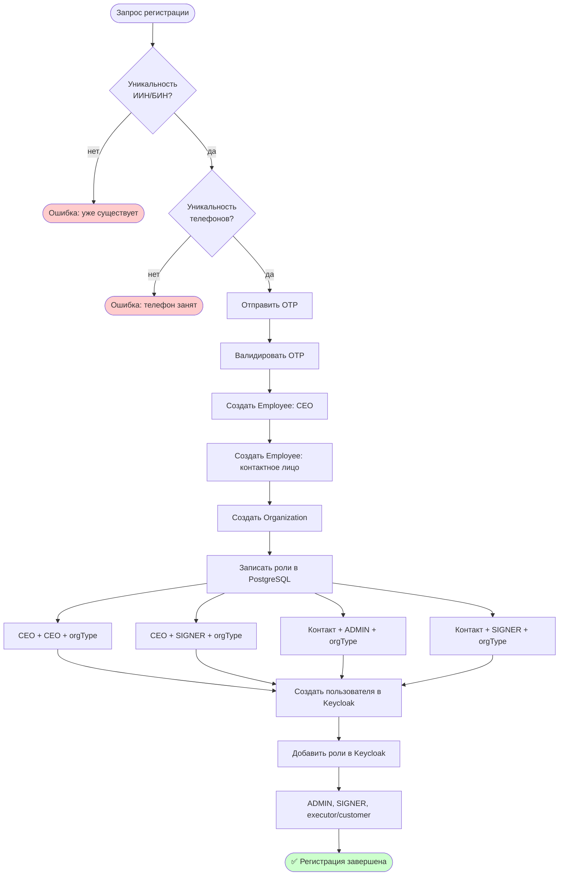
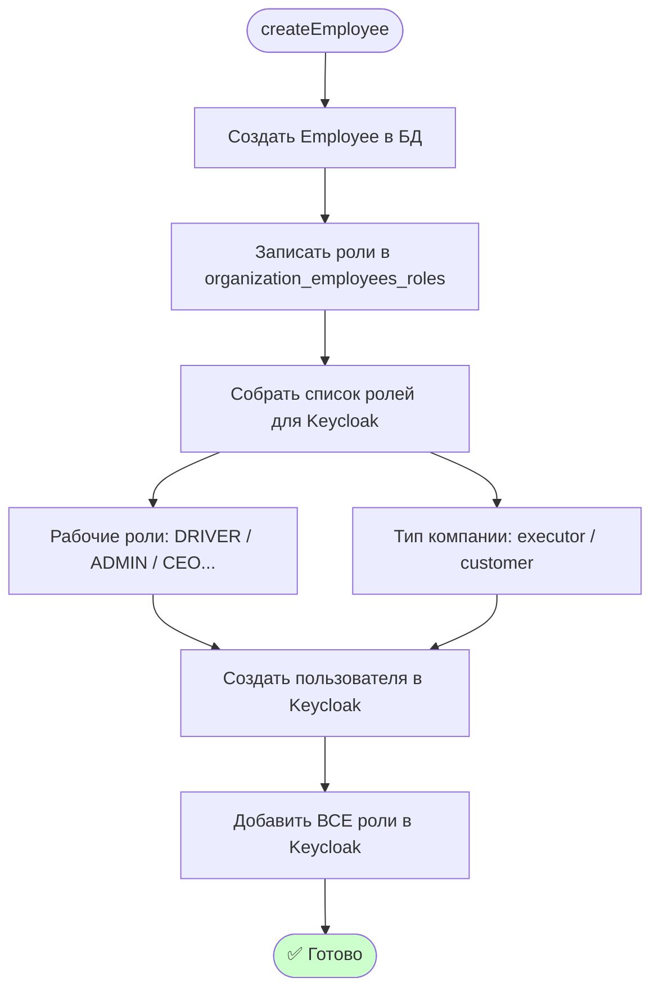
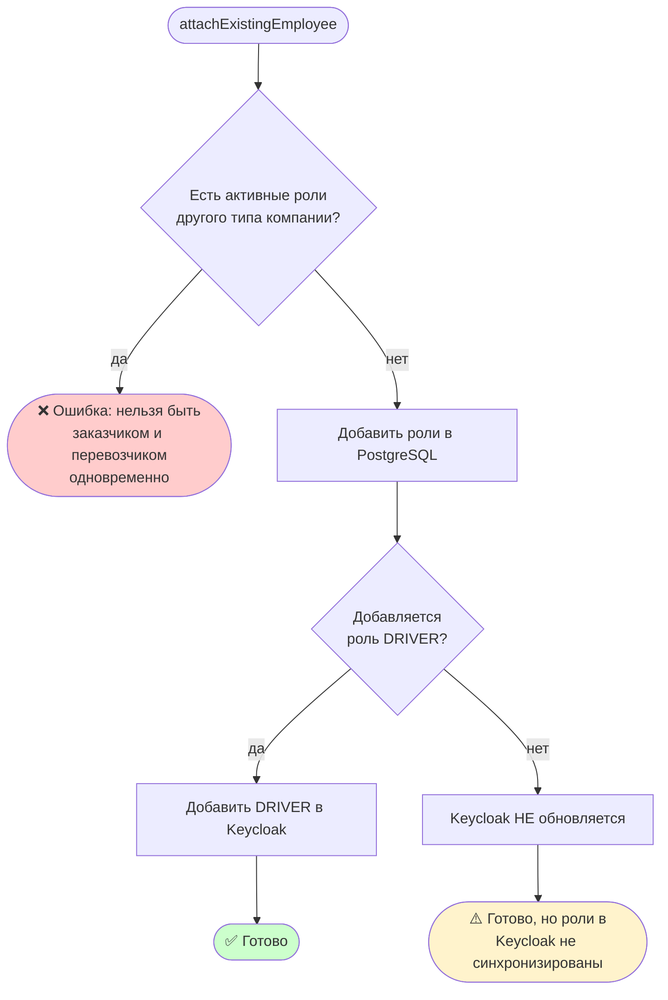
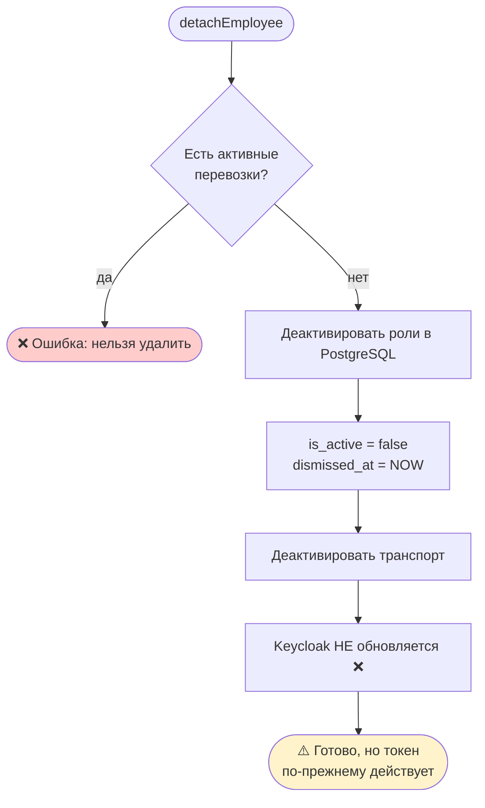
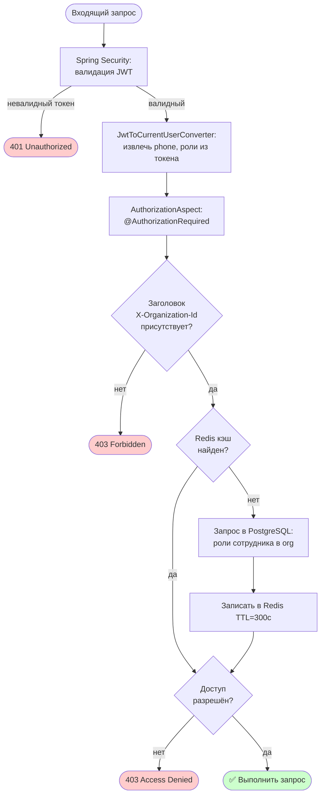

# Анализ ролевой системы Coube

> Дата: 2026-04-01  
> Статус: Анализ, изменений не вносилось

---

## Содержание

1. [Общая архитектура](#1-общая-архитектура)
2. [Роли и типы компаний](#2-роли-и-типы-компаний)
3. [Хранение ролей](#3-хранение-ролей)
4. [Flow: Регистрация новой организации](#4-flow-регистрация-новой-организации)
5. [Flow: Добавление сотрудника в компанию](#5-flow-добавление-сотрудника-в-компанию)
6. [Flow: Удаление сотрудника из компании](#6-flow-удаление-сотрудника-из-компании)
7. [Flow: Проверка доступа к эндпоинту](#7-flow-проверка-доступа-к-эндпоинту)
8. [Синхронизация Keycloak ↔ PostgreSQL](#8-синхронизация-keycloak--postgresql)
9. [Критические проблемы](#9-критические-проблемы)
10. [Рекомендации](#10-рекомендации)

---

## 1. Общая архитектура

Роли хранятся в **двух местах одновременно**:

```
┌────────────────────┐         ┌────────────────────┐
│     PostgreSQL     │         │      Keycloak       │
│                    │         │                     │
│  Источник истины   │ ◄──?──► │  Источник JWT       │
│  бизнес-логики     │         │  токенов            │
│                    │         │                     │
│  organization_     │         │  user_role_mapping  │
│  employees_roles   │         │                     │
└────────────────────┘         └────────────────────┘
         ▲                                ▲
         │                                │
         └──────────── НЕ ВСЕГДА ─────────┘
                     СИНХРОННЫ
```

**Почему два места:**
- **PostgreSQL** — кто в какой организации, с какой ролью, с какого числа. Нужен для бизнес-запросов
- **Keycloak** — выдаёт JWT токен. Бэкенд читает роли из токена при каждом запросе без обращения к БД

**Как бэкенд проверяет доступ:**

```
Запрос → JWT токен → Spring Security → AuthorizationAspect
                     (роли из токена)   (роли из PostgreSQL)
                                         ↓
                                      Redis кэш (TTL 300с)
```

> ⚠️ Важно: Spring Security читает роли из JWT, а `AuthorizationAspect` дополнительно
> проверяет их в PostgreSQL (с кэшем). Это значит расхождение между Keycloak и БД
> может привести к неожиданному поведению.

---

## 2. Роли и типы компаний

### Тип организации (CompanyType)

```
CompanyType
├─ CUSTOMER   — Заказчик (создаёт перевозки)
└─ EXECUTOR   — Перевозчик (исполняет перевозки)
```

### Роли сотрудников (KeycloakRole)

| Роль | Тип компании | Описание |
|------|-------------|----------|
| `CEO` | CUSTOMER / EXECUTOR | Генеральный директор |
| `ADMIN` | CUSTOMER / EXECUTOR | Администратор компании |
| `SIGNER` | CUSTOMER / EXECUTOR | Подписант документов |
| `DRIVER` | EXECUTOR только | Водитель |
| `LOGISTICIAN` | EXECUTOR только | Логист |
| `SUPER_ADMIN` | — | Системный администратор |
| `customer` | — | Keycloak: маркер типа CUSTOMER |
| `executor` | — | Keycloak: маркер типа EXECUTOR |

> `customer` и `executor` — это отдельные Keycloak-роли, они маркируют к какому
> типу компании относится пользователь. Они дублируют поле `company_type` из PostgreSQL.

### Матрица прав доступа

| Роль | Добавить сотрудника | Управлять ролями | Подписывать документы | Создавать перевозки |
|------|:---:|:---:|:---:|:---:|
| CEO | ✅ | ✅ | ✅ | ✅ |
| ADMIN | ✅ | ❌ | ✅ | ✅ |
| SIGNER | ❌ | ❌ | ✅ | ❌ |
| DRIVER | ❌ | ❌ | ❌ | ❌ |
| LOGISTICIAN | ✅ | ❌ | ❌ | ✅ |
| SUPER_ADMIN | ✅ | ✅ | ❌ | ❌ |

---

## 3. Хранение ролей

### PostgreSQL: `users.organization_employees_roles`

```sql
employee_id   BIGINT   -- сотрудник
role          TEXT     -- CEO, ADMIN, SIGNER, DRIVER, LOGISTICIAN...
organization_id BIGINT -- организация
company_type  TEXT     -- CUSTOMER или EXECUTOR
assigned_at   TIMESTAMP
dismissed_at  TIMESTAMP NULL  -- дата увольнения
is_active     BOOLEAN  -- активна ли роль
```

**Составной первичный ключ:** `(employee_id, role, organization_id, company_type)`

> Также существует устаревшая таблица `users.employees_roles` — оставлена для
> обратной совместимости, новым кодом не используется. Требует удаления.

### Keycloak: `user_role_mapping`

Хранит только плоский список ролей пользователя без привязки к организации:
```
user_id → [admin, signer, customer]
user_id → [ceo, signer, executor]
user_id → [driver, executor]
```

### Ключевые файлы

```
auth/roles/KeycloakRole.java                    — enum всех ролей
auth/keycloak/service/KeycloakRoleService.java  — управление ролями в Keycloak
auth/keycloak/service/KeycloakUserService.java  — управление пользователями в Keycloak
organization/model/OrganizationEmployeesRoles.java — Entity роли в БД
organization/dao/EmployeeRoleRepository.java    — репозиторий ролей
common/aspect/AuthorizationAspect.java          — AOP проверка доступа
common/validation/AuthorizationRequired.java    — аннотация для контроллеров
```

---

## 4. Flow: Регистрация новой организации



> **Что попадает в Keycloak при регистрации:**  
> Контактное лицо получает все роли: `ADMIN`, `SIGNER` + `executor` или `customer`.  
> CEO — роли не добавляются в Keycloak отдельно (только через контактное лицо).

---

## 5. Flow: Добавление сотрудника в компанию

### 5a. Создание нового сотрудника (нет аккаунта)



### 5b. Привязка существующего сотрудника (уже есть аккаунт)



> ❌ **Баг:** При привязке существующего сотрудника роли `ADMIN`, `SIGNER`,
> `LOGISTICIAN`, `CEO` добавляются в PostgreSQL, но **не добавляются в Keycloak**.  
> Пользователь получит их только после перелогина? — Нет, они так и не появятся
> в токене до тех пор, пока не будут добавлены вручную.

---

## 6. Flow: Удаление сотрудника из компании



> ❌ **Баг:** После отвязки сотрудника его Keycloak-роли остаются.  
> Если токен ещё не истёк — пользователь продолжает иметь доступ.
> Redis-кэш авторизации тоже не инвалидируется сразу.

---

## 7. Flow: Проверка доступа к эндпоинту



**Логика проверки:**
1. Проверяется `company_type` из PostgreSQL (CUSTOMER или EXECUTOR)
2. Проверяется наличие хотя бы одной из требуемых ролей (OR логика)
3. Оба условия должны выполняться одновременно

**Пример аннотации:**
```java
@AuthorizationRequired(
    roles = {CEO, ADMIN},
    companyTypes = {EXECUTOR}
)
```

---

## 8. Синхронизация Keycloak ↔ PostgreSQL

### Полная карта синхронизации

| Событие | PostgreSQL | Keycloak | Синхронны? |
|---------|:---:|:---:|:---:|
| Регистрация новой организации | ✅ | ✅ | ✅ Да |
| `createEmployee` (новый сотрудник) | ✅ | ✅ | ✅ Да |
| `attachExistingEmployee` + роль DRIVER | ✅ | ✅ | ✅ Да |
| `attachExistingEmployee` + роль ADMIN/CEO/SIGNER/LOGISTICIAN | ✅ | ❌ | ❌ **Нет** |
| `detachEmployee` (удаление из компании) | ✅ | ❌ | ❌ **Нет** |
| Смена `company_type` (CUSTOMER↔EXECUTOR) | ❌ заблокировано | ❌ | — |

### Почему это важно

```
Сценарий: Логист добавлен в перевозчика
───────────────────────────────────────
PostgreSQL: employee 123 → org 456 → LOGISTICIAN → EXECUTOR ✅
Keycloak:   employee 123 → [signer, executor]  ← роль LOGISTICIAN отсутствует!

Результат: Пользователь не получит доступ к эндпоинтам для LOGISTICIAN,
           потому что AuthorizationAspect проверяет PostgreSQL (там ОК),
           но некоторые проверки могут читать токен напрямую.
```

---

## 9. Критические проблемы

### Проблема 1 — Неполная синхронизация при attachExistingEmployee

**Приоритет: 🔴 Высокий**

При привязке существующего сотрудника в Keycloak добавляется только роль `DRIVER`. Роли `ADMIN`, `SIGNER`, `CEO`, `LOGISTICIAN` остаются только в PostgreSQL.

```java
// EmployeeService.java — текущий код
employeeRoleRepository.saveAll(toSave);  // ✅ все роли в БД

if (driverAddedNow) {
    keycloakUserService.addRoleToUserByPhoneIfMissing(phone, DRIVER);
    // ❌ остальные роли игнорируются
}
```

**Правильное поведение:** синхронизировать все добавляемые роли в Keycloak.

---

### Проблема 2 — Keycloak не обновляется при удалении сотрудника

**Приоритет: 🔴 Высокий**

После `detachEmployee()` роли деактивируются в БД, но остаются в Keycloak. Пока токен не истёк — пользователь сохраняет доступ.

```java
// EmployeeService.java — текущий код
employeeRoleRepository.deactivateAllByEmployeeAndOrganization(...);  // ✅ БД
// ❌ keycloakRoleService.removeRoles() — не вызывается
// ❌ Redis-кэш авторизации — не инвалидируется
```

**Правильное поведение:** удалять роли из Keycloak + инвалидировать кэш авторизации.

---

### Проблема 3 — Нет механизма смены company_type

**Приоритет: 🟡 Средний**

Система полностью блокирует смену типа компании для активного сотрудника. Если организацию нужно перевести из CUSTOMER в EXECUTOR — нет стандартного пути. Сейчас это делается вручную через БД и Keycloak напрямую.

**Правильное поведение:** эндпоинт в SuperAdmin для смены типа организации с каскадным обновлением всех сотрудников в обоих хранилищах.

---

### Проблема 4 — Устаревшая таблица employees_roles

**Приоритет: 🟢 Низкий (техдолг)**

Таблица `users.employees_roles` существует для обратной совместимости, но не используется новым кодом. Создаёт путаницу.

**Правильное поведение:** удалить после проверки отсутствия зависимостей.

---

### Проблема 5 — CEO не попадает в Keycloak при регистрации

**Приоритет: 🟡 Средний**

При регистрации организации в Keycloak создаётся только контактное лицо. CEO получает роли только в PostgreSQL. Если CEO и контактное лицо — разные люди, у CEO не будет Keycloak-аккаунта с нужными ролями.

---

## 10. Рекомендации

### 10.1 Исправить синхронизацию при attachExistingEmployee

```java
// Нужно добавить для каждой добавленной роли:
for (var addedRole : newlyAddedRoles) {
    keycloakUserService.addRoleToUserByPhoneIfMissing(phone, addedRole.getRole());
    // + добавить executor/customer если не было
}
```

### 10.2 Добавить синхронизацию при detachEmployee

```java
// После деактивации в БД:
var keycloakRolesToRemove = buildRolesToRemoveFromKeycloak(employeeId, orgId);
keycloakRoleService.removeRoles(subject, keycloakRolesToRemove);
// Инвалидировать Redis кэш:
redisTemplate.delete(buildCachePattern(phone));
```

### 10.3 Добавить эндпоинт смены типа организации в SuperAdmin

```
PATCH /api/v1/super-admin/organizations/{id}/company-type
Body: { "companyType": "EXECUTOR" }

Логика:
1. Обновить company_type для всех сотрудников в organization_employees_roles
2. Для каждого сотрудника: удалить старую роль из Keycloak, добавить новую
3. Инвалидировать Redis кэш для всей организации
```

### 10.4 Добавить мониторинг рассинхронизации

Периодическая задача (Cron / Scheduled):
```
1. Взять всех активных сотрудников из PostgreSQL
2. Для каждого проверить наличие нужных ролей в Keycloak
3. Логировать расхождения / автоматически синхронизировать
```

---

## Итоговая схема

```
Регистрация org  ──────────────────────────────► PG ✅  KC ✅
createEmployee   ──────────────────────────────► PG ✅  KC ✅
attachEmployee + DRIVER ───────────────────────► PG ✅  KC ✅
attachEmployee + ADMIN/CEO/SIGNER/LOGISTICIAN ─► PG ✅  KC ❌ ← БАГИ
detachEmployee   ──────────────────────────────► PG ✅  KC ❌ ← БАГИ
смена CUSTOMER↔EXECUTOR ──────────────────────► PG ❌  KC ❌ ← НЕТ ЭНДПОИНТА
```
